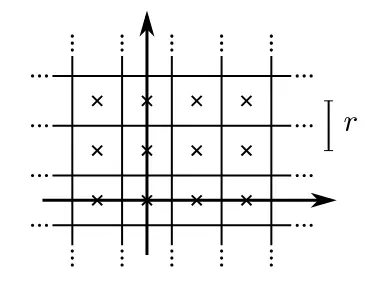
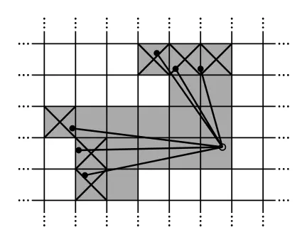
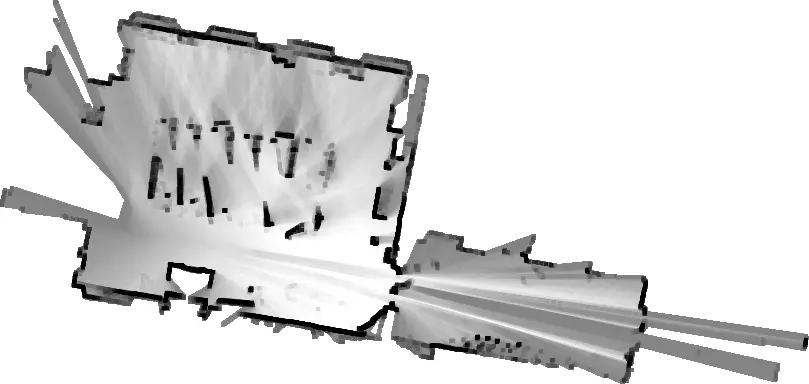
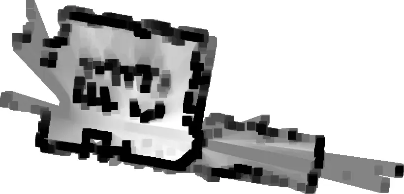
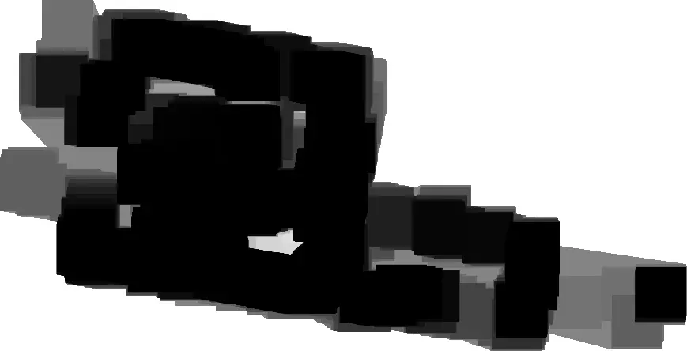
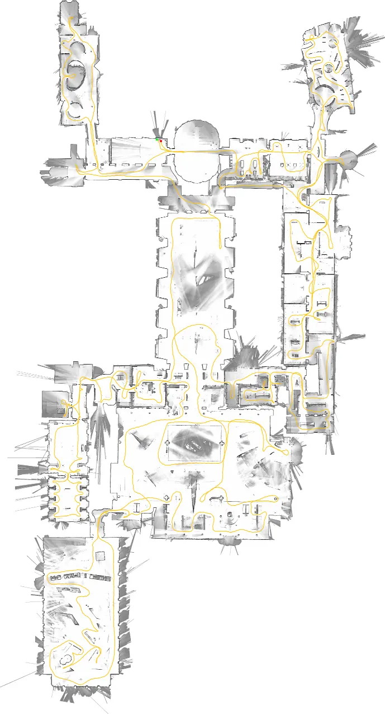
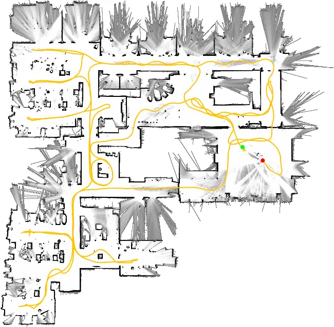

---
tags:
  - cartographer
  - SLAM
  - paper
comment: false
---

# 2D 激光雷达 SLAM 中的实时回环检测

> 作者：
> Wolfgang Hess , Damon Kohler, Holger Rapp, Daniel Andor  
> （所有作者均来自谷歌）  

> [Real-Time Loop Closure in 2D LIDAR SLAM](https://research.google.com/pubs/pub45466.html), in
> *Robotics and Automation (ICRA), 2016 IEEE International Conference on*.
> IEEE, 2016. pp. 1271–1278.

## 摘要
便携式激光测距仪（以下简称激光雷达/LIDAR）与同步定位与地图构建（SLAM）技术是获取竣工平面图的高效方法。实时生成并可视化平面图有助于操作人员评估采集数据的质量和覆盖范围。构建便携式采集平台需在有限的计算资源下运行。本文提出一种应用于背包式测绘平台的方法，该方法能够以5cm的分辨率实现实时测绘与回环检测。为达成实时回环检测，我们采用分支定界法计算扫描与子图的匹配结果作为约束条件。实验结果及与其他主流方法的对比表明，该方法在精度方面与现有成熟技术具有竞争力。

## 一、引言
竣工平面图在多种应用场景中具有重要价值。用于建筑管理任务的数据采集手动测量方法通常结合计算机辅助设计（CAD）与激光测距仪，这类方法效率低下，且由于依赖人类对建筑为直线集合的先验认知，往往无法准确描述空间的真实形态。借助SLAM技术，能够快速、精准地对大规模、复杂结构的建筑进行测绘，其效率较手动测量提升数个数量级。

SLAM技术在该领域的应用并非全新理念，也不是本文的研究重点。本文的核心贡献是提出一种新型方法，用于降低基于激光测距数据计算回环约束的计算开销。该技术使我们能够对数万平方米的大型楼层进行测绘，同时为操作人员实时提供完全优化的结果。

## 二、相关工作
在基于激光雷达的SLAM方法中，扫描与扫描匹配（scan-to-scan matching）常被用于计算相对位姿变化[^1][^2][^3][^4]。然而，仅依靠扫描与扫描匹配会快速累积误差。

扫描与地图匹配（scan-to-map matching）有助于抑制误差累积。例如，文献[^5]提出一种基于高斯-牛顿法(Gauss-Newton)的方法，在线性插值地图上寻找局部最优解。当通过高数据率激光雷达获得足够精确的位姿初始估计时，局部优化的扫描与地图匹配具有高效性和鲁棒性。在不稳定平台上，可利用惯性测量单元（IMU）估计重力方向，将激光扫描扇面投影至水平面。

像素级精确扫描匹配方法（如文献[^1]）进一步降低了局部误差累积。尽管计算开销更高，但该方法同样适用于回环检测。部分方法通过匹配激光扫描提取的特征来降低计算成本[^4]。其他回环检测方法包括基于直方图的匹配[^6]、扫描数据中的特征检测以及机器学习方法[^7]。

解决剩余局部误差累积的两种常用方法是粒子滤波(particle filter)和基于图的SLAM(graph-based SLAM)[^2]、[^8]：
- **粒子滤波**：需在每个粒子中维护完整的系统状态表示。对于基于栅格的SLAM，当地图规模扩大时（例如，我们的一个测试案例为轨迹长度3km、面积22000m²的场景），计算资源消耗会迅速增加。文献[^9]提出采用低维特征表示方法，无需为每个粒子维护栅格地图，从而降低资源需求。当需要实时更新的栅格地图时，文献[^10]提出计算子图的方法，仅在必要时更新子图，最终地图通过所有子图的栅格化得到。
- **基于图的方法**：通过节点集合表示位姿和特征，图中的边表示由观测生成的约束。可采用多种优化方法最小化所有约束引入的误差[^11]、[^12]。文献[^13]描述了一种适用于室外SLAM的系统，该系统结合基于图的方法、局部扫描与扫描匹配以及基于子图特征直方图的重叠局部地图匹配。

## 三、系统概述
谷歌的Cartographer系统以配备传感器的背包形式提供室内实时测绘解决方案，能够生成分辨率为 $r=5\ \text{cm}$ 的二维栅格地图。操作人员在建筑物内行走时，可实时查看正在生成的地图。激光扫描数据被插入到最佳估计位置对应的子图中，该位置在短时间内被认为具有足够的准确性。扫描匹配基于近期子图进行，仅依赖最新的扫描数据，因此世界坐标系下的位姿估计误差会逐渐累积。

为在中等硬件配置下实现良好性能，我们的SLAM方法未采用粒子滤波。为应对误差累积问题，系统定期执行位姿优化。
1. 当子图构建完成（即不再插入新的扫描数据）后，该子图将参与回环检测（loop closure）的扫描匹配过程；
2. 所有已完成的子图和扫描数据都会被自动纳入回环检测考虑范围，若根据当前位姿估计判断二者距离足够近，扫描匹配器将尝试在子图中寻找对应的扫描数据；
3. 如果在当前估计位姿周围的搜索窗口内找到足够优的匹配结果，则将其作为回环约束（loop closing constraint）添加到优化问题中；
4. 通过每几秒执行一次优化，操作人员在重访某个位置时能够实时实现回环检测。

为满足软实时（soft real-time）要求，回环扫描匹配的执行速度必须快于新扫描数据的生成速度，否则会出现明显的滞后。我们通过采用分支定界法（Branch-and-Bound Approach）以及为每个已完成子图预计算多个栅格（precomputed grids）的方式，满足了这一要求。

## 四、局部二维SLAM
我们的系统结合了局部和全局两种独立的二维SLAM方法。两种方法均优化激光雷达观测（以下简称扫描）的位姿 $\xi=(\xi_x, \xi_y, \xi_\theta)$ ，其中 $(x, y)$ 表示平移量， $\xi_\theta$ 表示旋转角度。在背包等不稳定平台上，利用IMU估计重力方向，将水平安装的激光雷达扫描数据投影至二维世界坐标系。

在局部方法中，每帧连续扫描数据与世界地图的一个小片段（称为子图 $M$ ）进行匹配，通过非线性优化使扫描数据与子图对齐（该过程称为扫描匹配）。扫描匹配会随时间累积误差，后续将通过第五节所述的全局方法消除。

### （一）扫描数据
子图构建是扫描坐标系与子图坐标系（以下简称坐标系）反复对齐的迭代过程。设扫描数据的原点为 $0 \in \mathbb{R}^2$ ，扫描点信息表示为 $H=\{h_k\}_{k=1, ..., K}, (h_k \in \mathbb{R}^2)$。扫描坐标系在子图坐标系中的位姿 $\xi$ 通过变换矩阵 $T_\xi$ 表示，该矩阵将扫描点从扫描坐标系刚性变换至子图坐标系，其数学定义为：

$$\begin{equation}
T_p=\begin{pmatrix}
\cos\xi_\theta & -\sin\xi_\theta \\ \sin\xi_\theta & \cos\xi_\theta
\end{pmatrix}p + \begin{pmatrix}
 \xi_x \\ \xi_y
\end{pmatrix}
\end{equation}$$

### （二）子图
子图由多帧连续扫描数据构建，采用概率栅格形式表示，即：

$$\begin{equation}
M: r \mathbb{Z} \times r \mathbb{Z} \to [p_{\text{min}}, p_{\text{max}}]
\end{equation}$$

其中 $r$ 为分辨率（例如5cm），该栅格将离散栅格点映射为概率值，表示栅格点被遮挡的概率。每个栅格点对应的像素包含所有距离该栅格点最近的空间点。

*Fig. 1. 栅格点及其相关像素*

当将扫描数据插入概率栅格时，需计算命中点（hits）和未命中点（misses）对应的两组不相交栅格点集合：
- 对于每个命中点，将最近的栅格点加入命中集合；
- 对于每个未命中点，将扫描原点与扫描点之间射线相交的每个像素对应的栅格点（已在命中集合中的除外）加入未命中集合；
- 对于所有先前未观测的栅格点，若属于命中集合则赋值为 $P_{\text{hit}}$ ，若属于未命中集合则赋值为 $p_{\text{miss}}$；
- 若栅格点 $x$ 已被观测到，我们将命中和未命中的概率更新为：

$$\begin{equation}
odds(p)=\frac{p}{1-p}
\end{equation}$$

$$\begin{equation}
M_{new}(x)=clamp(odds^{-1}(odds(M_{old}(x))\cdot odds(p_{hit})))
\end{equation}$$

- 对于未命中的点也类似。

*Fig. 2. 扫描结果以及与命中（阴影部分已划掉）和未命中（仅阴影部分）相关的像素。*

### （三）Ceres扫描匹配
在将扫描数据插入子图之前，利用基于Ceres求解器[^14]的扫描匹配器，相对于当前局部子图优化扫描位姿$\xi$。扫描匹配器的目标是找到使子图中扫描点概率最大化的扫描位姿，该问题被转化为非线性最小二乘问题：

$$\begin{equation}
\arg\min_\xi \sum_{k=1}^K (1 - M_{\text{smooth}}(T_\xi h_k))^2 \tag{CS}
\end{equation}$$

其中：
-  $T_\xi$ 根据扫描位姿将 $h_k$ 从扫描坐标系变换至子图坐标系；
- 函数 $M_{\text{smooth}}: \mathbb{R}^2 \to \mathbb{R}$ 是局部子图概率值的平滑版本，采用双三次插值计算，因此可能出现取值范围超出 $[0,1]$ 的情况，但被认为不会影响结果。

该平滑函数的数学优化精度通常高于栅格分辨率。由于这是局部优化，需要良好的初始估计：
- 可利用能够测量角速度的IMU估计位姿的旋转分量 $\theta$ ；
- 在无IMU的情况下，可采用更高频率的扫描匹配或像素级精确扫描匹配方法（尽管这会增加计算开销）。

## 五、回环检测
由于扫描数据仅与包含近期少数扫描帧的子图进行匹配，上述方法会缓慢累积误差。对于几十帧连续扫描数据，累积误差较小；对于更大空间，则通过构建多个小子图来处理。我们的方法遵循稀疏位姿调整（Sparse Pose Adjustment）[^2]的思路，优化所有扫描数据和子图的位姿——扫描数据插入时的相对位姿被存储在内存中，用于回环优化；当子图不再更新后，所有扫描与子图的组合都将被纳入回环检测考虑范围，后台运行扫描匹配器，若找到优匹配结果，则将对应的相对位姿添加到优化问题中。

### （一）优化问题
与扫描匹配类似，回环优化也被表述为非线性最小二乘问题，便于添加残差项以融合额外数据。每几秒使用Ceres求解器[^14]求解以下优化问题：

$$\begin{equation}
\underset{\Xi^m, \Xi^s}{\arg\min} \frac{1}{2} \sum_{ij} \rho\left(E^2\left(\xi_i^m, \xi_j^s; \Sigma_{ij}, \xi_{ij}\right)\right) \tag{SPA}
\end{equation}$$

其中：
- $\Xi^m=\{\xi_i^m\}_{i=1,...,m}$ 表示子图在世界坐标系中的位姿，$\Xi^s=\{\xi_j^s\}_{j=1,...,n}$ 表示扫描数据在世界坐标系中的位姿；
- 约束条件包括相对位姿 $\xi_{ij}$ 及对应的协方差矩阵 $\Sigma_{ij}$ ，对于子图 $i$ 和扫描 $j$，$\xi_{ij}$ 描述了扫描在子图坐标系中的匹配位置；
- 协方差矩阵 $\Sigma_{ij}$ 可通过文献[^15]的方法计算，或利用Ceres求解器的协方差估计功能结合公式 $(CS)$ 进行局部计算；
- $E$ 为约束对应的残差，计算方法如下：

$$\begin{equation}
E^2(\xi^m_i,\xi^s_j;\Sigma_{ij},\xi_{ij})=e(\xi^m_i,\xi^s_j;\xi_{ij})^T\Sigma^{-1}_{ij}e(\xi^m_i,\xi^s_j;\xi_{ij})
\end{equation}$$

$$\begin{equation}
e(\xi^m_i,\xi^s_j;\xi_{ij})=\xi_{ij}-\begin{pmatrix}R^{-1}_{\xi^m_i}(t_{\xi^m_i}-t_{\xi^s_j})\\\xi^m_{i;\theta}-\xi^s_{j;\theta}\end{pmatrix}
\end{equation}$$

- 采用损失函数 $\rho$（例如Huber损失）降低异常值的影响——在局部对称环境（如办公室隔间）中，扫描匹配可能会向优化问题中引入错误约束，从而产生异常值，其他处理异常值的方法可参见文献[^16]。

### （二）分支定界扫描匹配
我们的目标是找到像素级精确的最优匹配：

$$\begin{equation}
\xi^* = \arg\max_{\xi \in \mathcal{W}} \sum_{k=1}^K M_{\text{nearest}}(T_\xi h_k) \tag{BBS}
\end{equation}$$

其中 $\mathcal{W}$ 为搜索窗口，$M_{\text{nearest}}$ 是将 $M$ 扩展至整个 $\mathbb{R}^2$ 的函数（通过先将输入值四舍五入到最近的栅格点，即将栅格点的值扩展至对应的像素），可通过公式 $(CS)$ 进一步提高匹配质量。

#### 1. 步长选择
通过合理选择步长可提高效率。选择角步长 $\delta_\theta$ ，使得最大测距范围 $d_{\text{max}}$ 处的扫描点移动距离不超过一个像素的宽度 $r$ ，利用余弦定理推导步长计算公式：

$$\begin{equation}
d_{max}=\max_{k=1,...,K}||h_k||
\end{equation}$$

$$\begin{equation}
\delta_\theta=\arccos(1-\frac{r^2}{2d^2_{max}})
\end{equation}$$

我们计算覆盖给定线性和角度搜索窗口大小的整数步长，例如 $W_x=W_y=7\ \text{m}$ ， $W_\theta=30^\circ$，

$$\begin{equation}
w_x=\left [ \frac{W_x}{r}  \right ] ,
w_y=\left [ \frac{W_y}{r}  \right ] ,
w_\theta=\left [ \frac{W_\theta}{\delta_\theta}  \right ] .
\end{equation}$$

得到以估计值 $\xi_0$ 为中心的有限搜索窗口集合 $W$，

$$\begin{equation}
\overline{\mathcal{W}}=\left \{ -w_x,...,w_x \right \} \times \left \{ -w_y,...,w_y \right \} \times \left \{ -w_\theta ,...,w_\theta \right \}
\end{equation}$$

$$\begin{equation}
\mathcal{W}=\left \{ \xi_0 + (rj_x,rj_y,\delta_\theta j_\theta):(j_x,j_y,j_\theta)\in \overline{\mathcal{W}} \right \}
\end{equation}$$

可以很容易地制定出一个简单的算法来找到 $\delta^*$，参考算法1，但对于我们考虑的搜索窗口大小来说，它的速度太慢了。

算法1：朴素扫描匹配算法（求解 $(BBS)$）
$$
\begin{aligned}
&\mathit{best\_score} \gets -\infty \\
&\textbf{for } j_x = -w_x \textbf{ to } w_x \textbf{ do} \\
&\hspace{1em}\textbf{for } j_y = -w_y \textbf{ to } w_y \textbf{ do} \\
&\hspace{2em}\textbf{for } j_\theta = -w_\theta \textbf{ to } w_\theta \textbf{ do} \\
&\hspace{3em}\mathit{score} \gets \Sigma_{k=1}^K M_{\text{nearest}}(T_{\xi_0 + (r j_x, r j_y, \delta_\theta j_\theta)} h_k) \\
&\hspace{3em}\textbf{if } \mathit{score} > \mathit{best\_score} \textbf{ then} \\
&\hspace{4em}\mathit{match} \gets \xi_0 + (r j_x, r j_y, \delta_\theta j_\theta) \\
&\hspace{4em}\mathit{best\_score} \gets \mathit{score} \\
&\hspace{3em}\textbf{end if} \\
&\hspace{2em}\textbf{end for} \\
&\hspace{1em}\textbf{end for} \\
&\textbf{end for} \\
&\textbf{return } \mathit{best\_score} \text{ and } \mathit{match} \text{ when set}
\end{aligned}
$$

#### 2. 分支定界算法原理
可直接设计求解 $\xi^*$ 的朴素算法，但对于我们考虑的搜索窗口大小，该算法速度过慢。因此，采用分支定界法在更大的搜索窗口上高效计算 $\xi^*$ （该方法最初应用于混合整数线性规划[^17]，相关研究成果丰富，文献[^18]提供了简要综述）。

核心思想是将可能的解子集表示为树中的节点：
- 根节点代表所有可能的解（本文中为 $W$ ）；
- 每个节点的子节点构成父节点的划分，共同代表同一组可能解；
- 叶节点为单元素集合，每个叶节点对应一个可行解；
- 该算法是精确算法，只要内部节点 $c$ 的得分 $\text{score}(c)$ 是其元素得分的上界，就能得到与朴素算法相同的解——当某个节点被剪枝时，该子树中不存在优于当前最优解的解。

#### 3. 关键实现细节
要实现具体算法，需确定节点选择、分支策略和上界计算方法：
- **节点选择**：默认采用深度优先搜索（DFS），可快速遍历多个叶节点以获得优质当前解；引入得分阈值，低于该阈值的最优解不被考虑；DFS过程中优先访问上界最大的子节点。
- **分支规则**：树中的每个节点由整数元组 $c=(c_x, c_y, c_\theta, c_h) \in \mathbb{Z}^4$ 描述，高度为 $c_h$ 的节点包含最多 $2^{c_h} \times 2^{c_h}$ 个可能的平移量，但对应特定的旋转角度；叶节点的高度 $c_h=0$ ，对应可行解 $W \ni \xi_c=\xi_0+(r c_x, r c_y, \delta_\theta c_\theta)$ ；对于 $c_h>1$ 的节点 $c$ ，分支为最多四个高度为 $c_h-1$ 的子节点。
- **上界计算**：采用以下公式计算上界，确保计算效率和上界质量：

$$
\begin{aligned} 
\text{score}(c) & =\sum_{k=1}^{K} \max _{j \in \overline{\mathcal{W}}_{c}} M_{\text{nearest}}\left(T_{\xi_j} h_k\right) \\ 
& \geq \sum_{k=1}^{K} \max _{j \in \overline{\mathcal{W}}_{c}} M_{\text{nearest}}\left(T_{\xi_j} h_k\right) \\ 
& \geq \max _{j \in \overline{\mathcal{W}}_{c}} \sum_{k=1}^{K} M_{\text{nearest}}\left(T_{\xi_j} h_k\right) 
\end{aligned}
$$

  引入预计算栅格 $M_{\text{precomp}}^{c_h}$ ，为每个可能的高度 $c_h$ 预计算一个栅格，使得得分计算的时间复杂度与扫描点数量呈线性关系。 $M_{\text{precomp}}^h$ 与 $M_{\text{nearest}}$ 具有相同的像素结构，但每个像素存储从该像素开始的 $2^h \times 2^h$ 像素块的最大值。

|  |  |
| --- | --- |
|  |  |

*Fig. 3. 预先计算的大小为 1、4、16 和 64 的网格。*

## 六、实验结果
本节展示基于传感器实测数据的SLAM算法结果，所采用的在线算法与背包式平台的交互式运行算法一致。

### （一）真实场景实验：德意志博物馆
利用在德意志博物馆采集的传感器数据（数据时长1913s，计算得到的轨迹长度2253m），生成对应的地图。在配备Intel Xeon E5-1650（3.2GHz）处理器的工作站上：
- CPU总耗时为1018s，内存占用最高2.2GB，最多使用4个后台线程进行回环扫描匹配；
- 实际运行时间为360s，实时性能达到5.3倍；
- 回环优化的生成图包含11456个节点和35300条边；
- 每当图中新增少量节点时，执行一次稀疏位姿调整（SPA）优化，典型优化过程需3次迭代，耗时约0.3s。

*Fig. 4. 德意志博物馆二楼的 Cartographer 地图。*

### （二）真实场景实验：Neato Revo激光雷达
Neato Robotics公司在其扫地机器人中采用了一款成本低于30美元的激光测距传感器（LDS）Revo LDS[^20]。通过调试接口控制扫地机器人以约2Hz的频率采集扫描数据，生成5cm分辨率平面图。为评估平面图质量，将5条直线的激光测距测量结果与地图中通过绘图工具计算的像素距离进行对比，结果如下表所示（所有数值单位为米）：

| 激光测距值 | Cartographer测量值 | 绝对误差 | 相对误差 |
|------------|--------------------|----------|----------|
| 4.09       | 4.08               | -0.01    | -0.2%    |
| 5.40       | 5.43               | +0.03    | +0.6%    |
| 8.67       | 8.74               | +0.07    | +0.8%    |
| 15.09      | 15.20              | +0.11    | +0.7%    |
| 15.12      | 15.23              | +0.11    | +0.7%    |

*表1. Revo LDS 的定量误差*

误差量级与线段两端各一个像素的偏差一致，符合预期。

*Fig. 5. 使用 Revo LDS 传感器数据生成的 Cartographer 地图。*

### （三）基于Radish数据集的对比
采用文献[^21]提出的基准指标进行对比，该指标通过将相对位姿变化误差与人工校准的真实值进行比较。

#### 表2. 与文献[^21]中图映射（GM）方法的对比
| 场景 | 指标 | Cartographer | GM |
|------|------|--------------|----|
| Aces | 绝对平移误差（m） | 0.0375±0.0426 | 0.044±0.044 |
|      | 平方平移误差（m²） | 0.0032±0.0285 | 0.004±0.009 |
|      | 绝对旋转误差（°） | 0.373±0.469 | 0.4±0.4 |
|      | 平方旋转误差（°²） | 0.359±3.696 | 0.3±0.8 |
| Intel | 绝对平移误差（m） | 0.0229±0.0239 | 0.031±0.026 |
|       | 平方平移误差（m²） | 0.0011±0.0040 | 0.002±0.004 |
|       | 绝对旋转误差（°） | 0.453±1.335 | 1.3±4.7 |
|       | 平方旋转误差（°²） | 1.986±23.988 | 24.0±166.1 |
| MIT Killian Court | 绝对平移误差（m） | 0.0395±0.0488 | 0.050±0.056 |
|       | 平方平移误差（m²） | 0.0039±0.0144 | 0.006±0.029 |
|       | 绝对旋转误差（°） | 0.352±0.353 | 0.5±0.5 |
|       | 平方旋转误差（°²） | 0.248±0.610 | 0.9±0.9 |
| MIT CSAIL | 绝对平移误差（m） | 0.0319±0.0363 | 0.004±0.009 |
|       | 平方平移误差（m²） | 0.0023±0.0099 | 0.0001±0.0005 |
|       | 绝对旋转误差（°） | 0.369±0.365 | 0.05±0.08 |
|       | 平方旋转误差（°²） | 0.270±0.637 | 0.01±0.04 |
| Freiburg bldg 79 | 绝对平移误差（m） | 0.0452±0.0354 | 0.056±0.042 |
|       | 平方平移误差（m²） | 0.0033±0.0055 | 0.005±0.0005 |
|       | 绝对旋转误差（°） | 0.538±0.718 | 0.6±0.6 |
|       | 平方旋转误差（°²） | 0.804±3.627 | 0.7±1.7 |
| Freiburg hospital (local) | 绝对平移误差（m） | 0.1078±0.1943 | 0.143±0.180 |
|       | 平方平移误差（m²） | 0.0494±0.2831 | 0.053±0.272 |
|       | 绝对旋转误差（°） | 0.747±2.047 | 0.9±2.2 |
|       | 平方旋转误差（°²） | 4.745±40.081 | 5.5±46.2 |
| Freiburg hospital (global) | 绝对平移误差（m） | 5.2242±6.6230 | 11.6±11.9 |
|       | 平方平移误差（m²） | 71.0288±267.7715 | 276.1±516.5 |
|       | 绝对旋转误差（°） | 3.341±4.797 | 6.3±6.2 |
|       | 平方旋转误差（°²） | 34.107±127.227 | 77.2±154.8 |

#### 表3. 与文献[^9]中Graph FLIRT方法的对比
| 场景 | 指标 | Cartographer | Graph FLIRT |
|------|------|--------------|-------------|
| Intel | 绝对平移误差（m） | 0.0229±0.0239 | 0.02±0.02 |
|       | 绝对旋转误差（°） | 0.453±1.335 | 0.3±0.3 |
| Freiburg bldg 79 | 绝对平移误差（m） | 0.0452±0.0354 | 0.06±0.09 |
|                  | 绝对旋转误差（°） | 0.538±0.718 | 0.8±1.1 |
| Freiburg hospital (local) | 绝对平移误差（m） | 0.1078±0.1943 | 0.18±0.27 |
|                  | 绝对旋转误差（°） | 0.747±2.047 | 0.9±2.0 |
| Freiburg hospital (global) | 绝对平移误差（m） | 5.2242±6.6230 | 8.3±8.6 |
|                  | 绝对旋转误差（°） | 3.341±4.797 | 5.0±5.3 |

#### 表4. 回环检测精度
| 测试案例 | 约束数量 | 精度 |
|----------|----------|------|
| Aces | 971 | 98.1% |
| Intel | 5786 | 97.2% |
| MIT Killian Court | 916 | 93.4% |
| MIT CSAIL | 1857 | 94.1% |
| Freiburg bldg 79 | 412 | 99.8% |
| Freiburg hospital | 554 | 77.3% |

#### 表5. 性能指标
| 测试案例 | 数据时长（s） | 实际运行时间（s） |
|----------|--------------|------------------|
| Aces | 1366 | 41 |
| Intel | 2691 | 179 |
| MIT Killian Court | 7678 | 190 |
| MIT CSAIL | 424 | 35 |
| Freiburg bldg 79 | 1061 | 62 |
| Freiburg hospital | 4820 | 10 |

## 七、结论
本文提出并通过实验验证了一种二维SLAM系统，该系统结合扫描与子图匹配、回环检测和图优化技术。通过局部基于栅格的SLAM方法构建独立的子图轨迹。后台利用像素级精确扫描匹配将所有扫描数据与邻近子图进行匹配，生成回环约束。定期对包含子图和扫描位姿的约束图进行后台优化；
4. 通过GPU加速融合已完成子图和当前子图，为操作人员提供实时更新的最终地图预览。

实验表明，该算法可在中等硬件配置上实现实时运行。

## 致谢
本研究通过在慕尼黑德意志博物馆的实验得到验证，作者感谢博物馆管理部门的支持。对比实验采用了经人工验证的关系数据和文献[^21]的结果（该文献数据来自机器人数据集仓库（Radish）[^19]），感谢Patrick Beeson、Dieter Fox等研究者提供数据集；Freiburg大学医院的数据集由Bastian Steder、Rainer Kümmerle等研究者提供。

[^1]: Olson E. M3RSM: Many-to-many multi-resolution scan matching[C]//Proceedings of the IEEE International Conference on Robotics and Automation (ICRA), 2015: 1-8.  
[^2]: Konolige K, Grisetti G, Kümmerle R, et al. Sparse pose adjustment for 2D mapping[C]//IROS, Taipei, Taiwan, 2010: 22-28.  
[^3]: Lu F, Milios E. Globally consistent range scan alignment for environment mapping[J]. Autonomous robots, 1997, 4(4): 333-349.  
[^4]: Martín F, Triebel R, Moreno L, et al. Two different tools for three-dimensional mapping: DE-based scan matching and feature-based loop detection[J]. Robotica, 2014, 32(01): 19-41.  
[^5]: Kohlbrecher S, Meyer J, von Stryk O, et al. A flexible and scalable SLAM system with full 3D motion estimation[C]//Proc. IEEE International Symposium on Safety, Security and Rescue Robotics (SSRR), 2011: 155-160.  
[^6]: Himstedt M, Frost J, Hellbach S, et al. Large scale place recognition in 2D LIDAR scans using geometrical landmark relations[C]//Intelligent Robots and Systems (IROS 2014), 2014 IEEE/RSJ International Conference on, 2014: 5030-5035.  
[^7]: Granström K, Schön T B, Nieto J I, et al. Learning to close loops from range data[J]. The International Journal of Robotics Research, 2011, 30(14): 1728-1754.  
[^8]: Grisetti G, Stachniss C, Burgard W. Improving grid-based SLAM with Rao-Blackwellized particle filters by adaptive proposals and selective resampling[C]//Robotics and Automation, 2005. ICRA 2005. Proceedings of the 2005 IEEE International Conference on, 2005: 2432-2437.  
[^9]: Tipaldi G D, Braun M, Arras K O. FLIRT: Interest regions for 2D range data with applications to robot navigation[C]//Experimental Robotics, 2014: 695-710.  
[^10]: Strom J, Olson E. Occupancy grid rasterization in large environments for teams of robots[C]//Intelligent Robots and Systems (IROS), 2011 IEEE/RSJ International Conference on, 2011: 4271-4276.  
[^11]: Kümmerle R, Grisetti G, Strasdat H, et al. g2o: A general framework for graph optimization[C]//Robotics and Automation (ICRA), 2011 IEEE International Conference on, 2011: 3607-3613.  
[^12]: Carlone L, Aragues R, Castellanos J A, et al. A fast and accurate approximation for planar pose graph optimization[J]. The International Journal of Robotics Research, 2014: 965-987.  
[^13]: Bosse M, Zlot R. Map matching and data association for large-scale two-dimensional laser scan-based SLAM[J]. The International Journal of Robotics Research, 2008, 27(6): 667-691.  
[^14]: Agarwal S, Mierle K, et al. Ceres solver[EB/OL]. http://ceres-solver.org.  
[^15]: Olson E B. Real-time correlative scan matching[C]//Robotics and Automation, 2009. ICRA'09. IEEE International Conference on, 2009: 4387-4393.  
[^16]: Agarwal P, Tipaldi G D, Spinello L, et al. Robust map optimization using dynamic covariance scaling[C]//Robotics and Automation (ICRA), 2013 IEEE International Conference on, 2013: 62-69.  
[^17]: Land A H, Doig A G. An automatic method of solving discrete programming problems[J]. Econometrica, 1960, 28(3): 497-520.  
[^18]: Clausen J. Branch and bound algorithms-principles and examples[R]. Department of Computer Science, University of Copenhagen, 1999.  
[^19]: Howard A, Roy N. The robotics data set repository (Radish)[EB/OL]. 2003. http://radish.sourceforge.net/.  
[^20]: Konolige K, Augenbraun J, Donaldson N, et al. A low-cost laser distance sensor[C]//Robotics and Automation, 2008. ICRA 2008. IEEE International Conference on, 2008: 3002-3008.  
[^21]: Kümmerle R, Steder B, Dornhege C, et al. On measuring the accuracy of SLAM algorithms[J]. Autonomous Robots, 2009, 27(4): 387-407.