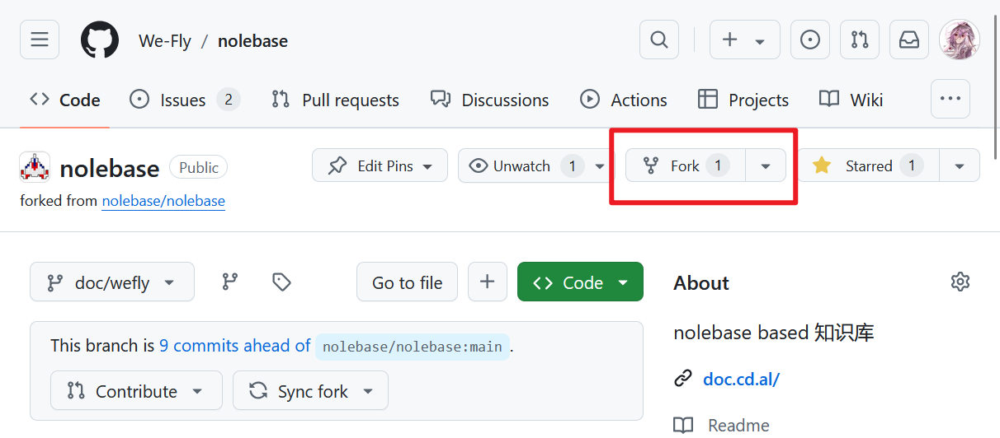
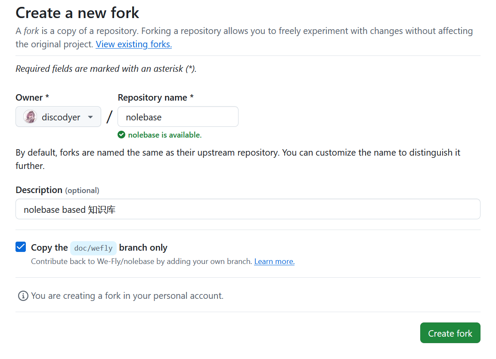
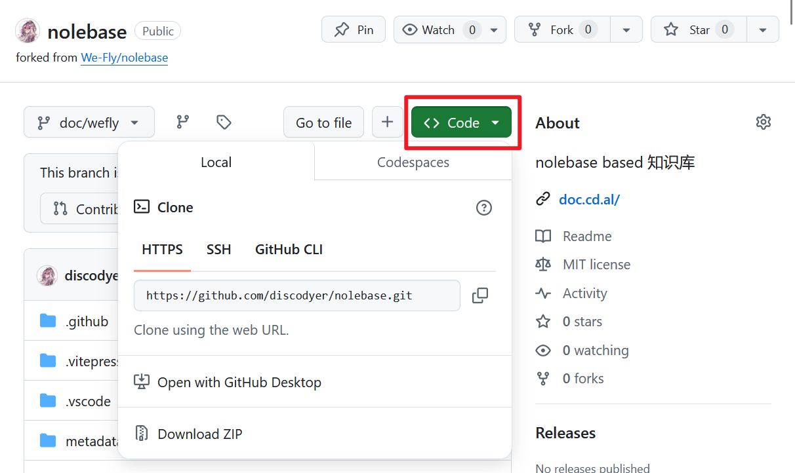
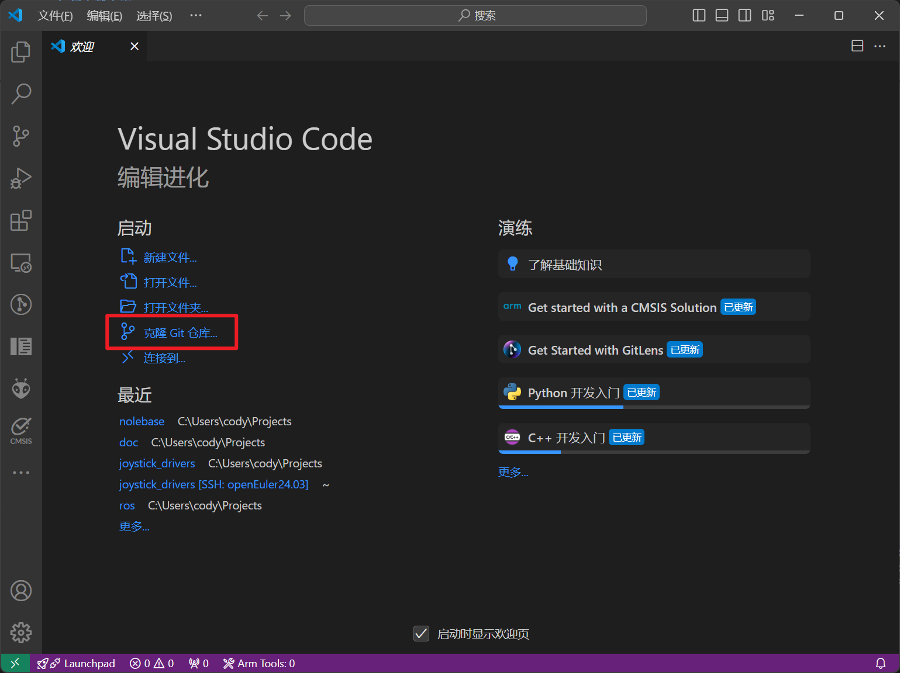
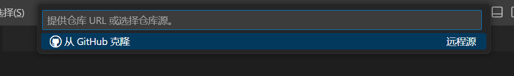
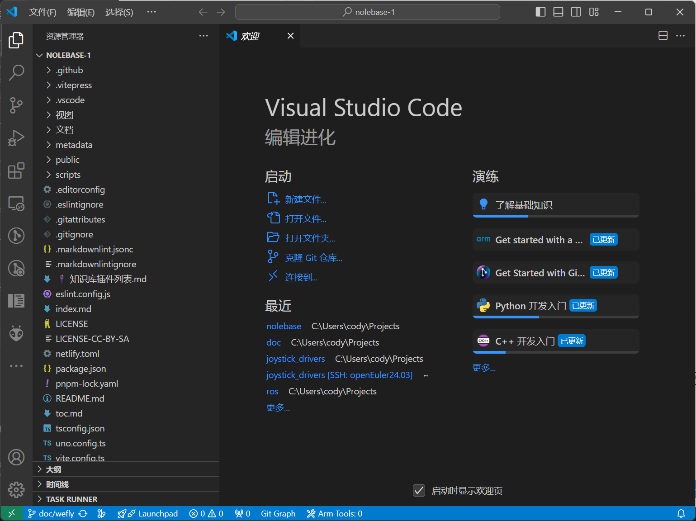

# 如何贡献内容

页面大纲：
[[toc]]

## 说明

首先感谢你愿意给本文档提供内容，我们会尽力维护文档。

如果你有好的建议和意见，可以在[issue区](https://github.com/discodyer/nolege/issues)中提出，也可以直接提交PR( ^ω^)

## 如何贡献

首先你会用到Git和编写Markdown，不会也没关系，本页面是逐步演示的教程

### 安装需要的环境

你需要安装Git、nodejs、pnpm、vscode、Obsidian(可选)

#### 安装Git并注册Github

首先，你需要有一个Github账号，请在[这里](https://github.com/signup)注册一个，**不推荐使用qq邮箱注册**

根据Github注册页面的引导注册就行了，这里推荐阅读[GitHub 入门文档](https://docs.github.com/zh/get-started)，里面的内容非常全面

可以根据Github入门文档学习如何使用Git，也可以根据本文档的教程指引，[Git for windows 安装教程](/zh-CN/笔记/👋环境配置/Git%20for%20windows%20安装配置.md)

到这里你应该完成了Github的注册，以及Git的安装。

#### 配置Git并克隆仓库

首先打开`Git bash`终端界面

##### 设置Git用户名

使用你的Github用户名作为Git提交的用户名

```bash
git config --global user.name "xxx" # 换成你的用户名
```

`--global` 参数是用于设置全局用户名，你也可以在某个仓库下为仓库单独设置用户名，去掉`--global`参数即可

验证是否正确设置了用户名

```bash
git config --global user.name
> xxx # 会输出你刚刚设置的用户名
```

##### 设置电子邮件地址

使用你注册Github所使用的电子邮件地址，也可以[在Github使用多个邮箱地址](https://docs.github.com/zh/account-and-profile/setting-up-and-managing-your-personal-account-on-github/managing-email-preferences/adding-an-email-address-to-your-github-account)

```bash
git config --global user.email "YOUR_EMAIL" # 换成你的电子邮件地址
```

和上面的一样，去掉`--global`参数可以只为当前仓库设置邮件地址

##### Fork仓库到你的账户下

首先，访问[本文档所属的仓库](https://github.com/discodyer/nolege)

点击右上角的Fork按钮



然后fork仓库的`note`分支，这个分支是发布分支，点击右下角的`Create Fork`按钮就会在你的用户下创建一个仓库



然后点击绿色的`<>Code`按钮，会出现三个选项卡，你可以选择任意一个方式克隆你Fork的仓库



##### 使用命令行克隆仓库

如果我们[设置了SSH密钥](/文档/🧑‍🔧一些技巧/SSH%20的一些奇技淫巧.md)，就可以使用SSH克隆，或者使用https和Github客户端克隆

使用`git clone`命令就可以克隆仓库到本地，下面是命令举例

```bash
git clone https://github.com/YOUR_NAME/nolebase.git  # 使用https克隆
git clone git@github.com:YOUR_NAME/nolebase.git      # 使用ssh克隆
```

然后通过code打开

```bash
cd nolebase
code .
```

##### 使用VSCode克隆仓库

使用VSCode克隆非常简单，首先打开VSCode界面，点击`克隆Git仓库...`



在弹出的窗口里，可以选择使用Github账户克隆（https），通过提示一步一步选择就行了，或者填入仓库链接使用ssh克隆



克隆完成后，会提示你打开仓库目录



如图所示，仓库就已经被克隆到本地了

#### 安装Node.js和pnpm

##### 安装Node.js

首先安装Node.js，你可以使用官网安装包安装，也可以使用windows下的包管理器安装

[官网下载地址](https://nodejs.org/en)

[官方包管理器安装教程](https://nodejs.org/en/download/package-manager)

然后打开一个`powershell`终端，输入`node --version`或者`npm --version`

如果你看到了类似于 `vxx.xx.xx` 的版本号（比如 v21.1.0），那么恭喜你，你已经成功安装了 Node.js

##### 安装pnpm

可以根据[官网教程](https://pnpm.io/installation)安装pnpm

如果已经安装了Node.js，可以使用npm安装pnpm

```bash
npm install -g pnpm
```

`-g` 表示全局安装

或者使用其他包管理器安装，官网文档都有相关的命令提示

使用下面的命令测试pnpm是否安装成功

```bash
pnpm --version
```

### 本地构建文档

到这边你已经安装了Git、nodejs、pnpm、vscode等工具，恭喜你已经完成了很艰难的一步！

#### 安装依赖和运行开发服务器

首先使用终端进入仓库目录

```bash
cd nolebase
```

我们需要安装依赖，使用下面的命令

```bash
pnpm install
```

这样所需要的软件包就会被下载到`node_modules`目录下了

接下来可以直接运行下面的命令来开启`开发服务器`，可以通过浏览器在本地访问渲染好的网页

```bash
pnpm docs:dev
```

就像下面这样

```bash
pnpm docs:dev

  vitepress v1.0.0-rc.20

  ➜  Local:   http://localhost:5173/
  ➜  Network: use --host to expose
  ➜  press h to show help
```

当输出上面的结果，就可以打开本地网页<http://localhost:5173/>来访问渲染完成的页面了

在这个页面下，你通过VSCode修改了markdown文件后，会实时响应到网页上，如果刷新不及时或者更新有异常，可以刷新一下网页或者重启服务器

#### 构建并渲染为可部署的静态页面

当你完成修改后，请使用下面的命令验证是否能正确构建出静态页面，如果没有报错，就可以提交更改到上游仓库了

```bash
pnpm docs:build
```

### 开始编写吧！

本文档内容都是用markdown编写的，你可以在这里找到一些markdown语法教程

 - [菜鸟教程](https://www.runoob.com/markdown/md-tutorial.html)

 - [Github式Markdown规范](https://github.github.com/gfm/)

或者参考别的页面的写法

#### 添加页面

所有页面都在`文档`目录下，可以以中文作为文档名称，末尾添加`.md`后缀名。

文档名称应该尽量简单易懂，按照分类放到不同的文件夹下

#### 修改内容

基本语法和Markdown一致，这里主要提一下如何链接到其他页面以及如何添加图片

##### 链接到其他页面

插入一个链接，以本页面为例，首先输入括号`[]()`，然后在VSCode下，输入一个`/`就会出现选单，可以快速选择路径

```markdown
[](/zh-CN/笔记/✍️写在前面/如何贡献内容.md)
```

链接到一个文档的某个章节，就在.md后加上章节名称，例如

```markdown
[](/zh-CN/笔记/✍️写在前面/如何贡献内容.md#链接到其他页面)
```

推荐在输入一个`#`后使用VSCode选单选择，或者去掉中文标题里的空格，英文标题用`-`连字符隔开

##### 添加图片

把图片文件放到当前目录下的`images`文件夹下，如果一个页面里的图片很多，可以创建一个文件夹，专门用于存放，建议给每张图片重命名，不要重名就行

插入的时候，地址是从`images`开始的，注意不能用反斜杠`\`，要使用`/`，例如

```markdown

```

### 提交拉取请求(Pull request)

#### 什么是拉取请求

拉取请求（Pull Request，简称 PR）是用于协作开发时提交代码的常见方式，尤其是在使用 Git 和 GitHub 等代码托管平台时。具体步骤如下：

 - Fork 仓库：由于你没有原始仓库的直接写权限，你需要将原始仓库 Fork 到你自己的账户下。这会创建一个与你账户相关联的、原仓库的副本。

 - 修改代码：你在自己的 Fork 仓库中进行代码修改。通常会在一个新的分支中进行这些修改。

 - 提交修改：当完成修改后，你将更改提交到自己 Fork 的仓库中。

 - 发起拉取请求：你可以在 GitHub 等平台上通过界面发起拉取请求，要求原始仓库的维护者审查并合并你的更改。拉取请求会显示出你对代码所做的更改，并且允许维护者对其进行评论、建议修改或直接合并。

 - 代码审查与合并：原始仓库的维护者会审查你的拉取请求，决定是否合并你的代码。如果需要，他们也可能要求你做进一步的修改。

#### 步骤1：获取上游仓库的更新

首先，确保你有添加上游仓库的 remote。如果你还没有添加，可以用以下命令：

```bash
git remote add upstream https://github.com/discodyer/nolege.git
```

可以使用`git remote -v`查看上游仓库是否添加成功

```bash
PS > git remote -v
origin  git@github.com:discodyer/nolebase.git (fetch)
origin  git@github.com:discodyer/nolebase.git (push)
upstream        https://github.com/discodyer/nolege.git (fetch)
upstream        https://github.com/discodyer/nolege.git (push)
```

然后获取上游仓库的最新代码：

```bash
git fetch upstream
```

会有类似的输出：

```bash
PS > git fetch upstream
From https://github.com/discodyer/nolege
 * [new branch]      note       -> upstream/note
 * [new branch]      main       -> upstream/main
```

#### 步骤2：合并上游 `note` 分支到本地 `note` 分支

切换到你的本地 `note` 分支：

```bash
git checkout note
```

合并上游 `note` 分支的更新：

```bash
git merge upstream/note
```

这会将上游仓库中最新的 `note` 分支合并到你的本地 `note` 分支。

如果合并没有冲突，你可以直接推送到你的远程仓库：

```bash
git push origin note
```

#### 步骤3：创建一个新的分支提交修改

创建一个分支，比如`fix`

```bash
git checkout -b fix
```

输出如下：

```bash
PS > git checkout -b fix
Switched to a new branch 'fix'
```

然后就可以在这个分支下进行一些修改

```bash
git add .
git commit -m "fix: 修复了XXX"
```

提交代码之前，请确保当前分支已经和上游保持同步，如果没有，请重复步骤1和步骤2

#### 步骤4：合并 note 分支的更改到 fix 分支

进行这一步之前，请重复执行步骤1和步骤2，同步上游更改到本地，然后再合并到`fix`分支

操作之前记得暂存你的更改，防止好不容易写好的内容被覆盖

现在你的本地 `note` 分支已经同步了上游的更改，接下来将这些更改合并到 `fix` 分支。

切换回你正在工作的 `fix` 分支：

```bash
git checkout fix
```

合并本地 `note` 分支的更改到 `fix` 分支：

```bash
git merge note
```

如果出现冲突，解决冲突后，继续合并

#### 步骤5：推送并发起 PR

合并完成后，将你更新后的 `fix` 分支推送到远程仓库：

```bash
git push origin fix
```

接下来，你可以在 GitHub 或其他代码托管平台上发起拉取请求（PR），请求将你的 `fix` 分支的修改合并到上游仓库的 `note` 分支中。

请确保你提交PR的时候已经和上游代码同步了，具体就是重复下面的步骤：

 - `git fetch upstream` 获取最新代码。
 - 在 `fix` 分支下执行 `git merge upstream/main` 进行合并。
 - 解决冲突（如果有），然后提交合并结果。
 - 推送到远程仓库

如果PR有问题的话，可以直接在 `fix` 分支提交修改，直到拉取请求被合并

发起PR前请确保以下几点：

 - 发起PR的分支已经和上游同步
 - 本地执行`pnpm docs:build`没有报错，能正常构建静态网页
