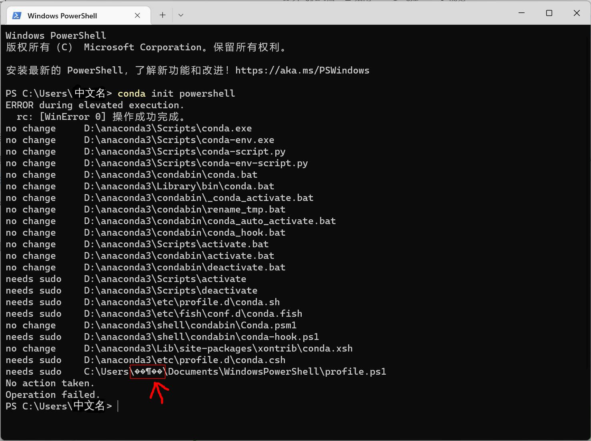
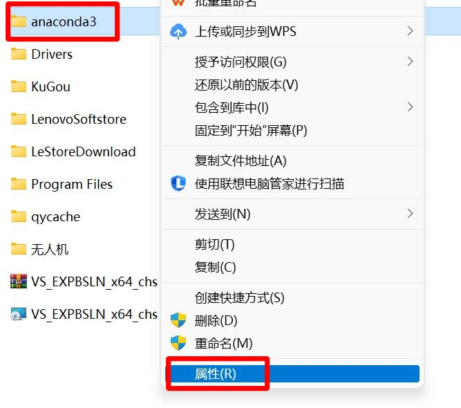
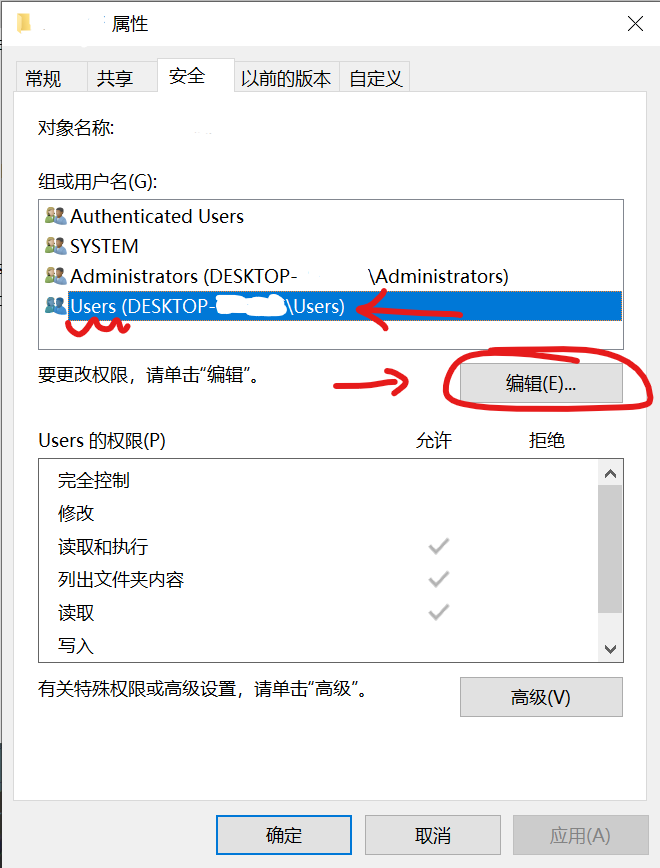
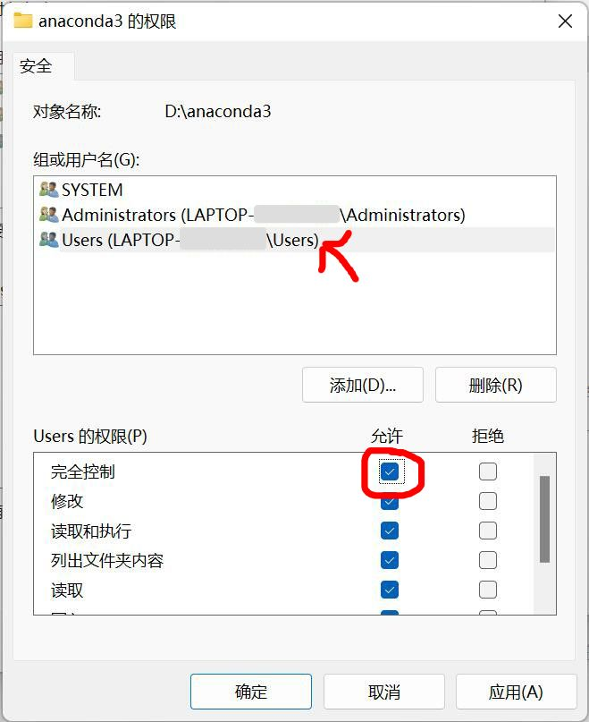
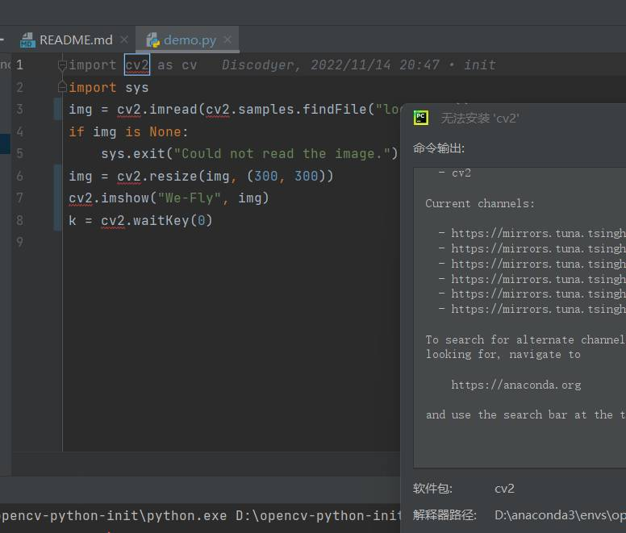
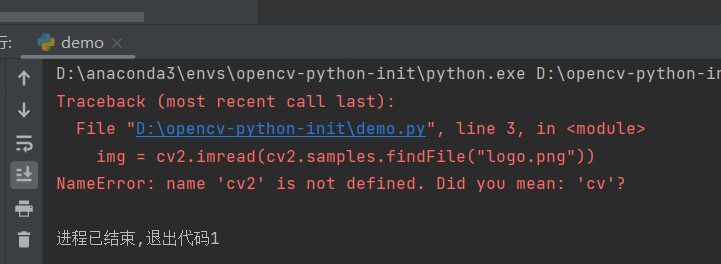
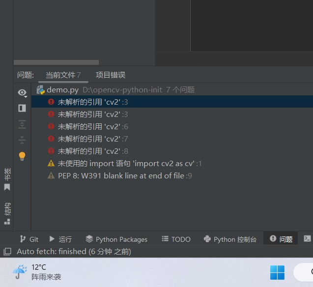
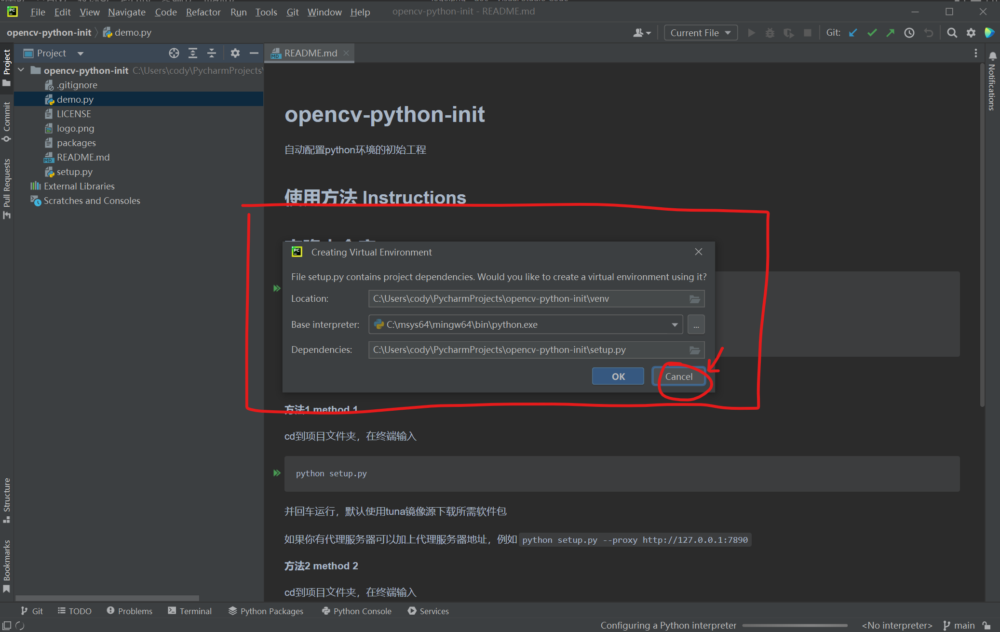
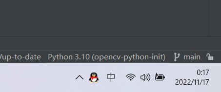
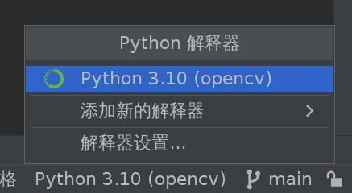

# 常见问题

页面大纲：
[[toc]]

## 提问的方法

详见[如何提问](/文档/✍️写在前面/如何提问.md)

## `conda init : need sudo`

输入下面的一行命令

```commandline
conda init powershell
```

可能会出现这样的错误



::: info 可能的原因

当前用户无权限访问anaconda安装目录

:::

::: details 解决方法

找到你安装的文件夹，右键文件夹，打开属性页面



切换到安全选项卡，选中Users，点击编辑



选中Users，点击完全控制，确定



然后再重新执行一次`conda init powershell`

:::

## command `pnpm install` failed

相关Issue：[Github Issue](https://github.com/npm/cli/issues/1201)

解决方法：

换一个硬盘克隆并运行仓库，貌似是因为 exfat 文件系统不支持符号链接导致的问题

## `无法将“xxx”项识别为 cmdlet、函数、脚本文件或可运行程序的名称。`

如果你添加了相应软件的path但还是不能执行，请检查你是否已经确认并关闭了path设置窗口。

或请尝试重新开启当时的`命令行窗口`/`IDE`，如果还是没有生效，请重启后再次尝试

或请检查path路径是否拼写正确

## 无法克隆仓库

如果仓库是GitHub上的，很正常，请使用实验室的网络

或请检查是否有仓库的访问权限

## `NameError: name 'cv2' is not defined. Did you mean: 'cv'?`

- 问题描述：

按照[pycharm安装配置](guide/guide-python-opencv-env-config.md#pycharm-安装配置)一节的提示

无法运行[示例仓库](https://github.com/We-Fly/opencv-python-init)的代码

终端提示`NameError: name 'cv2' is not defined. Did you mean: 'cv'?`

pycharm提示`未解析的引用‘cv2’`







- 期望：

能正常运行代码

- 可能的原因：

环境设置错误

第一次打开项目的时候，没有关闭这个



此时你右下角是`conda-python-init`环境



但你在执行之前的命令

```powershell
conda activate opencv
python setup.py
```

的时候，你将`opencv`软件包安装到了`opencv`这个环境下，而当前右下角的`conda-python-init`环境没有`opencv`软件包

这就好比你网上购物，地址填的是家里，但你人在学校一样，怎么想也不可能收到货吧

- 解决方法：

右下角切换到`opencv`环境



## 压缩文档里的软件无法运行

超市塑料袋应该都用过吧，比如说你有一天想做西红柿炒蛋，去超市买了油、盐、糖、西红柿、鸡蛋、葱，然后放在了一个塑料袋里。回到家里以后，你就拿出了其中的一个西红柿，其他的东西还放在塑料袋里不拿出来，那怎么想都不可能做出西红柿炒蛋吧？

有很多同学容易犯的错误是，通过压缩软件打开了压缩文档以后，没有完全解压，而是直接双击运行了里面的安装程序或软件，然后报出了一堆错误。这是因为安装程序或软件其实依赖了压缩文档里的其他文件才能正常运行。就像上面的例子一样。

## 仓库内容更新以后网页无新增内容

不得不承认，由于技术原因，本文档的页面在更新后会有一段时间的延迟，更改才会同步到网页上，请尝试清除浏览器缓存或者等待一段时间，参考这个[issue](https://github.com/We-Fly/doc/issues/26)

- 问题描述

仓库有新提交以后，网页不显示新内容

- 可能的原因

我们的网页采用了`Cloudflare Pages`服务搭建，`CF Pages`会检测我们的仓库`main`分支的新推送，然后自动构建

一个新的推送到构建完成需要2分钟左右的时间，然后会自动部署到`Cloudflare 内容分发网络`，会存在一个延迟，这个时间可能会在5分钟以上

由于我们的网页是纯静态的，所以本地浏览器会有缓存数据，如果不主动刷新的话是不会显示新内容的

- 解决方案

1. 刷新网页
2. 如果是新增页面，直接通过链接访问新页面会触发强制刷新
3. 拉取仓库到本地，直接通过`README.md`的方法进行本地构建
4. 通过快照访问某一个特定的版本 `commits` -> `check` -> `Preview URL`

- 获取更新信息

通过watch本仓库，可以及时收到新内容的推送，可以通过自定义watch仅接收仓库的`pull requests`消息以减少不必要的打扰

## `OpenCV:imread`无法打开图片

这个问题的原因有很多种，这里简单列举几个典型的错误

1. 请确定你的图片路径是否存在
2. 请确定你的图片路径中不存在中文字符或特殊字符(虽然Python支持中文路径，但调用的OpenCV函数还是用C写的，并不支持中文路径)
3. 请确定你的图片后缀名是否正确(e.g. `.png`/`.jpg`)
4. 请确定你的图片能正常使用图片查看器打开
