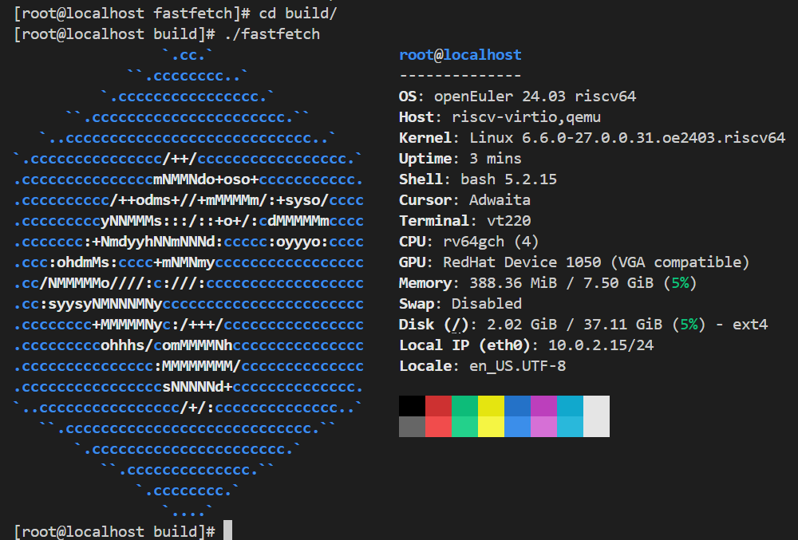

---
tags:
  - qemu
  - openEuler
  - RISC-V
---
# 在 qemu 上安装 openEuler 24.03 for RISC-V

主要测试环境:
 - Ubuntu 22.04.4 LTS

## 编译安装 qemu-8.2.6

由于发行版软件仓库里的qemu版本比较老(6.1)，所以需要自行编译安装新版本的qemu，运行24.09的openEuler for RISC-V要求qemu版本大于8.1，本文就安装 8.x 最新的 8.2.6 稳定版。

首先安装需要的软件包

```bash
sudo apt install build-essential git libglib2.0-dev libfdt-dev libpixman-1-dev zlib1g-dev ninja-build libslirp-dev ninja-build wget tar xz-utils
```

确保你的`/etc/apt/sources.list`里开启了deb-src源，然后用下面的命令自动安装依赖

```bash
sudo apt-get build-dep qemu
```

在 `/usr/local` 下创建目标文件夹

```bash
sudo mkdir -p /usr/local/bin/qemu-riscv64
```

下载源码压缩包

```bash
wget https://download.qemu.org/qemu-8.2.6.tar.xz
```

下载完成后，解压并进入源码文件夹

```bash
tar xvJf qemu-8.2.6.tar.xz && cd qemu-8.2.6
```

配置编译选项

```bash
sudo ./configure --enable-slirp --target-list=riscv64-softmmu,riscv64-linux-user --prefix=/usr/local/bin/qemu-riscv64
```

`riscv64-softmmu`表示系统模式，`riscv64-linux-user`表示用户模式，为了测试方便，建议两个都编译，避免重复编译。

开始编译，(-j开启多线程编译)

```bash
sudo make -j$(nproc) && sudo make install
```

然后编辑`.bashrc`，在最后添加环境变量，然后source刷新一下用户配置
```bash
echo "export PATH=/usr/local/bin/qemu-riscv64/bin:$PATH" >> ~/.bashrc
source ~/.bashrc
```

现在可以使用 `qemu-system-riscv64 --version`检查是否能正常显示版本号，若显示版本信息，则表示QEMU安装成功，并且正常运行。

## 运行 openEuler for RISC-V

首先创建一个工作目录

```bash
mkdir oerv2403 && cd oerv2403
```

下载镜像文件和启动脚本

镜像源的路径是`/openeuler/openEuler-24.03-LTS/virtual_machine_img/riscv64/`

```bash
wget https://repo.openeuler.org/openEuler-24.03-LTS/virtual_machine_img/riscv64/RISCV_VIRT_CODE.fd
wget https://repo.openeuler.org/openEuler-24.03-LTS/virtual_machine_img/riscv64/RISCV_VIRT_VARS.fd
wget https://repo.openeuler.org/openEuler-24.03-LTS/virtual_machine_img/riscv64/fw_dynamic_oe_2403_penglai.bin
wget https://repo.openeuler.org/openEuler-24.03-LTS/virtual_machine_img/riscv64/openEuler-24.03-LTS-riscv64.qcow2.xz
wget https://repo.openeuler.org/openEuler-24.03-LTS/virtual_machine_img/riscv64/start_vm.sh
wget https://repo.openeuler.org/openEuler-24.03-LTS/virtual_machine_img/riscv64/start_vm_penglai.sh
```

其中 `start_vm_penglai.sh` 是启用蓬莱 TEE 功能的脚本

此时，执行 `xz -d openEuler-24.03-LTS-riscv64.qcow2.xz` 命令对镜像解压，执行 `bash ./start_vm_penglai.sh` 就可以运行虚拟机了

默认的`root`用户密码是`openEuler12#$`

[fastfetch 编译步骤](https://github.com/fastfetch-cli/fastfetch/wiki/Building)



## 启动 xfce

使用上面的镜像[无法启动xfce桌面](https://github.com/discodyer/shutsuryoku/issues/1)，请使用[这个镜像](https://mirror.iscas.ac.cn/openeuler-sig-riscv/openEuler-RISC-V/devel/20240829/v0.1/QEMU/)

和上面一样，只需要下载里面的镜像和固件，然后再运行脚本就能启动xfce桌面环境了


## 参考文章

https://docs.openeuler.org/en/docs/24.03_LTS/docs/Installation/RISC-V-QEMU.html

https://www.openeuler.org/en/blog/phoebe/2023-09-26-Run-openEuler-RISC-V-On-Qemu.html

https://github.com/fastfetch-cli/fastfetch/wiki/Building