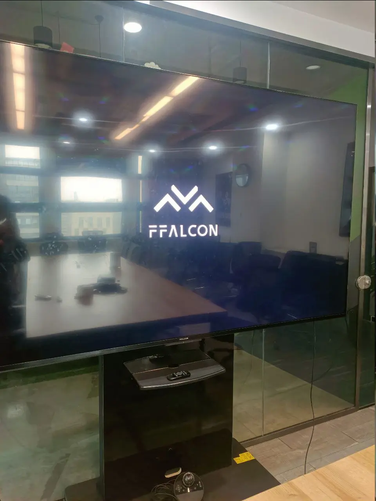
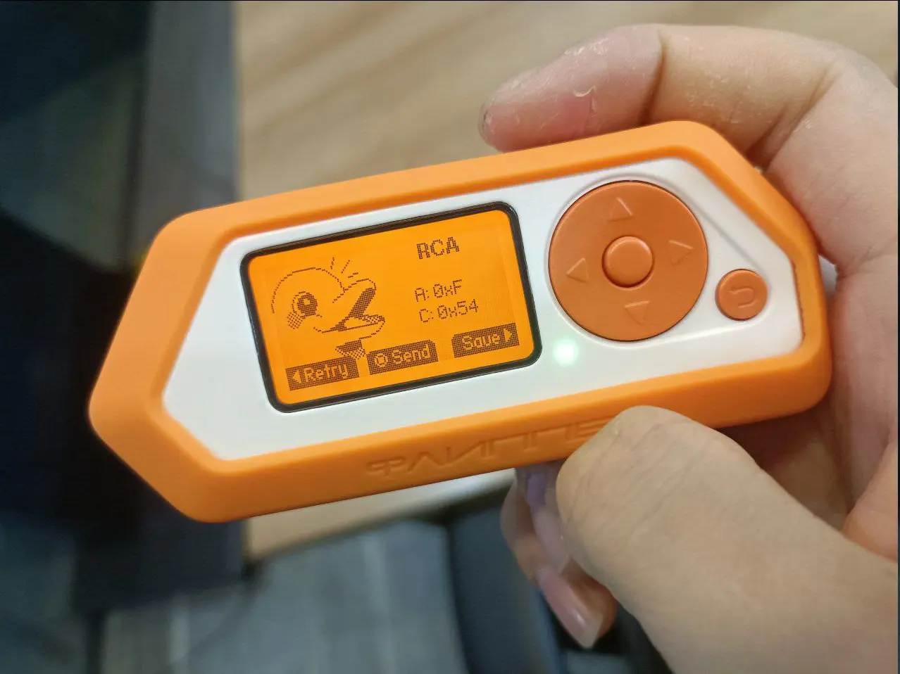
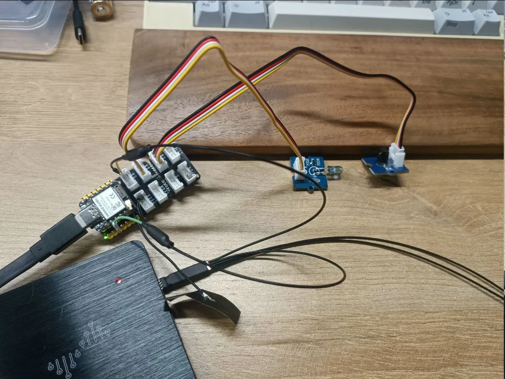
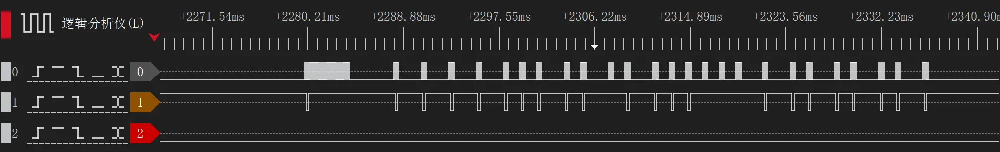
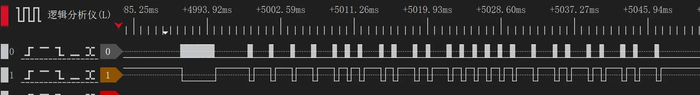
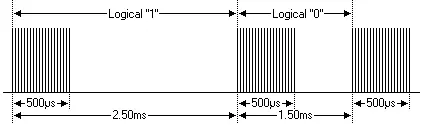
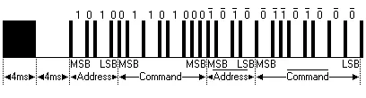

---
tags:
  - HomeAssistant
  - 逆向
  - 遥控
  - ESPHome
---
# 使用ESPHome代替RCA电视遥控器

## 逆向通信协议

今天的主角是下面这个FFALCON电视机，网上没有太多它的资料，应该是属于TCL品牌的电视。



我需要能遥控它的开启和关闭，我借了一台 Flipper Zero，开始尝试抓取遥控器的红外信号。



可以看到FLipperZero识别到了遥控器信号。信号是RCA协议，并且内容是`A:0xF C:0x54`。但是我此时并不知道这个协议的具体发送格式以及A和C分别代表了什么。于是我找到了下面的[这篇文章][1]，讲述了RCA协议的基本帧格式。

根据上面这篇文章的描述，RCA协议包含了如下特征

- 12 位协议。
- 4 位地址和 8 位命令（共 12 位）。
- 脉冲距离调制。
- **载波频率为 56kHz。**
- 位时间为 1.5ms 或 2.5ms。
- 为确保可靠性，在原码之后发送补码。

注意，这篇文章的作者使用的遥控器可能是使用56kHz频率的接收管，因此我在这里踩了个坑。后面会详细描述。

首先，我根据这个作者提供的信息，编写了如下的ESPHome代码，`code`字段下的数组里，正数表示脉冲，负数表示低电平，数字的绝对值是持续的时间，单位是微秒。

```yaml
remote_transmitter:
  - id: ir_transmitter
    pin: GPIO2
    # IR uses a typical 50% duty cycle
    carrier_duty_percent: 50%

button:  
  - platform: template
    name: TV Switch
    on_press: 
      - remote_transmitter.transmit_raw:
          transmitter_id: ir_transmitter
          code: [  # 自定义脉冲序列
            4000, -4000,   # 起始脉冲（前导码）
            500, -2000,    # A:0xF -> 1111
            500, -2000,    # 1
            500, -2000,    # 1
            500, -2000,    # 1
            
            500, -1000,    # C:0x54 -> 01010100
            500, -1000,    # 0
            500, -2000,    # 1
            500, -1000,    # 0

            500, -2000,    # 1
            500, -1000,    # 0
            500, -2000,    # 1
            500, -1000,    # 0
            
            500, -1000,    # 0
            500, -1000,    # 0
            500, -1000,    # 0
            500, -1000,    # 0
            
            500, -2000,    # 1
            500, -2000,    # 1
            500, -1000,    # 0
            500, -2000,    # 1

            500, -1000,    # 0
            500, -2000,    # 1
            500, -1000,    # 0
            500, -2000,    # 1
            500, -8000,    
          ]
          carrier_frequency: 56kHz
```

测试下来并不工作，于是我在自己的设备上搭建了测试平台，使用一个红外发射管和一个对应的红外接收管测试收发，逻辑分析仪的0通道接到红外发射管，1通道是接收管，我得到了下面的波形





注意，目前是工作在56kHz载波的情况下，接收管工作不正常，并且接到FlipperZero上也捕捉不到信号。于是经过一番搜索，我发现市面上常见的遥控器都是38kHz载波的，于是我把载波频率`carrier_frequency`换成了38kHz，又试了一次，这次能在FlipperZero上捕捉到RCA信号帧。同时用逻辑分析仪也能抓到正确的波形。



但是问题来了，依旧没办法正常遥控电视机，问题出在哪里了呢？其实需要连续发送两次以上，最终代码如下：

```yaml
remote_transmitter:
  - id: ir_transmitter
    pin: GPIO2
    # IR uses a typical 50% duty cycle
    carrier_duty_percent: 50%

button:  
  - platform: template
    name: TV Switch
    on_press: 
      - remote_transmitter.transmit_raw:
          transmitter_id: ir_transmitter
          code: [  # 自定义脉冲序列
            4000, -4000,   # 起始脉冲（前导码）
            500, -2000,    # A:0xF -> 1111
            500, -2000,    # 1
            500, -2000,    # 1
            500, -2000,    # 1
            
            500, -1000,    # C:0x54 -> 01010100
            500, -1000,    # 0
            500, -2000,    # 1
            500, -1000,    # 0

            500, -2000,    # 1
            500, -1000,    # 0
            500, -2000,    # 1
            500, -1000,    # 0
            
            500, -1000,    # 0
            500, -1000,    # 0
            500, -1000,    # 0
            500, -1000,    # 0
            
            500, -2000,    # 1
            500, -2000,    # 1
            500, -1000,    # 0
            500, -2000,    # 1

            500, -1000,    # 0
            500, -2000,    # 1
            500, -1000,    # 0
            500, -2000,    # 1
            500, -8000,    
          ]
          carrier_frequency: 38kHz
          repeat:
            times: 3
```

## RCA红外协议

### 特征

- 4 位地址和 8 位指令（共 12 位）。
- 脉冲距离调制。
- 载波频率为 38kHz。
- 位时间为 1.5ms 或 2.5ms。
- 为确保可靠性，在原码之后发送补码。
- 按下遥控器后每 64ms 重新发送一次（从前一帧开始到下一帧开始计算）

### 调制



RCA 协议使用脉冲距离编码。每个脉冲是一个 500μs 长的 38kHz 载波信号（28 个周期）。码元`1`一共持续2.5ms；码元`0`一共持续1.5ms。

### 协议编码



上图显示了RCA协议的典型脉冲序列。在该协议中，最高有效位（MSB）优先传输。在此示例中，传输的是地址0xA和命令0x68。消息以一个4毫秒的AGC（自动增益控制）脉冲开始，这个脉冲用于设置早期红外接收器的增益。随后是一个4毫秒的间隔，接着传输地址和命令。地址和命令会传输两次，第二次的所有位都被取反，用于验证接收到的消息。

总的传输时间是固定的，因为每一位的反转值都会重复传输。如果你不关心这种可靠性，可以忽略反码。

只要遥控器上的按键保持按下，命令会每64毫秒重复一次（从前一帧开始到下一帧开始计算）。

## 参考资料

- [SB-Project | RCA Protocol][1]

[1]: https://www.sbprojects.net/knowledge/ir/rca.php "SB-Project | RCA Protocol"