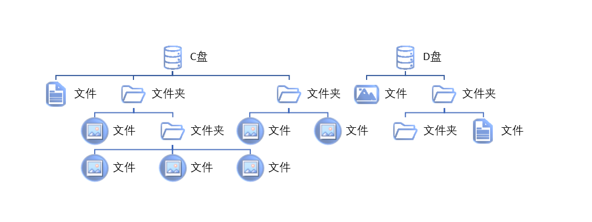

# 文件路径介绍

页面大纲：
[[toc]]

## 什么是文件路径

大部分同学可能是到了大学才接触到电脑这个玩意的。所以不知道文件路径的概念很正常

可以参考维基百科[路径 (计算机科学)](https://w.wiki/5woB)

和智能手机不一样，智能手机的操作逻辑不强调路径的概念

Windows下文件的路径是一个树状的结构，你的C盘，D盘等等都是这个数的起始节点，往下有很多文件夹，每个文件夹又是一个节点，一层一层的套着，文件就是最终的叶子节点



文件的路径一般有两种表达方式，全局路径和相对路径

假设目前你的C盘下是这样的

```text
C:.
+---吃的东西
|   +---水果
|   |   +---苹果
|   |   +---香蕉
|   |   +---梨子
|   |   \---桃子
|   +---蔬菜
|   |   +---菠菜
|   |   +---芹菜
|   |   +---萝卜
|   |   \---茄子
|   +---饮料
|   |   +---可乐
|   |   +---雪碧
|   |   \---咖啡
```

全局路径是从根节点开始的，比如`C盘:\吃的东西\水果\苹果`

相对路径是从当前目录相对而来的，比如你当前目录是`水果`，你想表示`可乐`的话，可以这样表示`..\饮料\可乐`

其中`..\`表示相对于当前目录的上一级目录，这边就表示了`吃的东西`
