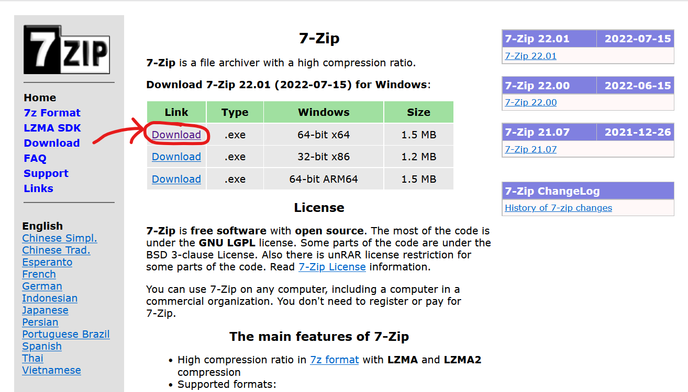
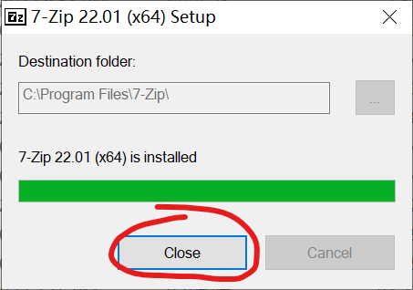
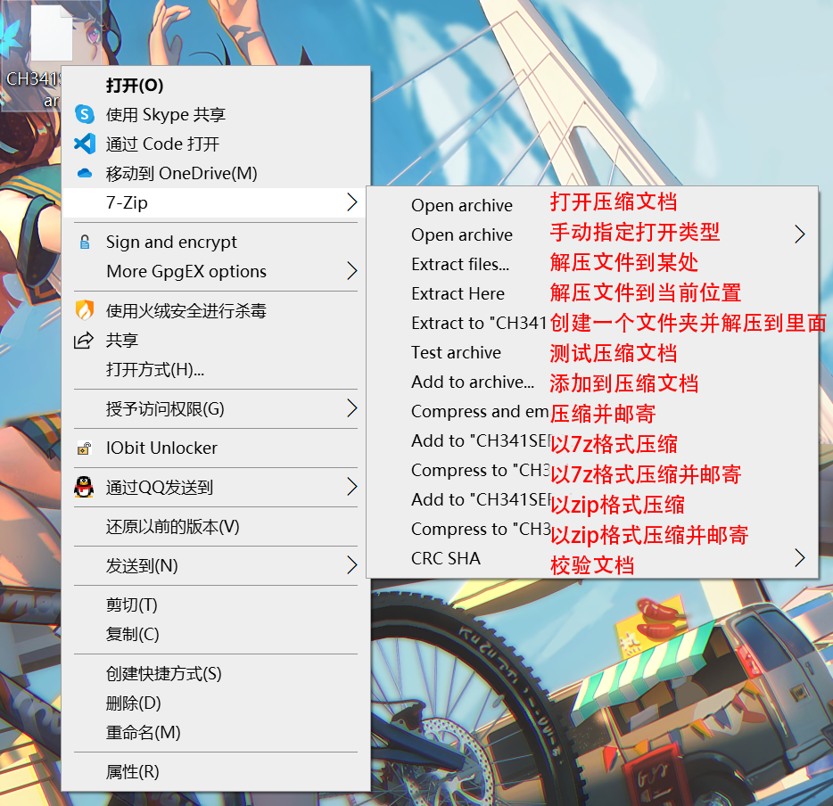
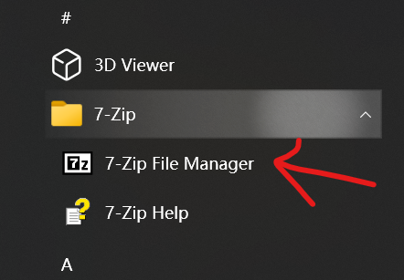
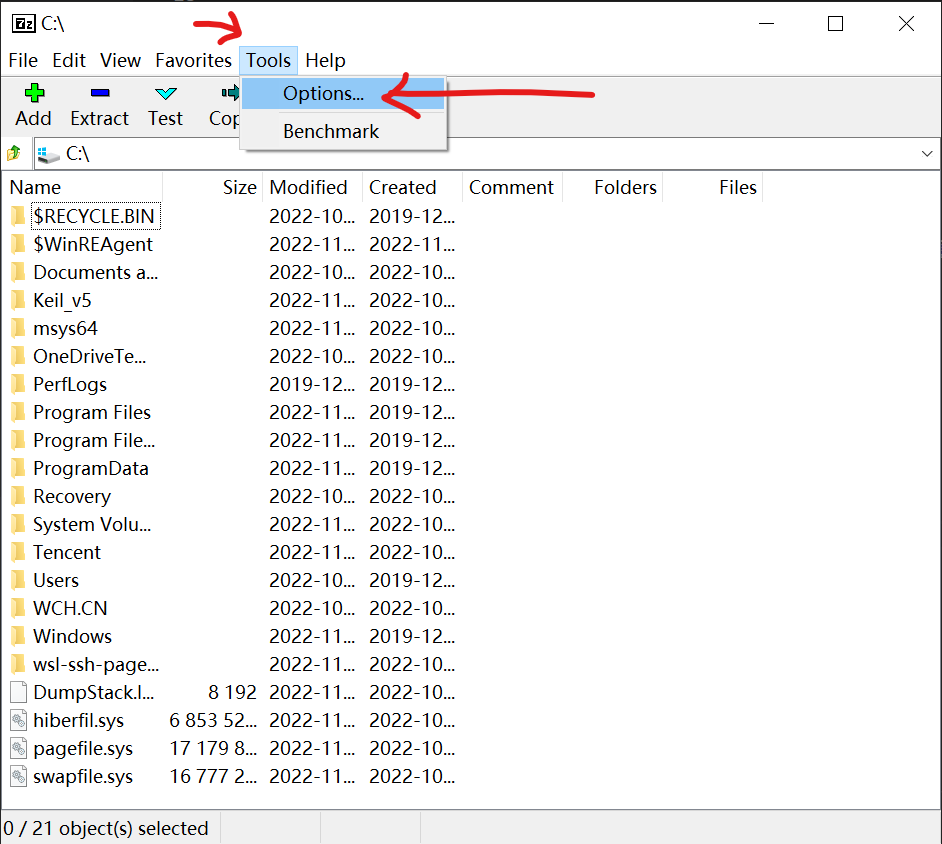
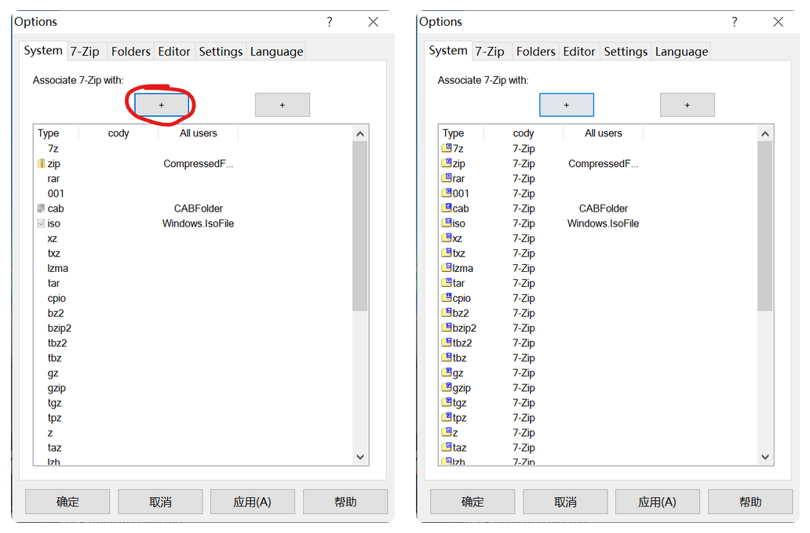
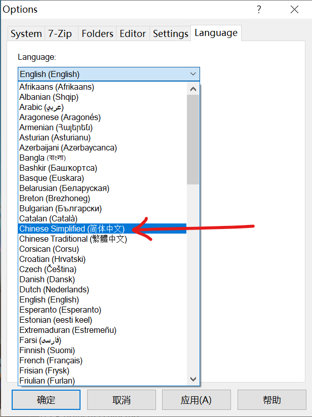

# 7-Zip 安装配置

页面大纲：
[[toc]]

## 前置知识

阅读本篇文章需要的前置知识

- [文件路径的概念](../🐾%20基础概念/文件路径)

## 介绍

压缩软件有很多种，比如国内的`360压缩`，`2345好压`，还有老牌的压缩软件，比如`WinRAR`和`7-Zip`等，可以参考维基百科的[压缩软件比较](https://w.wiki/5wnv)

虽然这些压缩软件的界面可能不太一样，但主要功能都是解压缩

这边推荐的软件是`7-Zip`，理由是免费，无广告，体积小。实际上很多国产压缩软件本质上是`7-Zip`美化了个界面。

在实际使用之前，必须要普及一下[文件路径介绍](../🐾%20基础概念/文件路径)和[压缩文档的概念](7-Zip%20安装配置.md#压缩文档的概念)

## 压缩文档的概念

相信你见过真空压缩袋吧，就是可以把很多衣服都装进去，然后抽出里面的空气，这样就可以很方便的收纳了

压缩文件的概念也差不多

现在假设你妈妈要给你寄衣服，有下面三种方法可以寄

1. 把每一件衣服都作为一个单独的快递件发给你，你收到以后一件一件签收，然后最后还要检查有没有丢失的快递......
2. 把所有衣服装在一个箱子里给你寄过来，衣服的体积和重量不变，但是你签收以后收到一个巨大无比的包裹......
3. 把所有衣服放进真空压缩袋，然后抽出里面的空气，再寄给你，虽然重量没变，但是包裹会小很多

你觉得哪种方法好？

其实在网络传输过程中也是同样的。网络传输类似于现实中的物流，传输一堆小文件，和打包成一个大文件传输的效率哪个高，应该就能理解了吧

我们常见的压缩文档五花八门，常见的格式有 `.zip` `.rar` `.7z` `.tar` 等。还有一些光盘镜像文件 `.iso` `.img` 等也属于压缩文档格式。还有安卓软件的安装包，大部分的安装程序，游戏下载的数据包等都用到了压缩文档技术。

压缩文档虽然方便，但还是有人不清楚其中的概念，闹出了不少笑话。

超市塑料袋应该都用过吧，比如说你有一天想做西红柿炒蛋，去超市买了油、盐、糖、西红柿、鸡蛋、葱，然后放在了一个塑料袋里。回到家里以后，你就拿出了其中的一个西红柿，其他的东西还放在塑料袋里不拿出来，那怎么想都不可能做出西红柿炒蛋吧？

有很多同学容易犯的错误是，通过压缩软件打开了压缩文档以后，没有完全解压，而是直接双击运行了里面的安装程序或软件，然后报出了一堆错误。这是因为安装程序或软件其实依赖了压缩文档里的其他文件才能正常运行。就像上面的例子一样。

## 下载

- [官网](https://www.7-zip.org/)

## 安装

你可以点击右边的三个点选择安装到其他位置，然后点击`Install`开始安装

等几秒钟就会安装完成，点击Close就可以了

## 配置

其实`7-Zip`无需配置可以直接使用，随意右键一个文件或文件夹，就可以通过右键菜单的`7-zip`选项卡进行操作

`7-Zip`默认不关联文件后缀名称，不过可以在设置里关联支持的文件格式

打开`7-Zip`，可以在开始菜单里寻找

然后点击菜单栏上的`Tools`，在下拉菜单里选择`Options`

然后点击左边图片中圈出来的`+`号两次，会变成右边一样

这样文件关联就设置好了

下面是设置语言的方法

切换到`Language`选项卡，然后在下拉菜单中选择简体中文

设置好以后按下方`确定`键就可以保存设置了

## 更好的 7-Zip

官方版本的7-Zip已经非常够用，后面如果需要在windows平台上解压缩更多格式的话，可以尝试[这个版本](https://github.com/mcmilk/7-Zip-zstd)的7-Zip，安装方式和官方版一致
