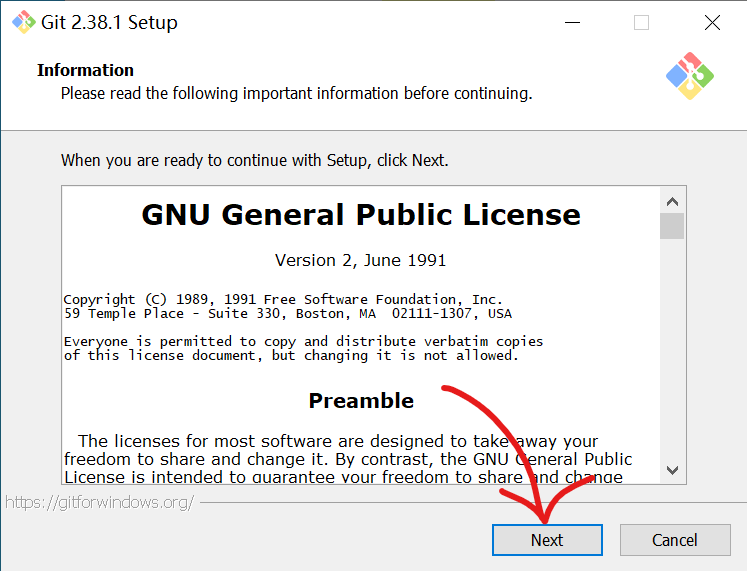
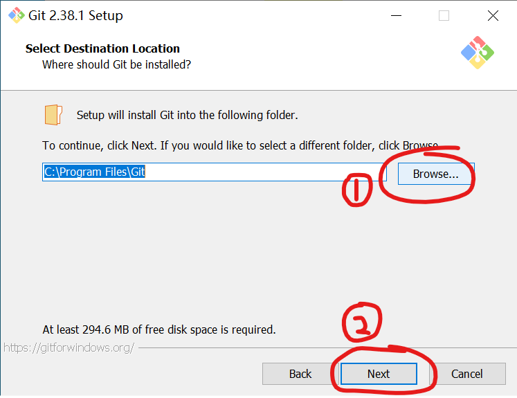
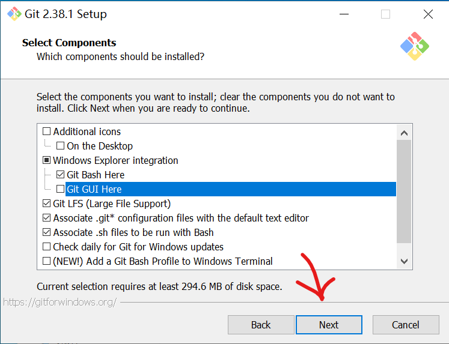
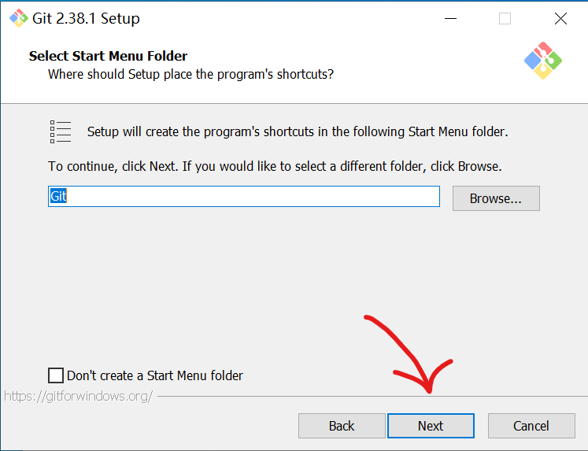
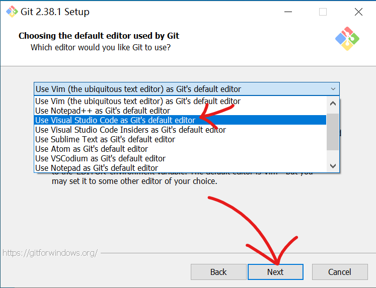
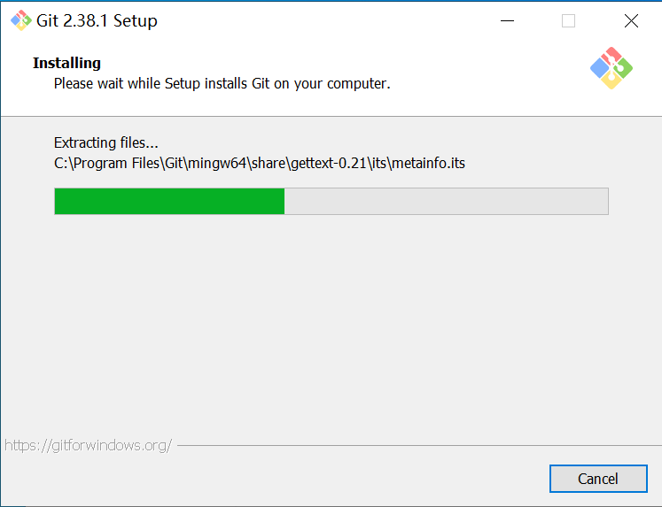
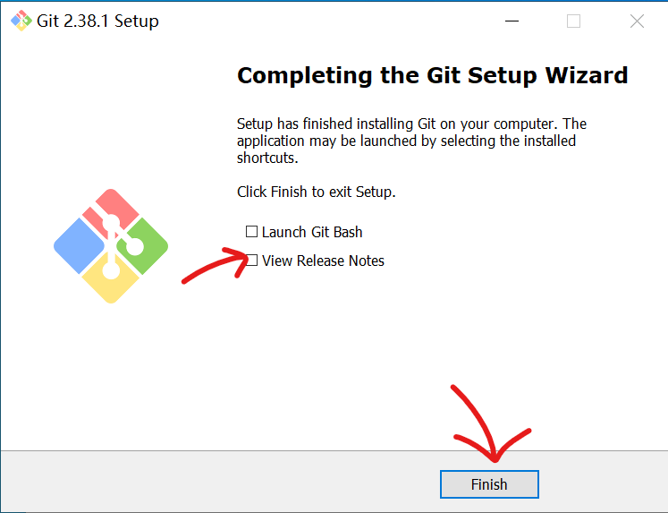

# Git for windows 安装配置

页面大纲：
[[toc]]

## 简介

>GPT生成的回答

Git 是一种广泛使用的**版本控制系统**，用于跟踪和管理项目中的代码变更。它可以帮助开发人员在团队协作或个人开发中有效地记录代码历史，避免文件丢失或版本混乱。

### Git 的作用：
1. **版本管理**：Git 能记录项目的每一个修改，每次提交（commit）都可以视为项目的一个“快照”，开发者可以轻松地查看过去的代码或还原到之前的版本。
2. **多人协作**：团队成员可以各自开发不同的功能，通过 Git 将各自的代码合并在一起，解决冲突并确保每个人都在使用最新版本的代码。
3. **分支管理**：Git 允许开发者在不同的分支上进行开发，不影响主分支（通常称为 `main` 或 `master`）。这样开发者可以在独立的环境中测试新功能，只有在功能完成且经过验证后再合并到主分支中。
4. **分布式系统**：与传统的集中式版本控制系统不同，Git 是分布式的，这意味着每个人的电脑上都有一份完整的项目历史记录。因此，即使没有网络连接，开发者也可以查看历史、提交更改等。

### 基本概念：
- **仓库（Repository）**：存储项目的地方，包含所有代码、文件以及它们的修改历史。
- **提交（Commit）**：将文件的变动保存为一次快照，记录了哪些文件被修改了以及具体的修改内容。
- **分支（Branch）**：用于并行开发的独立工作线。最常用的分支是 `main` 或 `master`，其他分支通常用来开发新功能或修复 bug。
- **合并（Merge）**：将不同分支的变动合并到一起。

总之，Git 是开发人员必备的工具，它不仅能有效管理代码，还能帮助团队成员更好地协作，确保项目的版本控制和开发流程更加高效、规范。

## Git for windows 安装过程

### 需要下载的东西

- [Git官网下载地址](https://git-scm.com/) [Git Tuna镜像下载](https://mirror.tuna.tsinghua.edu.cn/github-release/git-for-windows/git/LatestRelease/)

### Git 安装步骤

点击`Next`

`1`处选择安装目录，路径不可以含有中文，然后点击`Next`

根据自己的需要，可以取消勾选`Git Gui Here`右键菜单选项，然后点击`Next`

然后这边是选择开始菜单目录，直接点击`Next`

这边是设置Git默认配置文件编辑器，可以自由更改，后期可以通过命令修改

后面的页面全部点击`Next`就可以了，一般不需要改，如果有需要可以自己查阅

安装完成，取消勾选`View Release Notes`

然后根据网上的教程配置你的Git账号和邮箱，也可以自己研究如何SSH登录等等

## Linux发行版的安装方式

使用各个发行版的包管理器安装Git即可。
