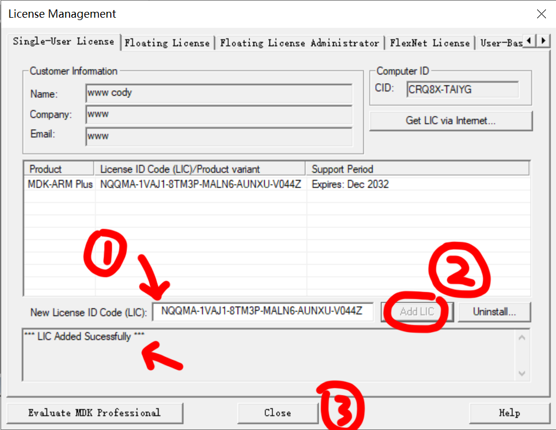

# Keil MDK5 安装破解教程

页面大纲：
[[toc]]

## 前置知识

阅读本篇文章需要的前置知识

- [文件路径的概念](../🐾%20基础概念/文件路径.md)
- [压缩文档的概念](7-Zip%20安装配置.md#压缩文档的概念)
- Keil是干什么的

## 需要的零件

本文中可能需要的零件

- 单片机（STM32F103RCT6或任意其他支持的单片机）
- mini USB 连接线（一般是卖家送的一根，团购的这个单片机可以直接通过USB烧录程序）
- 任意仿真器（stlink v2、Jlink、DAPlink）
- 一台Windows电脑

## 下载

- [Keil MDK 5.39 官网下载](https://armkeil.blob.core.windows.net/eval/MDK539.EXE)

> Keil下载其他版本只需要把链接`https://armkeil.blob.core.windows.net/eval/MDK539.EXE`最后的三个数字改成你想要的版本就行

- [Keil MDK 注册机](https://1drv.ms/u/s!ApkfmL_xaiYQmpkOJVTvugKPaNsuYA?e=THJGzU) Onedrive 分享 密码: 1234

下面是`STM32CubeMX`和`STM32CubeIDE`的下载链接，**注意需要先安装`Java`运行环境**

- [Java SE 11.0.17 官网下载](https://www.oracle.com/cn/java/technologies/downloads/#java11-windows)
- [STM32CubeMX 官网下载](https://www.st.com/content/st_com/en/products/development-tools/software-development-tools/stm32-software-development-tools/stm32-configurators-and-code-generators/stm32cubemx.html#get-software)
- [STM32CubeIDE 官网下载](https://www.st.com/content/st_com/en/products/development-tools/software-development-tools/stm32-software-development-tools/stm32-ides/stm32cubeide.html#overview)

下面是几个可能用得到的设备驱动程序，用得到的话需要安装对应的驱动程序

- [CH340 驱动 官网下载](http://www.wch-ic.com/downloads/CH341SER_EXE.html)

- [STLink V2 驱动 官网下载](https://www.st.com/zh/development-tools/st-link-v2.html#tools-software)

- [Jlink 驱动 官网下载](https://www.segger.com/downloads/jlink)

下面是之前从不知道哪边得到的资料包，好像是从淘宝商家那边下载的，没啥用，有需要的自己下载

- [STM32F103RCT6 资料包](https://1drv.ms/u/s!ApkfmL_xaiYQhfsHyR_kbNgAzLfsmA?e=IUIhL8) Onedrive 分享 密码: 1234

## 安装教程

### 安装之前的环境准备

首先你电脑里至少需要一种解压缩软件，如果你不知道的话，请看这个文章

[解压缩软件安装教程](/文档/👋环境配置/7-Zip%20安装配置.md)

安装STM32CubeMX之前需要先安装Java运行时环境。因为STM32CubeMX是使用Java编写的软件，所以需要先装Java

首先下载Java [Java SE 11.0.17 官网下载](https://www.oracle.com/cn/java/technologies/downloads/#java11-windows)

点击下一步开始安装

这边可以选择你安装的位置，点击下一步

安装完成以后点击关闭就行

### 安装 Keil MDK 5

首先打开安装文件，这边以5.37版本为例，其他版本的安装破解流程基本一致

点击`Next>>`

勾选`I agree to all ...`，点击`Next>>`

这边是选择安装位置的，上面的是Keil本身安装的位置，下面的是对应的开发板的开发套件的安装位置，设置好以后点击`Next>>`

这边的信息请随意填写，点击`Next>>`

接下来的安装过程中可能会弹出类似的驱动软件安装窗口好几次，请一律同意安装

安装结束后点击`Finish`退出

第一次运行会弹出这样一个窗口，点击一下`OK`，然后等待下方的进度条下载索引文件，如果太慢或者卡住说明你网络不好，请用实验室的网络

<!-- markdownlint-disable -->

  
  

<!-- markdownlint-restore -->

索引下载完成以后就可以关闭这个窗口了

### 注册 Keil MDK 5

右键桌面上的`Keil uVision`，以管理员身份运行

<!-- markdownlint-disable -->

  
  

> [!WARNING] 确保关闭电脑上的杀毒软件

打开 `File` - `License Management...`

选中CID，然后右键复制

打开`Keil注册机.zip`压缩包内的`keygen.exe`

> [!WARNING]注册机是用来破解的软件，注意这个软件可能会被杀毒软件查杀，如果杀毒软件有提示请放行。**这个软件有点吵，戴耳机的同学注意一下**

然后将刚刚复制的CID粘贴到1位置，在2位置的下拉菜单里选择ARM，然后在3位置的下拉选单里选择`Prof.Developers Kit (Plus)`，然后点击4位置的`Generate`，然后复制5位置的一串密码

然后回到刚刚Keil的证书界面，请确保你已经以管理员身份运行

将刚刚复制的密码粘贴到1位置，然后点击2位置的`Add LIC`，确认箭头部分显示的是`***LIC Added Successfully***`，然后上面的列表会有一行刚刚添加的证书，然后点击3位置的`Close`关闭界面

至此，Keil的安装破解已经完成，记得重新打开杀毒软件哦

### 安装 STM32CubeMX

首先需要按照[这边的步骤](/文档/👋环境配置/Keil%20MDK5%20安装破解教程.md#安装之前的环境准备)安装好Java运行时环境

解压并双击打开安装程序，等待安装程序自解压完成

点击`Next`开始安装

勾选`I accept the...`，点击`Next`

勾选`I have read and understand...`，点击`Next`

选择安装位置，点击`Next`

点击`Next`

等待安装完成，点击`Next`

点击`Done`

然后`STM32CubeMX`就安装完成了

### 安装驱动程序

硬件要在操作系统上正常使用就需要安装对应的软件，也就是驱动程序

下面是几个可能用得到的设备驱动程序，用得到的话需要安装对应的驱动程序

下面是 `CH340 USB 转 TTL` 模块

<!-- markdownlint-disable -->

  
  

<!-- markdownlint-restore -->

- [CH340 驱动 官网下载](http://www.wch-ic.com/downloads/CH341SER_EXE.html)

::: tip

大家买的 `STM32F103RCT6` 有些是内置 `CH340 USB 转 TTL` 芯片的，比如图中这款，也需要安装这个驱动

<!-- markdownlint-disable -->

  

<!-- markdownlint-restore -->

:::

下面是ST Link V2 仿真器的样子

<!-- markdownlint-disable -->

  

<!-- markdownlint-restore -->

- [STLink V2 驱动 官网下载](https://www.st.com/zh/development-tools/st-link-v2.html#tools-software)

还有一种 `DAP Link` 仿真器，这种是免驱动的

<!-- markdownlint-disable -->

  
  

<!-- markdownlint-restore -->

下面是Jlink仿真器的驱动，如果你有的话也需要安装驱动

- [Jlink 驱动 官网下载](https://www.segger.com/downloads/jlink)
