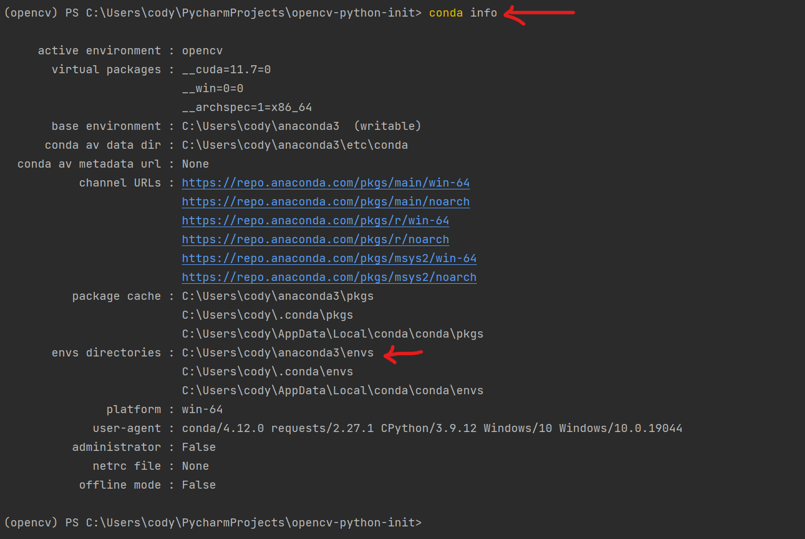

# Python Opencv 环境配置

页面大纲：
[[toc]]

## 前置知识

阅读本篇文章需要的前置知识

- [文件路径的概念](../🐾%20基础概念/文件路径.md)
- [压缩文档的概念](7-Zip%20安装配置.md#压缩文档的概念)

## 安装python，并正确配置和安装环境

::: danger
请检查你的用户名是否为中文

按下`windows徽标+R`组合键，输入powershell


如果箭头所指的部分和图片中的一样，是英文或数字的话，就没问题

如果是中文的话，请参考[中文用户名conda安装配置方法](/文档/👋环境配置/windows中文用户名conda安装配置.md)

:::

### 1. 安装和配置conda

我们需要安装`Anaconda3`。前往[Anaconda的官网](https://www.anaconda.com/)下载安装包


然后打开安装软件，点击`Next`


点击`I Agree`


这边请选择`Just me`仅为当前用户安装


然后这边选择安装位置，如果这边显示的目录里有中文，请参考[中文用户名conda安装配置方法](/文档/👋环境配置/windows中文用户名conda安装配置.md)

目录会随着你创建的虚拟环境而变大，如果你的硬盘空间不足的话请安装到其他位置，但路径里不可以有中文

<!-- markdownlint-disable -->

<div class="image-preview">
  
  
</div>

<style>
  .image-preview {
    display: flex;
    justify-content: space-evenly;
    align-items: center;
    flex-wrap: wrap;
  }

  .image-preview > img {
     box-sizing: border-box;
     width: 50% !important;
     padding: 9px;
     border-radius: 16px;
  }

  @media (max-width: 719px){
    .image-preview > img {
      width: 100% !important;
    }
  }

  @media (max-width: 419px){
    .image-preview > img {
      width: 100% !important;
    }
  }
</style>

<!-- markdownlint-restore -->

::: details 过时的内容(不需要看)

1.首先安装Python和Anaconda

:::

2.配置conda环境变量，**按照你conda安装的位置来**，默认情况下安装位置是C盘用户目录下

比如你安装在`D:\anaconda3\`则需要添加的path有下面四条

```commandline
D:\anaconda3\
D:\anaconda3\Scripts
D:\anaconda3\Library\bin
D:\anaconda3\Library\mingw-w64
```

什么？你说你不会设置环境变量？那就参考这个文章吧：[如何设置系统环境变量](/文档/🧑‍🔧一些技巧/windows设置Path环境变量.md)

2.然后需要开启Powershell运行PS脚本的限制

这边需要**选择你的系统版本**，windows10和windows11略有不同

#### 如果你使用的是win10

按下`windows徽标键+R`组合键，在弹出的输入框内输入`powershell`，然后同时按下`Ctrl+Shift+回车`三个键，会弹出一个提示，点`是`就行

然后在黑窗口内输入下面的一行命令并回车

```commandline
set-executionpolicy remotesigned
```

会出现下面的信息

```commandline
执行策略更改
执行策略可帮助你防止执行不信任的脚本。更改执行策略可能会产生安全风险，如 https:/go.microsoft.com/fwlink/?LinkID=135170
中的 about_Execution_Policies 帮助主题所述。是否要更改执行策略?
[Y] 是(Y)  [A] 全是(A)  [N] 否(N)  [L] 全否(L)  [S] 暂停(S)  [?] 帮助 (默认值为“N”):
```

然后输入大写的`Y`，敲击回车

继续在powershell里输入

```commandline
Get-ExecutionPolicy
```

如果显示的是 `RemoteSigned`说明设置成功了

#### 如果你使用的是win11

按下`windows徽标键+R`组合键，在弹出的输入框内输入`wt`，然后同时按下`Ctrl+Shift+回车`三个键，会弹出一个提示，点`是`就行

然后在黑窗口内输入下面的一行命令并回车

```commandline
set-executionpolicy remotesigned
```

继续在powershell里输入

```commandline
Get-ExecutionPolicy
```

如果显示的是 `RemoteSigned`说明设置成功了

3.接下来需要初始化conda环境

#### 如果你使用的是win10

按下`windows徽标键+R`组合键，在弹出的输入框内输入`powershell`，然后同时按下`Ctrl+Shift+回车`三个键，会弹出一个提示，点`是`就行

然后在黑窗口内输入下面的一行命令并回车

```commandline
conda init powershell
```

然后关闭powershell

再次打开powershell的时候如果出现这个就说明你初始化成功了


#### 如果你使用的是win11

按下`windows徽标键+R`组合键，在弹出的输入框内输入`wt`，然后同时按下`Ctrl+Shift+回车`三个键，会弹出一个提示，点`是`就行

然后在黑窗口内输入下面的一行命令并回车

```commandline
conda init powershell
```

然后关闭powershell

再次打开powershell的时候如果出现这个就说明你初始化成功了


::: tip
到这边你已经完成了conda环境的初始化
:::

### 2. 配置conda环境

::: tip
conda下载速度可能会很慢，推荐先食用下面的解决方法
:::

::: details conda下载速度慢的解决方法

有两种方法

1.如果你有代理服务器，在终端中输入

```commandline
$Env:http_proxy="http://127.0.0.1:7893";$Env:https_proxy="http://127.0.0.1:7893"
#改成你自己的端口号
```

2.如果你没有代理服务器，可以使用conda镜像

同时按下`windows徽标键`+`R`，在左下角弹出界面输入框内输入`powershell`

在powershell中输入`conda config --set show_channel_urls yes`

同时按下`windows徽标键`+`R`

在左下角弹出的窗口内输入`notepad %HOMEPATH%\.condarc`然后点击确定

在弹出的记事本中所有的文字删除，并以下面的文字替代

```text
channels:
  - defaults
show_channel_urls: true
default_channels:
  - https://mirrors.tuna.tsinghua.edu.cn/anaconda/pkgs/main
  - https://mirrors.tuna.tsinghua.edu.cn/anaconda/pkgs/r
  - https://mirrors.tuna.tsinghua.edu.cn/anaconda/pkgs/msys2
custom_channels:
  conda-forge: https://mirrors.tuna.tsinghua.edu.cn/anaconda/cloud
  msys2: https://mirrors.tuna.tsinghua.edu.cn/anaconda/cloud
  bioconda: https://mirrors.tuna.tsinghua.edu.cn/anaconda/cloud
  menpo: https://mirrors.tuna.tsinghua.edu.cn/anaconda/cloud
  pytorch: https://mirrors.tuna.tsinghua.edu.cn/anaconda/cloud
  pytorch-lts: https://mirrors.tuna.tsinghua.edu.cn/anaconda/cloud
  simpleitk: https://mirrors.tuna.tsinghua.edu.cn/anaconda/cloud
```

然后按`Ctrl`+`S`保存修改

:::

首先创建一个conda环境,`<conda环境名称>`可以自定义，后面的python版本也可以自定义

```commandline
conda create -n <conda环境名称> python=<python版本>
```

比如我想创建一个环境名称是`opencv`，python版本是3.10的虚拟环境，我就输入

```commandline
conda create -n opencv python=3.10
```

安装环境的时候会提示是否确认安装，按照提示输入y并回车就可以了

接下来进入`opencv`环境

```commandline
conda activate opencv
```

这个时候你的终端最左侧应该会从`(base)`变成`(opencv)`或者`<conda环境名称>`


## 配置IDE

### Pycharm 安装配置

`Pycharm` 是一个编写Python语言的集成开发环境

首先下载 `Pycharm` 这边我们下载Community社区版。别问专业版怎么搞，我们不提供盗版，请自行购买正版。目前学习阶段是用不到专业版功能的，等你真正有需求的时候，你已经上班了，你的老板会给你买的。

[官网下载地址](https://www.jetbrains.com/zh-cn/pycharm/download/#section=windows)


打开安装程序，按`Next >`


这边选择安装目录，请不要含有中文


这边根据需要自行选择勾选


这边直接下一步


这边就安装完成了


然后打开Pycharm，**请确保你已经安装好了Git**

点击第三个按钮`Get from VCS`


在弹出的窗口内，URL一栏内填入我们的示例仓库地址`https://github.com/We-Fly/opencv-python-init.git`，然后选择一个位置存放你的仓库，然后点击下方的Clone按钮克隆仓库


克隆完成以后，会提示你是否信任仓库，如果你嫌麻烦的话，可以勾选信任父文件夹，以后放在这个文件夹下的项目都不会再提示是否信任了。然后点击`Trust Project`


打开仓库文件夹后，第一次会提示配置虚拟环境，请直接点击`Cancel`取消


先做最重要的事情，点击上方的 `File` - `Settings...`


在弹出的界面左侧选择Plugins标签页。搜索框内输入`chinese`，第二个插件就是我们需要的中文语言包，点击`install`安装


安装过程如果卡住，请检查网络情况，如果实在不行，请使用实验室网络下载

安装完成后，会提示你重启IDE，请点击`Restart IDE`


会让你确认是否重启，点击`Restart`


重启后点击刚刚的项目


打开后，页面右下角应该是显示`<无解释器>`，点一下，选择`添加新的解释器` - `添加本地解释器...`


在弹出的界面左侧，选择Conda 环境，确认箭头所指的`Conda 可执行文件`是否存在，如果没有的话，请手动找到你安装的anaconda可执行文件。然后点击右上角的三个小点点


在弹出的界面里，找到你的环境位置，然后选择`环境名称目录`下的`python.exe`


如果你找不到环境装到哪里去了，请在终端输入

```powershell
conda info
```

然后找到`envs directories`，一般第一个位置就是



然后勾选可用于所有项目，然后点击确定


此时界面右下角会变成你刚刚选择的`conda`虚拟环境，比如我就是`Python 3.10(opencv)`

如果你这边不是你设置的环境，请点击一下，然后切换过来


然后点击下方的终端按钮，会弹出一个powershell终端

请先尝试阅读仓库的README文档

根据刚刚克隆的仓库的自述文档描述，在终端内输入

```powershell
conda activate your_conda_env_name
# 改成你的conda环境名称,比如opencv
python setup.py
```

就会自动安装opencv-python和其他软件包


> [!WARNING]
>运行setup.py会安装到前面括号对应的conda环境，Pycharm右下角需要切换到对应的环境才行
>参考[FAQ](/文档/✍️写在前面/常见问题.md#nameerror-name-cv2-is-not-defined-did-you-mean-cv)

然后双击打开左侧的`demo.py`

点击上方的运行按钮


如果弹出了这个窗口说明你已经配置完成了


### VSCode 安装配置

首先点击`文件` - `新建窗口`创建一个新窗口

然后点击克隆仓库，将示例仓库地址粘贴进去`https://github.com/We-Fly/opencv-python-init.git`然后按回车


会弹出一个窗口让你选择克隆下拉的仓库放到哪里，你自己选一个合适的位置就行


克隆完成以后，会提示是否打开仓库，点击打开就行


这边会询问你是否信任仓库，可以勾选信任父文件夹，这样下次其他克隆到这个位置的仓库就不用再点信任了。


注意，右下角会提示是否安装推荐插件，点击`install`

如果你不小心关掉了，或者没弹出来这个窗口，就在侧边栏的插件里搜索`@recommended`，然后安装所有的推荐插件


如果插件安装过程中有这个问题，请等插件都安装完成以后点击那个按钮


然后点击图片右下角的这个数字，一般是这个默认的python解释器，我们点一下，会弹出上面的这个窗口，你选择你创建的conda虚拟环境，比如这边的`Python 3.10.6 (opencv)`


右下角会变成你刚刚选择的解释器


点击上方的`终端` - `新建终端`，下方会自动切换到你设置的conda环境


确保已经切换到了你的虚拟环境，如果没有，输入

```powershell
conda init your_conda_env_name
# 改成你的conda虚拟环境名称
```

在终端中输入

```powershell
python setup.py
```

等待自动安装依赖


然后输入

```powershell
python demo.py
```

如果弹出了这个小飞机图片，就说明环境配置成功了


