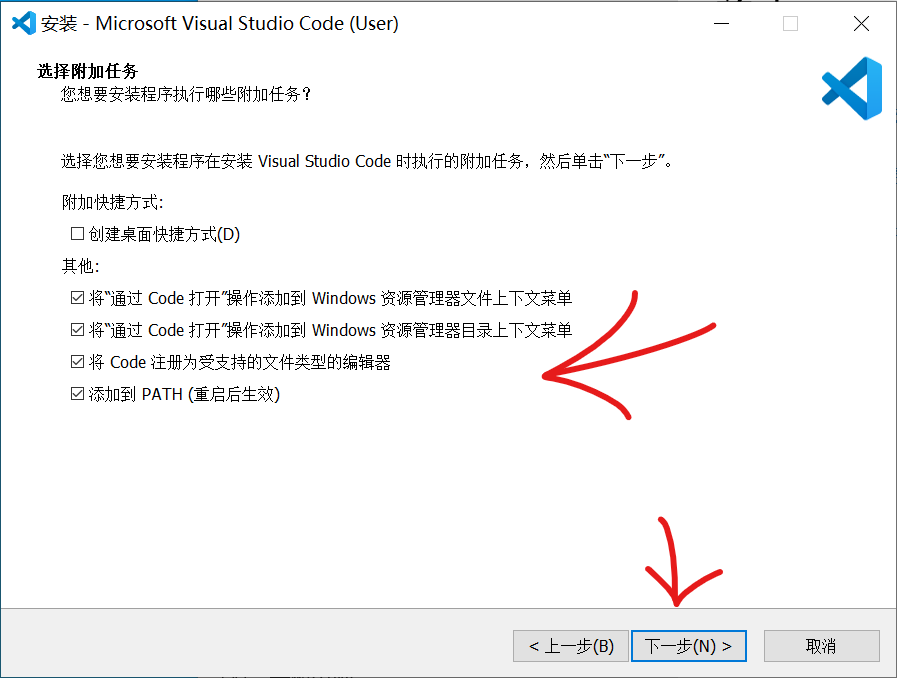

# Visual Studio Code 安装配置

页面大纲：
[[toc]]

>[!WARNING]
可以参阅[OI Wiki的教程](https://oi.wiki/tools/editor/vscode/)

## 前置知识

阅读本篇文章需要的前置知识

- 电脑已经[安装Git](Git%20for%20windows%20安装配置.md)并且会[使用Git](https://www.runoob.com/git/git-tutorial.html)
- 会[设置环境变量](../🧑‍🔧%20一些技巧/windows设置Path环境变量.md)

## 简介

### VS Code 介绍

`Visual Studio Code`（简称 `VS Code`）是一款轻量级的文本编辑器，因其丰富的插件生态而广受欢迎。大多数功能都通过插件实现，用户可以根据需要自由扩展。然而，需注意的是，`VS Code` 与 `Visual Studio` 并非同一款软件，二者的关系类似于 `JavaScript` 与 `Java`——它们是完全不同的两个工具。`VS Code` 由微软基于 `Electron` 框架开发，得益于 `Electron` 的强大跨平台能力，`VS Code` 可以在 Windows、macOS 和 Linux 等多种操作系统上流畅运行。

你可以使用 `VS Code` 进行 `C/C++` 开发。在项目的早期阶段，我们采用了 `VS Code` 和 `CMake` 进行基于 `C++` 语言的 OpenCV 开发。

在转向使用 `Python` 语言进行 OpenCV 开发后，我们继续使用 `VS Code` 作为主要的开发工具，当然，也有团队成员使用 `PyCharm` 进行开发。

得益于 `VS Code` 强大的插件生态，甚至可以通过 `Platform IO` 插件进行单片机开发和调试。

本篇文章将主要介绍如何安装和配置 `VS Code` 以进行 `C/C++` 开发，其他功能可以自行探索与体验。

### MSYS2 介绍

MSYS2 是一个面向 Windows 的软件分发和构建平台，提供开发人员使用的工具和库。它通过命令行终端（如 mintty 和 bash）和版本控制系统（如 Git、Subversion）帮助开发者构建和运行原生 Windows 软件。MSYS2 依赖 Pacman 作为包管理器，使用户能够轻松安装、更新和管理数千个预构建的软件包，如 GCC、Python、CMake 等。MSYS2 旨在为开发者提供简便的构建和开发环境。更多信息请访问 [MSYS2 官网](https://www.msys2.org/)。

>GPT生成内容

### 典型的使用场景：
1. **跨平台开发**：开发者可以在 Windows 上模拟 Linux 环境，以测试或开发需要在不同操作系统上运行的应用程序。
2. **原生 Windows 应用开发**：使用 MinGW-w64 工具链，开发者可以编译和链接适用于 Windows 的程序，而无需依赖 Cygwin 这样的兼容层。
3. **轻松安装工具**：通过 Pacman，用户可以迅速安装所需的开发工具或库，无需手动下载和配置。

#### 总结
MSYS2 是一个强大的工具，特别适合那些习惯了 Linux 或 Unix 环境的开发者。它通过提供兼容的工具和包管理系统，使 Windows 成为一个更灵活和强大的开发平台，无论是进行跨平台开发还是构建原生 Windows 应用程序。

## C++ 开发环境安装过程

### 需要下载的东西

- [Visual Studio Code](https://code.visualstudio.com/)
- [msys2官网下载](https://www.msys2.org/) [msys2 Tuna镜像下载](https://mirrors.tuna.tsinghua.edu.cn/msys2/distrib/x86_64/)

::: details msys2 Tuna镜像下载提示
请访问该镜像目录，翻到最下面，找到名为 `msys2-x86_64-<日期>.exe` 的文件（如 `msys2-x86_64-20221028.exe`），下载安装即可。
:::

<!-- markdownlint-disable -->

<div class="image-preview">
  
  
</div>

<style>
  .image-preview {
    display: flex;
    justify-content: space-evenly;
    align-items: center;
    flex-wrap: wrap;
  }

  .image-preview > img {
     box-sizing: border-box;
     width: 33.3% !important;
     padding: 9px;
     border-radius: 16px;
  }

  @media (max-width: 719px){
    .image-preview > img {
      width: 50% !important;
    }
  }

  @media (max-width: 419px){
    .image-preview > img {
      width: 100% !important;
    }
  }
</style>

<!-- markdownlint-restore -->

<!-- ### CMake 安装步骤

点击`Next`


勾选下方`I accept ...`，点击`Next`


点击`Add CMake to the system PATH for the current user`，点击`Next`


选择安装目录，路径不可以含有中文，然后点击`Next`


点击`Install`


等待安装结束


::: -->

### msys2 安装步骤

[官方安装步骤【英文】](https://www.msys2.org/)

#### 开始安装

点击`Next`


选择安装位置

> [!WARNING]
>如果这边改了路径，后面所有`C:\msys64`都需要修改成你的安装位置（无中文和空格以及特殊字符等）  
>由于后期会陆续安装很多软件包，文件夹会越来越大，如果C盘空间不足的请自行更改安装位置，但路径中**不要有中文字符**


这边是修改开始菜单的名称，保留默认，点击`Next`就行


安装过程可能会卡住，但一般在`5分钟左右`


安装完成页面如图，点击`Next`


点击`Finish`，退出安装程序，会出现下面的UCRT64环境的终端界面


参考[这个文章](/文档/🧑‍🔧一些技巧/windows设置Path环境变量.md)，**修改环境变量**，添加一条`C:\msys64\ucrt64\bin`如果你修改过安装位置需要把开头的路径修改成对应的位置

在`开始菜单`中找到`MSYS2 UCRT64`文件夹，然后点击运行，会出现上面的黑色终端窗口

> [!WARNING]
这个黑框框是**不能直接粘贴**的，需要右键，然后点击`Paste`，后面代码都不能直接用`ctrl+v`快捷键粘贴

然后是换源，请参考[Tuna - MSYS2 镜像使用帮助](https://mirror.tuna.tsinghua.edu.cn/help/msys2/)

直接在 `MSYS2 UCRT64` 黑窗口内执行一行命令

```bash
sed -i "s#https\?://mirror.msys2.org/#https://mirrors.tuna.tsinghua.edu.cn/msys2/#g" /etc/pacman.d/mirrorlist*
```

然后在黑框框里输入`pacman -Syu`更新一下系统

中途会卡住，问你 `:: Proceed with installation? [Y/n]` 是提示你是否继续，直接按回车就行


::: details 黑框框应该会有类似的输出

```bash
Dustella@DESKTOP-VMFH9JG MINGW64 ~ 
# pacman -Syu
:: Synchronizing package databases...
 mingw32                        1732.9 KiB   622 KiB/s 00:03 [###############################] 100%
 mingw64                        1747.5 KiB   545 KiB/s 00:03 [###############################] 100%
 ucrt64                         1796.2 KiB   625 KiB/s 00:03 [###############################] 100%
 clang32                        1676.0 KiB   431 KiB/s 00:04 [###############################] 100%
 clang64                        1736.6 KiB   664 KiB/s 00:03 [###############################] 100%
 msys                            409.0 KiB   251 KiB/s 00:02 [###############################] 100%

:: Starting core system upgrade...
warning: terminate other MSYS2 programs before proceeding
resolving dependencies...
looking for conflicting packages...

Packages (2) filesystem-2022.01-6  pacman-6.0.1-24

Total Download Size:    5.62 MiB
Total Installed Size:  33.00 MiB
Net Upgrade Size:       0.16 MiB

:: Proceed with installation? [Y/n]
:: Retrieving packages...
 filesystem-2022.01-6-x86_64     107.7 KiB   139 KiB/s 00:01 [###############################] 100%
 pacman-6.0.1-24-x86_64            5.5 MiB  3.26 MiB/s 00:02 [###############################] 100%
 Total (2/2)                       5.6 MiB  3.24 MiB/s 00:02 [###############################] 100%
(2/2) checking keys in keyring                               [###############################] 100%
(2/2) checking package integrity                             [###############################] 100%
(2/2) loading package files                                  [###############################] 100%
(2/2) checking for file conflicts                            [###############################] 100%
(2/2) checking available disk space                          [###############################] 100%
:: Processing package changes...
(1/2) upgrading filesystem                                   [###############################] 100%
(2/2) upgrading pacman                                       [###############################] 100%
:: To complete this update all MSYS2 processes including this terminal will be closed. Confirm to proceed [Y/n]
```

:::

最后会有提示你会关闭窗口`:: To complete this update all MSYS2 processes including this terminal will be closed. Confirm to proceed [Y/n]`

直接回车确认就好


然后再次打开`MSYS2 UCRT64`窗口

输入`pacman -Syyu`

::: details 黑框框应该会有类似的输出

```bash
cody@DESKTOP-AE86 UCRT64 ~
$ pacman -Syyu
:: Synchronizing package databases...
 clangarm64                      419.3 KiB  1033 KiB/s 00:00 [###############################] 100%
 mingw32                         212.2 KiB   724 KiB/s 00:00 [###############################] 100%
 mingw64                         446.3 KiB  1193 KiB/s 00:00 [###############################] 100%
 ucrt64                          473.9 KiB  1305 KiB/s 00:00 [###############################] 100%
 clang32                         198.2 KiB   644 KiB/s 00:00 [###############################] 100%
 clang64                         458.4 KiB  4.07 MiB/s 00:00 [###############################] 100%
 msys                            289.4 KiB  1891 KiB/s 00:00 [###############################] 100%
:: Starting core system upgrade...
 there is nothing to do
:: Starting full system upgrade...
resolving dependencies...
looking for conflicting packages...

Packages (9) curl-8.9.1-1  libcurl-8.9.1-1  libexpat-2.6.3-1  libgnutls-3.8.7-1
             libnghttp2-1.63.0-1  libopenssl-3.3.2-1  libreadline-8.2.013-1  libsqlite-3.46.1-1
             openssl-3.3.2-1

Total Download Size:    5.93 MiB
Total Installed Size:  13.63 MiB
Net Upgrade Size:       0.01 MiB

:: Proceed with installation? [Y/n]
:: Retrieving packages...
 libopenssl-3.3.2-1-x86_64      1833.8 KiB  5.21 MiB/s 00:00 [###############################] 100%
 libgnutls-3.8.7-1-x86_64       1410.9 KiB  3.09 MiB/s 00:00 [###############################] 100%
 curl-8.9.1-1-x86_64             798.4 KiB  1512 KiB/s 00:01 [###############################] 100%
 libsqlite-3.46.1-1-x86_64       682.7 KiB  1181 KiB/s 00:01 [###############################] 100%
 openssl-3.3.2-1-x86_64          629.6 KiB  1014 KiB/s 00:01 [###############################] 100%
 libcurl-8.9.1-1-x86_64          299.2 KiB  4.12 MiB/s 00:00 [###############################] 100%
 libreadline-8.2.013-1-x86_64    292.3 KiB  2.97 MiB/s 00:00 [###############################] 100%
 libnghttp2-1.63.0-1-x86_64       66.7 KiB   661 KiB/s 00:00 [###############################] 100%
 libexpat-2.6.3-1-x86_64          57.3 KiB   546 KiB/s 00:00 [###############################] 100%
 Total (9/9)                       5.9 MiB  7.40 MiB/s 00:01 [###############################] 100%
(9/9) checking keys in keyring                               [###############################] 100%
(9/9) checking package integrity                             [###############################] 100%
(9/9) loading package files                                  [###############################] 100%
(9/9) checking for file conflicts                            [###############################] 100%
(9/9) checking available disk space                          [###############################] 100%
:: Processing package changes...
(1/9) upgrading libnghttp2                                   [###############################] 100%
(2/9) upgrading libopenssl                                   [###############################] 100%
(3/9) upgrading openssl                                      [###############################] 100%
(4/9) upgrading libsqlite                                    [###############################] 100%
(5/9) upgrading libcurl                                      [###############################] 100%
(6/9) upgrading curl                                         [###############################] 100%
(7/9) upgrading libexpat                                     [###############################] 100%
(8/9) upgrading libgnutls                                    [###############################] 100%
(9/9) upgrading libreadline                                  [###############################] 100%
:: Running post-transaction hooks...
(1/1) Updating the info directory file...
```

:::

这样就可以了

如果期间有错误什么的，确认一下你之前换源的时候，有没有添加到第一行

然后安装完整的MINGW工具链

```bash
pacman -S --needed base-devel mingw-w64-ucrt-x86_64-toolchain mingw-w64-ucrt-x86_64-cmake mingw-w64-ucrt-x86_64-ninja
```

上面的完整的MINGW工具链安装完成后会占用很大的空间 345M -> 1.58 G

安装过程中，根据程序的提示，可以自行选择软件包安装，或者一路按回车默认全部安装就行

根据网络和电脑配置，这个过程会持续5~10分钟

::: details 黑框框应该会有类似的输出

```bash
cody@DESKTOP-AE86 UCRT64 ~
$ pacman -S --needed base-devel mingw-w64-ucrt-x86_64-toolchain mingw-w64-ucrt-x86_64-cmake mingw-w64-ucrt-x86_64-ninja
:: There are 13 members in group mingw-w64-ucrt-x86_64-toolchain:
:: Repository ucrt64
   1) mingw-w64-ucrt-x86_64-binutils  2) mingw-w64-ucrt-x86_64-crt-git
   3) mingw-w64-ucrt-x86_64-gcc  4) mingw-w64-ucrt-x86_64-gdb
   5) mingw-w64-ucrt-x86_64-gdb-multiarch  6) mingw-w64-ucrt-x86_64-headers-git
   7) mingw-w64-ucrt-x86_64-libmangle-git  8) mingw-w64-ucrt-x86_64-libwinpthread-git
   9) mingw-w64-ucrt-x86_64-make  10) mingw-w64-ucrt-x86_64-pkgconf
   11) mingw-w64-ucrt-x86_64-tools-git  12) mingw-w64-ucrt-x86_64-winpthreads-git
   13) mingw-w64-ucrt-x86_64-winstorecompat-git

Enter a selection (default=all):
resolving dependencies...
looking for conflicting packages...

Packages (74) binutils-2.43.1-1  bison-3.8.2-5  diffstat-1.66-1  diffutils-3.10-1  dos2unix-7.5.2-1
              flex-2.6.4-3  m4-1.4.19-2  make-4.4.1-2  mingw-w64-ucrt-x86_64-brotli-1.1.0-2
              mingw-w64-ucrt-x86_64-bzip2-1.0.8-3  mingw-w64-ucrt-x86_64-c-ares-1.33.1-1
              mingw-w64-ucrt-x86_64-ca-certificates-20240203-1  mingw-w64-ucrt-x86_64-cppdap-1.65-1
              mingw-w64-ucrt-x86_64-curl-8.9.1-2  mingw-w64-ucrt-x86_64-expat-2.6.3-1
              mingw-w64-ucrt-x86_64-gcc-libs-14.2.0-1
              mingw-w64-ucrt-x86_64-gettext-runtime-0.22.5-2  mingw-w64-ucrt-x86_64-gmp-6.3.0-2
              mingw-w64-ucrt-x86_64-isl-0.27-1  mingw-w64-ucrt-x86_64-jsoncpp-1.9.5-3
              mingw-w64-ucrt-x86_64-libarchive-3.7.4-1  mingw-w64-ucrt-x86_64-libb2-0.98.1-2
              mingw-w64-ucrt-x86_64-libffi-3.4.6-1  mingw-w64-ucrt-x86_64-libiconv-1.17-4
              mingw-w64-ucrt-x86_64-libidn2-2.3.7-2  mingw-w64-ucrt-x86_64-libpsl-0.21.5-2
              mingw-w64-ucrt-x86_64-libssh2-1.11.0-2  mingw-w64-ucrt-x86_64-libsystre-1.0.1-5
              mingw-w64-ucrt-x86_64-libtasn1-4.19.0-1
              mingw-w64-ucrt-x86_64-libtre-git-r177.07e66d0-2
              mingw-w64-ucrt-x86_64-libunistring-1.2-1  mingw-w64-ucrt-x86_64-libuv-1.48.0-1
              mingw-w64-ucrt-x86_64-lz4-1.10.0-1  mingw-w64-ucrt-x86_64-mpc-1.3.1-2
              mingw-w64-ucrt-x86_64-mpdecimal-4.0.0-1  mingw-w64-ucrt-x86_64-mpfr-4.2.1-2
              mingw-w64-ucrt-x86_64-ncurses-6.4.20231217-1  mingw-w64-ucrt-x86_64-nghttp2-1.63.0-1
              mingw-w64-ucrt-x86_64-nghttp3-1.5.0-1  mingw-w64-ucrt-x86_64-openssl-3.3.2-1
              mingw-w64-ucrt-x86_64-p11-kit-0.25.5-1  mingw-w64-ucrt-x86_64-python-3.11.9-1
              mingw-w64-ucrt-x86_64-readline-8.2.013-1  mingw-w64-ucrt-x86_64-rhash-1.4.4-3
              mingw-w64-ucrt-x86_64-sqlite3-3.46.1-1  mingw-w64-ucrt-x86_64-tcl-8.6.13-1
              mingw-w64-ucrt-x86_64-termcap-1.3.1-7  mingw-w64-ucrt-x86_64-tk-8.6.13-1
              mingw-w64-ucrt-x86_64-tzdata-2024b-1
              mingw-w64-ucrt-x86_64-windows-default-manifest-6.4-4
              mingw-w64-ucrt-x86_64-xxhash-0.8.2-2  mingw-w64-ucrt-x86_64-xz-5.6.2-2
              mingw-w64-ucrt-x86_64-zlib-1.3.1-1  mingw-w64-ucrt-x86_64-zstd-1.5.6-2  patch-2.7.6-2
              pkgconf-2.3.0-1  texinfo-7.1-3  texinfo-tex-7.1-3  base-devel-2022.12-2
              mingw-w64-ucrt-x86_64-binutils-2.43.1-1  mingw-w64-ucrt-x86_64-cmake-3.30.3-1
              mingw-w64-ucrt-x86_64-crt-git-12.0.0.r264.g5c63f0a96-1
              mingw-w64-ucrt-x86_64-gcc-14.2.0-1  mingw-w64-ucrt-x86_64-gdb-15.1-1
              mingw-w64-ucrt-x86_64-gdb-multiarch-15.1-1
              mingw-w64-ucrt-x86_64-headers-git-12.0.0.r264.g5c63f0a96-1
              mingw-w64-ucrt-x86_64-libmangle-git-12.0.0.r264.g5c63f0a96-1
              mingw-w64-ucrt-x86_64-libwinpthread-git-12.0.0.r264.g5c63f0a96-1
              mingw-w64-ucrt-x86_64-make-4.4.1-2  mingw-w64-ucrt-x86_64-ninja-1.12.1-1
              mingw-w64-ucrt-x86_64-pkgconf-1~2.3.0-1
              mingw-w64-ucrt-x86_64-tools-git-12.0.0.r264.g5c63f0a96-1
              mingw-w64-ucrt-x86_64-winpthreads-git-12.0.0.r264.g5c63f0a96-1
              mingw-w64-ucrt-x86_64-winstorecompat-git-12.0.0.r264.g5c63f0a96-1

Total Download Size:    142.20 MiB
Total Installed Size:  1010.51 MiB

:: Proceed with installation? [Y/n]
:: Retrieving packages...
 mingw-w64-ucrt-x86_64-open...     7.3 MiB  3.13 MiB/s 00:02 [###############################] 100%
 mingw-w64-ucrt-x86_64-gdb-...     6.3 MiB  1763 KiB/s 00:04 [###############################] 100%
 mingw-w64-ucrt-x86_64-cmak...     8.6 MiB  2.18 MiB/s 00:04 [###############################] 100%
 mingw-w64-ucrt-x86_64-head...     6.1 MiB  2.63 MiB/s 00:02 [###############################] 100%
 mingw-w64-ucrt-x86_64-binu...     6.0 MiB  2.06 MiB/s 00:03 [###############################] 100%
 mingw-w64-ucrt-x86_64-crt-...     4.5 MiB  1978 KiB/s 00:02 [###############################] 100%
 mingw-w64-ucrt-x86_64-pyth...    23.3 MiB  2.30 MiB/s 00:10 [###############################] 100%
···
···
(73/74) installing mingw-w64-ucrt-x86_64-rhash               [###############################] 100%
(74/74) installing mingw-w64-ucrt-x86_64-cmake               [###############################] 100%
Optional dependencies for mingw-w64-ucrt-x86_64-cmake
    mingw-w64-ucrt-x86_64-emacs: for cmake emacs mode
:: Running post-transaction hooks...
(1/1) Updating the info directory file...

cody@DESKTOP-AE86 UCRT64 ~
$
```

:::

然后这边就安装OK啦，可以参考网上的其他教程继续探索强大的msys2哦(⊙o⊙)

官方文档也有很大的参考价值，[MSYS2-installation](https://www.msys2.org/wiki/MSYS2-installation/)

#### 在 Windows Terminal 中集成 MSYS2 UCRT64

翻译自官方文档 [terminals](https://www.msys2.org/docs/terminals/)

新的 Windows 终端应用程序（默认情况下支持 cmd、powershell 和 WSL）也可以扩展为支持 MSYS2 shell。


- 如果您尚未安装，请通过 [Windows 应用商店](https://aka.ms/terminal)获取。
- 在选项卡下拉菜单中选择“设置”，这将打开一个显示 JSON 配置文件的代码编辑器。
- 在 `profiles` 键下插入下面显示的示例配置文件。请注意，示例假设您已在 `C:\msys64` 下安装 MSYS2，否则需要修改路径。
- 您可以通过将 `defaultProfile` 键设置为其中一个配置文件条目的 `guid` 值，将其中一个 MSYS2 配置文件设为默认配置文件。

有关不同配置文件设置的更多信息，请参阅 https://docs.microsoft.com/en-us/windows/terminal/customize-settings/profile-settings 

```json
// This makes UCRT64 the default shell
"defaultProfile": "{17da3cac-b318-431e-8a3e-7fcdefe6d114}",
"profiles": {
  "list":
  [
    // ...
    {
      "guid": "{17da3cac-b318-431e-8a3e-7fcdefe6d114}",
      "name": "UCRT64 / MSYS2",
      "commandline": "C:/msys64/msys2_shell.cmd -defterm -here -no-start -ucrt64",
      "startingDirectory": "C:/msys64/home/%USERNAME%",
      "icon": "C:/msys64/ucrt64.ico",
      "font": 
      {
        "face": "Lucida Console",
        "size": 9
      }
    },
    {
      "guid": "{71160544-14d8-4194-af25-d05feeac7233}",
      "name": "MSYS / MSYS2",
      "commandline": "C:/msys64/msys2_shell.cmd -defterm -here -no-start -msys",
      "startingDirectory": "C:/msys64/home/%USERNAME%",
      "icon": "C:/msys64/msys2.ico",
      "font": 
      {
        "face": "Lucida Console",
        "size": 9
      }
    },
    // ...
  ]
}
```

 - 默认情况下，该配置文件中的`commandline`将启动 bash shell。要更改默认登录 shell，请为该 shell 安装相应的软件包，并在命令行中附加 -shell 选项。例如

 - 要将 fish shell 设置为默认值：

```json
"commandline": "C:/msys64/msys2_shell.cmd -defterm -here -no-start -ucrt64 -shell fish"
```

 - 要将 zsh shell 设置为默认值：

```json
"commandline": "C:/msys64/msys2_shell.cmd -defterm -here -no-start -ucrt64 -shell zsh"
```

### VScode 基础安装

首先，打开安装软件，勾选`我同意此协议`，然后点击`下一步`


这里选择安装位置，建议默认就好，然后点击`下一步`


这里是开始菜单的名字，默认就好，然后点击`下一步`


这边建议勾选下面四个，然后点击`下一步`



然后点击`安装`


然后点击`完成`就ok了


下面是`VScode`第一次启动的页面，右下角过一小会会提示你安装中文语言包，很贴心吧

你可以看主页上的提示，默认有四种主题可选，`VScode`是可以定制主题的，远不止这几种配色哦


点击了右下角的安装并重启后，我们可以点击左侧的插件按钮，打开插件侧边栏。

不小心关掉了提示也没关系，后面会教你手动安装中文语言包


### VSCode 插件安装

vscode本身几乎不包含任何功能，它的强大体现在插件的丰富上。我们这边推荐你安装以下这些插件

C++ 插件推荐列表

|插件名称|作用|备注|
| --- | --- | --- |
|[C/C++](https://marketplace.visualstudio.com/items?itemName=ms-vscode.cpptools)|C/C++语法提示，调试等||
|[C/C++ Themes](https://marketplace.visualstudio.com/items?itemName=ms-vscode.cpptools-themes)|C++主题||
|[Chinese (Simplified) (简体中文) Language Pack for Visual Studio Code](https://marketplace.visualstudio.com/items?itemName=MS-CEINTL.vscode-language-pack-zh-hans)|汉化包|需要重启vscode生效|
|[CMake](https://marketplace.visualstudio.com/items?itemName=twxs.cmake)|CMake工具||
|[CMake Tools](https://marketplace.visualstudio.com/items?itemName=ms-vscode.cmake-tools)|CMake工具||
|[Markdown Preview Enhanced](https://marketplace.visualstudio.com/items?itemName=shd101wyy.markdown-preview-enhanced)|Markdown预览工具|打开方式有ctrl+shift+P搜索markdown或者先按ctrl+k松手再按v,注意vscode底部会有提示|
|[Workspace Sidebar](https://marketplace.visualstudio.com/items?itemName=sketchbuch.vsc-workspace-sidebar)|快速切换工作区|看[这边的配置](/guide/guide-how-to-install-vscode.html#workspace-sidebar-工作区侧边栏插件)|
|[Code Runner](https://marketplace.visualstudio.com/items?itemName=formulahendry.code-runner)|一键运行代码|看[这边的配置](/guide/guide-how-to-install-vscode.html#code-runner-插件)|
|[Doxygen Documentation Generator](https://marketplace.visualstudio.com/items?itemName=cschlosser.doxdocgen)|生成代码注释的小工具|自行百度如何使用|
|[vscode-icons](https://marketplace.visualstudio.com/items?itemName=vscode-icons-team.vscode-icons)|图标美化||
|[Better C++ Syntax](https://marketplace.visualstudio.com/items?itemName=jeff-hykin.better-cpp-syntax)|不知道干啥的，装一下||

上面的表格里列出了一些写C++用得到的插件和简要描述，有些可以自行选择安装

直接点击表格里的链接，会跳转一个网页，点击一下`Install`按钮，就可以唤起VScode跳转到插件安装页面了

出现下面的弹窗点击`Continue`


然后浏览器上方的弹窗记得允许打开`VScode`哦，这里是用edge浏览器演示的，其他浏览器可能会有所不同


`VScode`会弹出相应插件的页面，然后点击`安装`就可以了


这是安装完的插件列表，你也可以手动搜索相应的插件，或者安装你喜欢的插件哦。


## VScode 使用方法

这边教你如何从网上克隆一个仓库，然后编译运行

前面你已经安装好了`Git`，你可以直接使用VScode里集成的Git图形化界面，不需要记住复杂的命令

点击左上角`文件` - `新建窗口`

`VScode`会提示你克隆一个仓库或者打开一个文件夹

这边我们选择克隆仓库，上方会弹出一个窗口，我们可以选择从github账户克隆，也可以直接粘贴仓库地址

我们这边使用第二种方法，直接粘贴仓库地址然后敲击回车

`https://github.com/discodyer/nytd-cpp-class-student-score.git`


弹出的窗口是存放克隆的仓库的位置，可以创建一个专案文件夹，比如`Projects`，专门放各种仓库。但由于项目类型的不同，最好不要有中文的目录。比如Python程序对中文不敏感，但是C或者其他语言就可能会有问题。

这边就选择桌面作为存放的位置


弹出的窗口会询问你是否信任此文件夹，是为了安全考虑，默认会禁用插件。如果你信得过仓库内容的话,就信任文件夹吧。


右下角的提示是来自`CMake Tools`扩展的提示，询问你是否配置当前工程，根据你自己的情况来选择。


右上角的这个按钮是打开一个实时预览`markdown`文件的窗口，挺有用的。


我们点击下方的这个位置，会提示我们找一个编译器，先点击一下`[Scan for kits]`找一下我们系统里存在的编译器，我们这里就选择前面通过`msys2`安装的`GNU GCC`编译器。


然后会让你选择编译的选项，我们开发时期可以选择使用`Debug`模式，方便我们的调试。等程序需要发布的时候，或者有其他需要的时候，可以使用`Release`模式编译

然后点击下方的`Build`或者`▷`编译运行我们的工程


可以随便在某一行你感兴趣的代码处打一个断点，比如图中的第31行，然后点击下方的从🐞图标


会自动进入调试模式，程序会自动运行到你刚刚打的断点处然后暂停，你可以查看此时代码中内存里变量的数据，方便你查找错误


## 插件配置补充说明

### Workspace Sidebar 工作区侧边栏插件

这个插件用于快速切换工作区，在VScode中，工作区是可以保存成一个单独的文件的。工作区是用于记录你当前窗口的所有状态的一个文件。

这个插件是用来快速切换不同的工作区，让你事半功倍哦

当然，也可以通过`文件` - `打开最近的文件`或者`文件` - `从文件打开工作区`代替该插件的功能

这个插件需要设置一个`workspace文件夹`，用于存放你的工作区，插件会列出该文件夹下存放的所有工作区文件。

这边建议在`Onedrive`中创建这个文件夹，这样可以通过`Onedrive`同步你的工作区，很有用哦

打开`VScode`的`文件` - `首选项` - `设置`，或者使用快捷键`Ctrl+,`快速打开设置

搜索`workspaceSidebar.folder`，然后填上你设置的`workspace文件夹`

这时候，你每次打开一个工程，切换到这个插件的侧边栏的时候，都会提示你`Save as new Workspace`

你点击一下，然后选择保存到你设置的`workspace文件夹`中，下次就能快速切换过去了

### Code runner 插件

这个插件可以快速运行代码，通过插件侧边栏，搜索`formulahendry.code-runner`

打开`VScode`的`文件` - `首选项` - `设置`，或者使用快捷键`Ctrl+,`快速打开设置

搜索`code-runner.runInTerminal`,将这一项打上勾就行

然后你就可以使用编辑窗口右上角的`▷`按钮快速运行了，或者使用快捷键

运行文件:

- 使用快捷键 `Ctrl+Alt+N`
- 或者按 `F1` 然后选择/输入 `Run Code`
- 或者右键文本编辑窗口然后点击 `Run Code`
- 或者在文本编辑窗口的标题栏侧边点击`▷`按钮
- 或者在文件浏览侧边栏右键文件，然后点击 `Run Code`

停止运行文件:

- 使用快捷键 `Ctrl+Alt+M`
- 或者按 `F1` 然后选择/输入 `Stop Code Run`
- 或者在文本编辑窗口的标题栏侧边点击 `Stop Code Run` 按钮
- 或右键单击输出通道，然后单击上下文菜单中的停止代码运行
