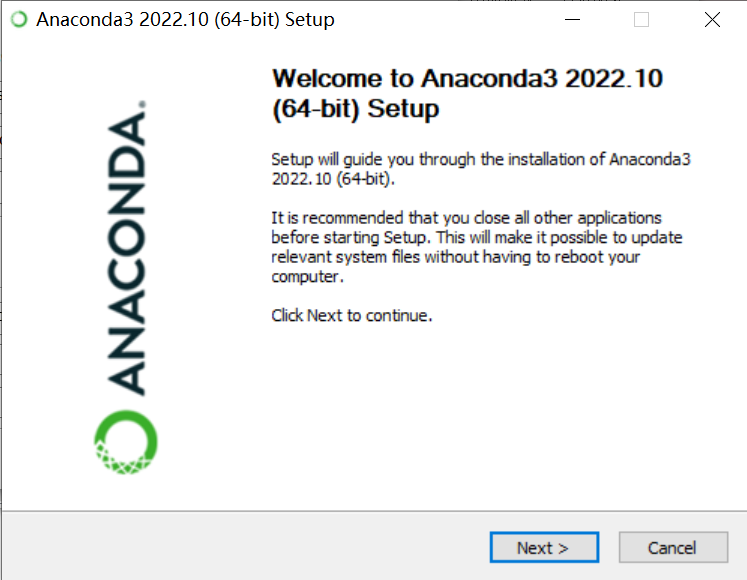
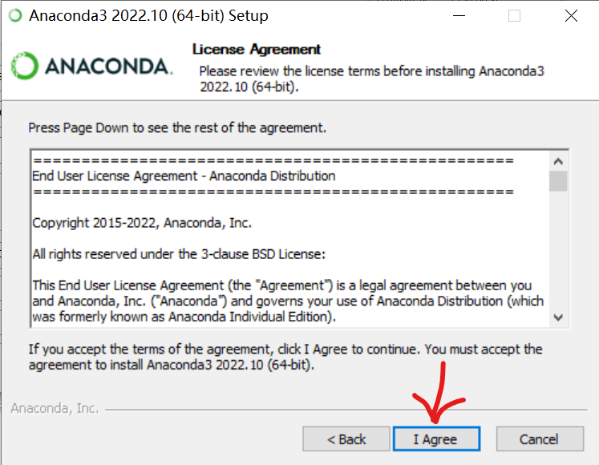
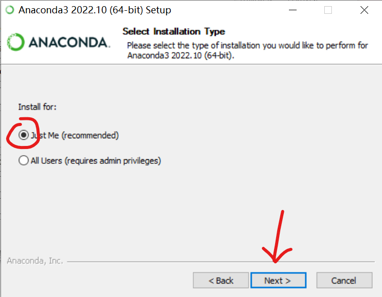
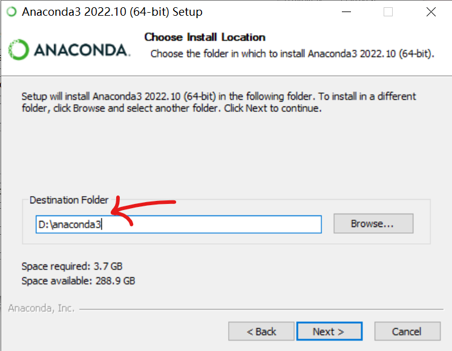
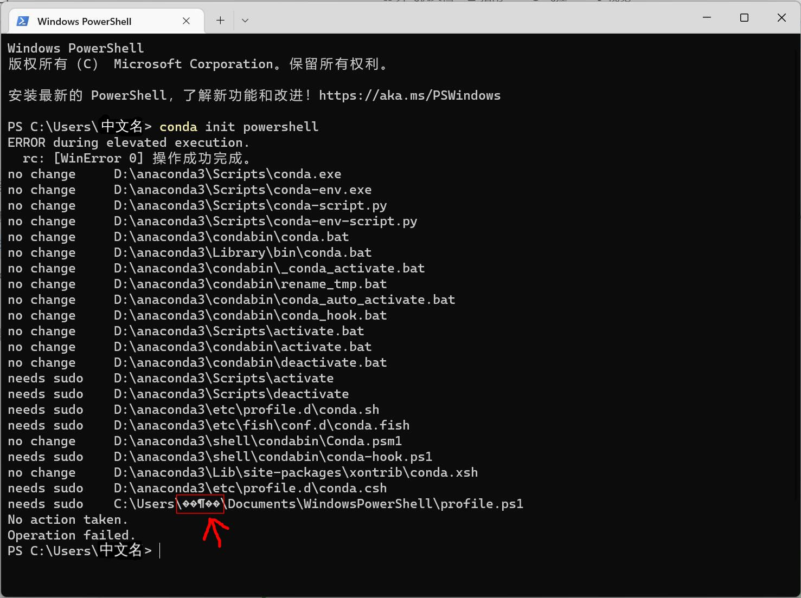
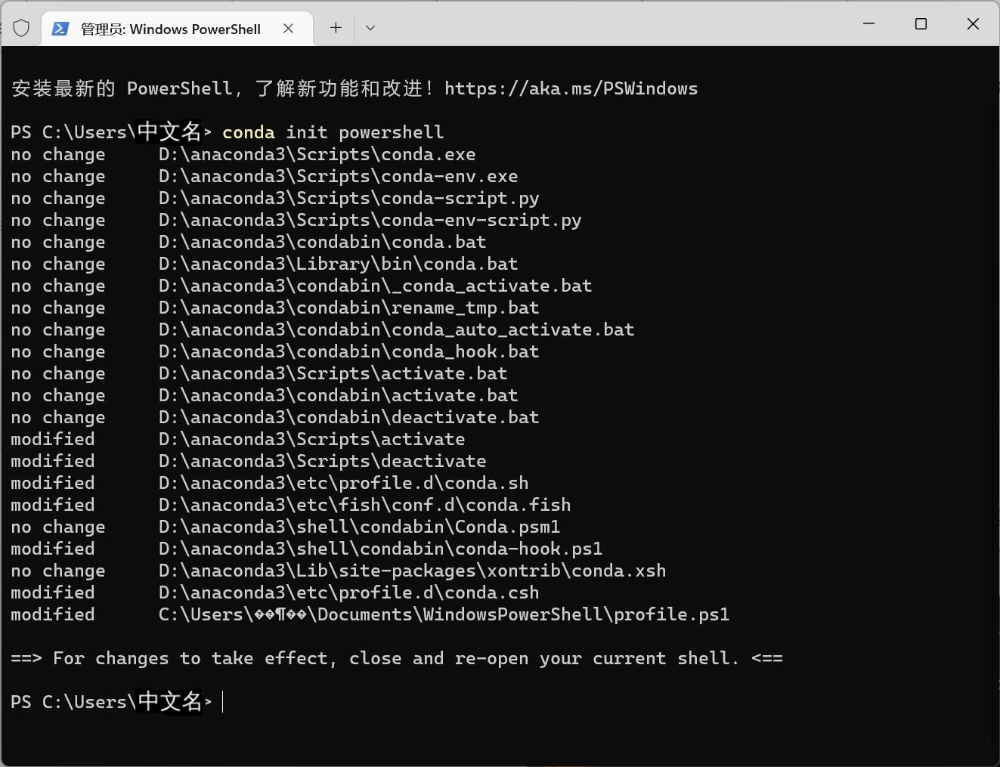
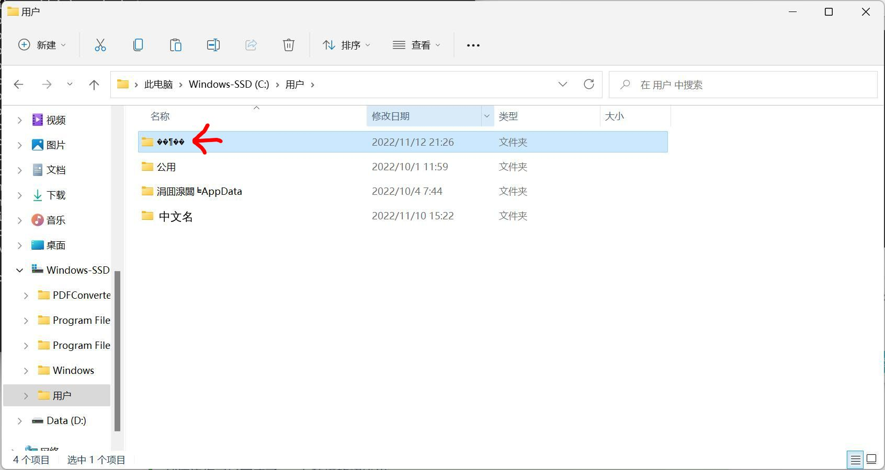
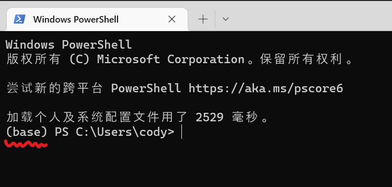
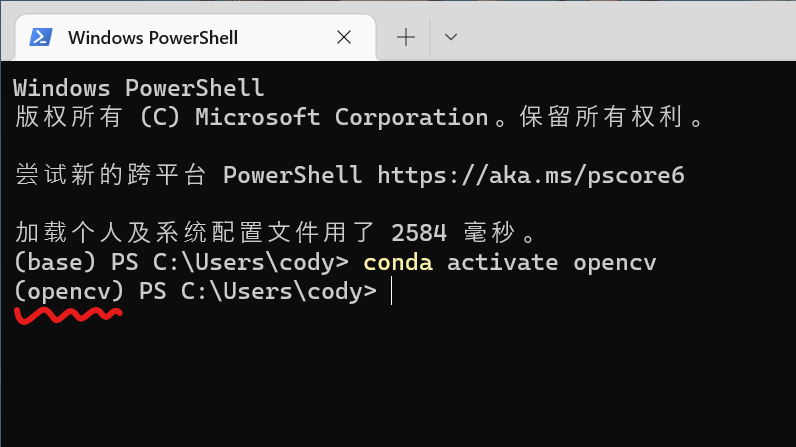

# 中文用户名conda安装配置方法

页面大纲：
[[toc]]

## 前置知识

阅读本篇文章需要的前置知识

- [文件路径的概念](../🐾%20基础概念/文件路径.md)
- [压缩文档的概念](7-Zip%20安装配置.md#压缩文档的概念)

## 中文用户名安装和配置conda

### 中文用户名安装anaconda

我们需要安装`Anaconda3`。前往[Anaconda的官网](https://www.anaconda.com/)下载安装包


然后打开安装软件，点击`Next`



点击`I Agree`



这边请选择`Just me`仅为当前用户安装



**必须选择一个不含中文的路径**



2.配置conda环境变量，**按照你conda安装的位置来**

比如你安装在`D:\anaconda3\`则需要添加的path有下面四条

```commandline
D:\anaconda3\
D:\anaconda3\Scripts
D:\anaconda3\Library\bin
D:\anaconda3\Library\mingw-w64
```

什么？你说你不会设置环境变量？那就参考这个文章吧：[如何设置系统环境变量](/文档/🧑‍🔧一些技巧/windows设置Path环境变量.md)

2.然后需要开启Powershell运行PS脚本的限制

这边需要**选择你的系统版本**，windows10和windows11略有不同

#### 如果你使用的是win10

按下`windows徽标键+R`组合键，在弹出的输入框内输入`powershell`，然后同时按下`Ctrl+Shift+回车`三个键，会弹出一个提示，点`是`就行

然后在黑窗口内输入下面的一行命令并回车

```commandline
set-executionpolicy remotesigned
```

会出现下面的信息

```commandline
执行策略更改
执行策略可帮助你防止执行不信任的脚本。更改执行策略可能会产生安全风险，如 https:/go.microsoft.com/fwlink/?LinkID=135170
中的 about_Execution_Policies 帮助主题所述。是否要更改执行策略?
[Y] 是(Y)  [A] 全是(A)  [N] 否(N)  [L] 全否(L)  [S] 暂停(S)  [?] 帮助 (默认值为“N”):
```

然后输入大写的`Y`，敲击回车

继续在powershell里输入

```commandline
Get-ExecutionPolicy
```

如果显示的是 `RemoteSigned`说明设置成功了

#### 如果你使用的是win11

按下`windows徽标键+R`组合键，在弹出的输入框内输入`wt`，然后同时按下`Ctrl+Shift+回车`三个键，会弹出一个提示，点`是`就行

然后在黑窗口内输入下面的一行命令并回车

```commandline
set-executionpolicy remotesigned
```

继续在powershell里输入

```commandline
Get-ExecutionPolicy
```

如果显示的是 `RemoteSigned`说明设置成功了

3.接下来需要初始化conda环境

按下`windows徽标键+R`组合键，win10系统在弹出的输入框内输入`powershell`，win11系统输入`wt`，然后同时按下`Ctrl+Shift+回车`三个键，会弹出一个提示，点`是`就行

然后在黑窗口内输入下面的一行命令并回车

```commandline
conda init powershell
```

可能会出现这样的错误



::: info

如果你的输出左侧显示need sudo，请参考[这边](../✍️%20写在前面/常见问题.md#conda-init-need-sudo)

:::

如果你的输出和这边一样，左侧显示的是no change和modified，并且最后一行用户名显示的是乱码，那就可以继续了



还记得乱码的目录么，是确确实实创建了的，你找到那个位置，打开，里面会有一个文件夹



把里面的documents文件夹直接复制到你的中文用户名文件夹下


然后重新打开powershell窗口应该就正常了



::: tip
到这边你已经完成了conda环境的初始化
:::

### 中文用户名配置conda环境

同时按下`windows徽标键`+`R`，在左下角弹出界面输入框内输入`powershell`

在powershell中输入`conda config --set show_channel_urls yes`

同时按下`windows徽标键`+`R`

在左下角弹出的窗口内输入`notepad %HOMEPATH%\.condarc`然后点击确定

在弹出的记事本中所有的文字删除，并以下面的文字替代

```text
channels:
  - defaults
show_channel_urls: true
default_channels:
  - https://mirrors.tuna.tsinghua.edu.cn/anaconda/pkgs/main
  - https://mirrors.tuna.tsinghua.edu.cn/anaconda/pkgs/r
  - https://mirrors.tuna.tsinghua.edu.cn/anaconda/pkgs/msys2
custom_channels:
  conda-forge: https://mirrors.tuna.tsinghua.edu.cn/anaconda/cloud
  msys2: https://mirrors.tuna.tsinghua.edu.cn/anaconda/cloud
  bioconda: https://mirrors.tuna.tsinghua.edu.cn/anaconda/cloud
  menpo: https://mirrors.tuna.tsinghua.edu.cn/anaconda/cloud
  pytorch: https://mirrors.tuna.tsinghua.edu.cn/anaconda/cloud
  pytorch-lts: https://mirrors.tuna.tsinghua.edu.cn/anaconda/cloud
  simpleitk: https://mirrors.tuna.tsinghua.edu.cn/anaconda/cloud
envs_dirs:
  - D:\anaconda3\envs
pkgs_dirs:
  - D:\anaconda3\pkgs
```

主要是修改默认的环境安装位置和软件包缓存位置，要换成一个没有中文的目录（默认是用户目录下的所以会乱码）

就是最后两项，改成安装目录下的位置或者其他位置，需要确保用户有文件夹的读写权限

然后按`Ctrl`+`S`保存修改

首先创建一个conda环境,`<conda环境名称>`可以自定义，后面的python版本也可以自定义

```commandline
conda create -n <conda环境名称> python=<python版本>
```

比如我想创建一个环境名称是`opencv`，python版本是3.10的虚拟环境，我就输入

```commandline
conda create -n opencv python=3.10
```

安装环境的时候会提示是否确认安装，按照提示输入y并回车就可以了

接下来进入`opencv`环境

```commandline
conda activate opencv
```

这个时候你的终端最左侧应该会从`(base)`变成`(opencv)`或者`<conda环境名称>`



配置完了以后，从这边继续 -> [配置IDE](/文档/👋环境配置/Python%20Opencv%20环境配置.md#配置ide)
