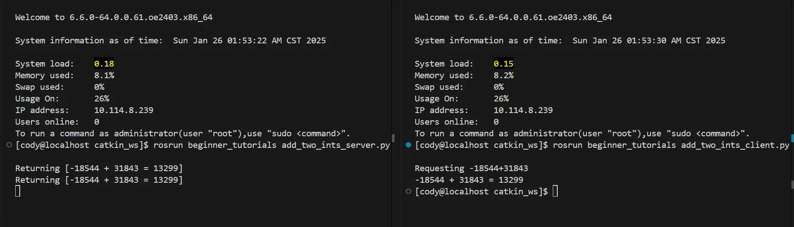

---
tags:
  - ROS1-noetic
  - openEuler
---

# 在 openEuler 24.03 上安装 ROS1 Noetic 的踩坑记录

## 踩坑的心路历程

首先，确保你使用的是[这个源](https://eulermaker.compass-ci.openeuler.openatom.cn/api/ems1/repositories/ROS-SIG-Multi-Version_ros-noetic_openEuler-24.03-LTS-TEST1/openEuler%3A24.03-LTS/x86_64/)，对应的[EulerMaker链接](https://eulermaker.compass-ci.openeuler.openatom.cn/project/overview?osProject=ROS-SIG-Multi-Version_ros-noetic_openEuler-24.03-LTS-TEST1)

然后你按照[这篇文章](在%20openEuler%2024.03%20上安装%20ROS1%20Noetic.md)安装完Noetic后，会发现有一些问题，执行Python的server代码后，过几秒钟终端会疯狂报错，而且莫名其妙。

:::details 错误输出
```text
[cody@localhost catkin_ws]$ rosrun beginner_tutorials add_two_ints_server.py 
Traceback (most recent call last):
  File "/opt/ros/noetic/lib/python3.11/site-packages/rospy/impl/rosout.py", line 99, in _rosout
    l.header.stamp = Time.now()
                     ^^^^^^^^^^
  File "/opt/ros/noetic/lib/python3.11/site-packages/rospy/rostime.py", line 155, in now
    return get_rostime()
           ^^^^^^^^^^^^^
  File "/opt/ros/noetic/lib/python3.11/site-packages/rospy/rostime.py", line 190, in get_rostime
    raise rospy.exceptions.ROSInitException("time is not initialized. Have you called init_node()?")
rospy.exceptions.ROSInitException: time is not initialized. Have you called init_node()?

During handling of the above exception, another exception occurred:


# 后面会一直重复报错这个，大概过几秒钟就会停止，最后提示下面这个


Traceback (most recent call last):
  File "/opt/ros/noetic/lib/python3.11/site-packages/rospy/impl/rosout.py", line 99, in _rosout
  File "/usr/lib64/python3.11/traceback.py", line 187, in format_exc
    l.header.stamp = Time.now()
    return "".join(format_exception(*sys.exc_info(), limit=limit, chain=chain))
                     ^^^^^^^^^^
                   ^^^^^^^^^^^^^^^^^^^^^^^^^^^^^^^^^^^^^^^^^^^^^^^^^^^^^^^^^^^
  File "/opt/ros/noetic/lib/python3.11/site-packages/rospy/rostime.py", line 155, in now
    return get_rostime()
  File "/usr/lib64/python3.11/traceback.py", line 139, in format_exception
           ^^^^^^^^^^^^^
    te = TracebackException(type(value), value, tb, limit=limit, compact=True)
  File "/opt/ros/noetic/lib/python3.11/site-packages/rospy/rostime.py", line 190, in get_rostime
    raise rospy.exceptions.ROSInitException("time is not initialized. Have you called init_node()?")
         ^^^^^^^^^^^^^^^^^^^^^^^^^^^^^^^^^^^^^^^^^^^^^^^^^^^^^^^^^^^^^^^^^^^^^
  File "/usr/lib64/python3.11/traceback.py", line 697, in __init__
rospy.exceptions.ROSInitException: time is not initialized. Have you called init_node()?

During handling of the above exception, another exception occurred:

Traceback (most recent call last):
  File "/opt/ros/noetic/lib/python3.11/site-packages/rospy/impl/rosout.py", line 99, in _rosout
    _seen.add(id(exc_value))
              ^^^^^^^^^^^^^
RecursionError: maximum recursion depth exceeded while calling a Python object
```
:::

很莫名其妙的问题，网上也找不到类似的问题。那么让我们来分析一下问题在哪里

首先，ROS 1 Noetic 是为 Python 3.7-3.9 设计的，而 Python 3.11 引入了一些对 logging 模块的更新或行为变化。

临时解决方法是，将日志级别从 loginfo 降为 logerror 可以绕过这个问题，但是最好的解决方法是修改ros_comm包的源码

然后我搜索了一圈，ros官方已经有相关的issue了 [python3.11 and roslogging (rospy.init_node) #2296](https://github.com/ros/ros_comm/issues/2296)

在这里，维护者已经有相关的patch，但是还没合并到主线，就是这个 [685a96e rosgraph: update code from Python 3.11](https://github.com/ros/ros_comm/commit/685a96ec9cd67f1fd6f8cd52cce6f251f8899e67)

关联的PR是这个 [\[ROS-O\] required patches on current systems #2297](https://github.com/ros/ros_comm/pull/2297)

然后我根据这个pr制作了patch文件

:::details Patch内容
```
diff --git a/ros-noetic-rosgraph-1.16.0/src/rosgraph/roslogging.py b/ros-noetic-rosgraph-1.16.0/src/rosgraph/roslogging.py
index 9ecc121..b16ab3c 100644
--- a/src/rosgraph/roslogging.py
+++ b/src/rosgraph/roslogging.py
@@ -50,32 +50,58 @@ from rospkg.environment import ROS_LOG_DIR
 class LoggingException(Exception): pass
 
 class RospyLogger(logging.getLoggerClass()):
-    def findCaller(self, *args, **kwargs):
+    # copied from python3.11/logging/__init__.py
+    # _srcfile is only used in conjunction with sys._getframe().
+    # Setting _srcfile to None will prevent findCaller() from being called. This
+    # way, you can avoid the overhead of fetching caller information.
+
+    # The following is based on warnings._is_internal_frame. It makes sure that
+    # frames of the import mechanism are skipped when logging at module level and
+    # using a stacklevel value greater than one.
+    @staticmethod
+    def _is_internal_frame(frame):
+        """Signal whether the frame is a CPython or logging module internal."""
+        filename = os.path.normcase(frame.f_code.co_filename)
+        return filename == logging._srcfile or (
+            "importlib" in filename and "_bootstrap" in filename
+        )
+
+
+    def findCaller(self, stack_info=False, stacklevel=1):
         """
         Find the stack frame of the caller so that we can note the source
         file name, line number, and function name with class name if possible.
         """
-        file_name, lineno, func_name = super(RospyLogger, self).findCaller(*args, **kwargs)[:3]
-        file_name = os.path.normcase(file_name)
-
-        f = inspect.currentframe()
-        if f is not None:
-            f = f.f_back
-        while hasattr(f, "f_code"):
-            # Search for the right frame using the data already found by parent class.
-            co = f.f_code
-            filename = os.path.normcase(co.co_filename)
-            if filename == file_name and f.f_lineno == lineno and co.co_name == func_name:
+
+
+        f = logging.currentframe()
+        #On some versions of IronPython, currentframe() returns None if
+        #IronPython isn't run with -X:Frames.
+        if f is None:
+            return "(unknown file)", 0, "(unknown function)", None
+        while stacklevel > 0:
+            next_f = f.f_back
+            if next_f is None:
+                ## We've got options here.
+                ## If we want to use the last (deepest) frame:
                 break
-            if f.f_back:
-                f = f.f_back
-
-        # Jump up two more frames, as the logger methods have been double wrapped.
-        if f is not None and f.f_back and f.f_code and f.f_code.co_name == '_base_logger':
-            f = f.f_back
-            if f.f_back:
-                f = f.f_back
+                ## If we want to mimic the warnings module:
+                #return ("sys", 1, "(unknown function)", None)
+                ## If we want to be pedantic:
+                #raise ValueError("call stack is not deep enough")
+            f = next_f
+            if not RospyLogger._is_internal_frame(f):
+                stacklevel -= 1
         co = f.f_code
+        sinfo = None
+        if stack_info:
+            with io.StringIO() as sio:
+                sio.write("Stack (most recent call last):\n")
+                traceback.print_stack(f, file=sio)
+                sinfo = sio.getvalue()
+                if sinfo[-1] == '\n':
+                    sinfo = sinfo[:-1]
+
         func_name = co.co_name
 
         # Now extend the function name with class name, if available.
@@ -85,11 +111,7 @@ class RospyLogger(logging.getLoggerClass()):
         except KeyError:  # if the function is unbound, there is no self.
             pass
 
-        if sys.version_info > (3, 2):
-            # Dummy last argument to match Python3 return type
-            return co.co_filename, f.f_lineno, func_name, None
-        else:
-            return co.co_filename, f.f_lineno, func_name
+        return co.co_filename, f.f_lineno, func_name, sinfo
 
 logging.setLoggerClass(RospyLogger)
 
@@ -295,4 +317,4 @@ class RosStreamHandler(logging.Handler):
     def _write(self, fd, msg, color):
         if self._colorize and color and hasattr(fd, 'isatty') and fd.isatty():
             msg = color + msg + _color_reset
-        fd.write(msg)
+        fd.write(msg)
\ No newline at end of file
```
:::

你以为事情结束了？哈哈，我fork了[这个仓库](https://gitee.com/simonaxi/ros_comm.git)，修改了spec文件，然后尝试编译了ros-noetic-rosgraph，重新安装这个包后，问题依旧。

不应该啊，理论上打了这个patch就好了才对，于是我又搜索了一番，发现了这个patch [Properly fix rospy logging in Python 3.11](https://salsa.debian.org/science-team/ros-ros-comm/-/blob/b74ca5c2c868a084ab36e46d68f7775518ac4c58/debian/patches/0015-rosgraph-update-code-from-Python-3.11.patch) 

这个patch的修改更精简，并且根据历史记录，这个patch比上面这个提交更新。

于是我又生成了一个[patch文件](https://gitee.com/codygua/ros_comm/blob/master/0000-rosgraph-update-code-from-Python-3.11.patch)，编译后重新安装，问题还是没有解决

:::details Patch内容
```
From: Jochen Sprickerhof <git@jochen.sprickerhof.de>
Date: Sun, 13 Nov 2022 16:39:59 +0100
Subject: rosgraph: update code from Python 3.11

---
 tools/rosgraph/src/rosgraph/roslogging.py | 7 +++----
 1 file changed, 3 insertions(+), 4 deletions(-)

diff --git a/tools/rosgraph/src/rosgraph/roslogging.py b/tools/rosgraph/src/rosgraph/roslogging.py
index 9ecc121..2df2f22 100644
--- a/src/rosgraph/roslogging.py
+++ b/src/rosgraph/roslogging.py
@@ -62,13 +62,12 @@ class RospyLogger(logging.getLoggerClass()):
         if f is not None:
             f = f.f_back
         while hasattr(f, "f_code"):
-            # Search for the right frame using the data already found by parent class.
-            co = f.f_code
-            filename = os.path.normcase(co.co_filename)
-            if filename == file_name and f.f_lineno == lineno and co.co_name == func_name:
+            if f.f_code.co_name == '_base_logger':
                 break
             if f.f_back:
                 f = f.f_back
+            else:
+                break
 
         # Jump up two more frames, as the logger methods have been double wrapped.
         if f is not None and f.f_back and f.f_code and f.f_code.co_name == '_base_logger':
```
:::

问题到底出在哪里了呢？我把关注点放到了openEuler的原始仓库，注意到这个提交 [Fix: adapter logging for python 3.11](https://gitee.com/simonaxi/ros_comm/commit/e14bc8cc37c62b796821ccad75650624b79f1912) 于是我对比了这四个压缩包的修改内容，发现了一些端倪

:::details 这是修改的内容

```
diff --git a/ros-noetic-rosgraph-1.16.0/src/rosgraph/impl/graph.py b/ros-noetic-rosgraph-1.16.0/src/rosgraph/impl/graph.py
index 55553ac..6e77c9c 100644
--- a/ros-noetic-rosgraph-1.16.0/src/rosgraph/impl/graph.py
+++ b/ros-noetic-rosgraph-1.16.0/src/rosgraph/impl/graph.py
@@ -52,7 +52,7 @@ import socket
 
 import rosgraph.masterapi
 
-logger = logging.getLogger('rosgraph.graph')
+logger = logging.getLogger('roslaunch')
 
 _ROS_NAME = '/rosviz'
 
diff --git a/ros-noetic-rosgraph-1.16.0/src/rosgraph/network.py b/ros-noetic-rosgraph-1.16.0/src/rosgraph/network.py
index 8da3797..2e86f13 100644
--- a/ros-noetic-rosgraph-1.16.0/src/rosgraph/network.py
+++ b/ros-noetic-rosgraph-1.16.0/src/rosgraph/network.py
@@ -70,7 +70,7 @@ if platform.system() == 'FreeBSD':
     else:
         SIOCGIFCONF = 0xc0086924
 
-logger = logging.getLogger('rosgraph.network')
+logger = logging.getLogger('roslaunch')
 
 def parse_http_host_and_port(url):
     """
diff --git a/ros-noetic-rosgraph-1.16.0/src/rosgraph/xmlrpc.py b/ros-noetic-rosgraph-1.16.0/src/rosgraph/xmlrpc.py
index 4d1de93..412c515 100644
--- a/ros-noetic-rosgraph-1.16.0/src/rosgraph/xmlrpc.py
+++ b/ros-noetic-rosgraph-1.16.0/src/rosgraph/xmlrpc.py
@@ -131,7 +131,7 @@ class ThreadingXMLRPCServer(socketserver.ThreadingMixIn, SimpleXMLRPCServer):
         # connections in OSX 10.11
         self.request_queue_size = min(socket.SOMAXCONN, 128)
         if rosgraph.network.use_ipv6():
-            logger = logging.getLogger('xmlrpc')
+            logger = logging.getLogger('roslaunch')
             # The XMLRPC library does not support IPv6 out of the box
             # We have to monipulate private members and duplicate
             # code from the constructor.
@@ -153,7 +153,7 @@ class ThreadingXMLRPCServer(socketserver.ThreadingMixIn, SimpleXMLRPCServer):
         override ThreadingMixin, which sends errors to stderr
         """
         if logging and traceback:
-            logger = logging.getLogger('xmlrpc')
+            logger = logging.getLogger('roslaunch')
             if logger:
                 logger.error(traceback.format_exc())
 
@@ -260,7 +260,7 @@ class XmlRpcNode(object):
 
     # separated out for easier testing
     def _run_init(self):
-        logger = logging.getLogger('xmlrpc')            
+        logger = logging.getLogger('roslaunch')            
         try:
             log_requests = 0
             port = self.port or 0 #0 = any
@@ -330,5 +330,5 @@ class XmlRpcNode(object):
                     pass
                 elif e.errno != errno.EINTR:
                     self.is_shutdown = True
-                    logging.getLogger('xmlrpc').error("serve forever IOError: %s, %s"%(e.errno, e.strerror))
+                    logging.getLogger('roslaunch').error("serve forever IOError: %s, %s"%(e.errno, e.strerror))
                     
diff --git a/ros-noetic-roslaunch-1.16.0/src/roslaunch/child.py b/ros-noetic-roslaunch-1.16.0/src/roslaunch/child.py
index aa84e67..4ba6eb0 100644
--- a/ros-noetic-roslaunch-1.16.0/src/roslaunch/child.py
+++ b/ros-noetic-roslaunch-1.16.0/src/roslaunch/child.py
@@ -77,7 +77,7 @@ class ROSLaunchChild(object):
         """
         roslaunch.core.set_child_mode(True)
         
-        self.logger = logging.getLogger("roslaunch.child")
+        self.logger = logging.getLogger("roslaunch")
         self.run_id = run_id
         self.name = name
         self.server_uri = server_uri
diff --git a/ros-noetic-roslaunch-1.16.0/src/roslaunch/config.py b/ros-noetic-roslaunch-1.16.0/src/roslaunch/config.py
index 13eb7f1..df0fd54 100644
--- a/ros-noetic-roslaunch-1.16.0/src/roslaunch/config.py
+++ b/ros-noetic-roslaunch-1.16.0/src/roslaunch/config.py
@@ -432,7 +432,7 @@ def load_config_default(roslaunch_files, port, roslaunch_strs=None, loader=None,
     @rytpe: L{ROSLaunchConfig} initialized rosconfig instance
     @raises: RLException
     """
-    logger = logging.getLogger('roslaunch.config')
+    logger = logging.getLogger('roslaunch')
     
     # This is the main roslaunch server process. Load up the
     # files specified on the command line and launch the
diff --git a/ros-noetic-roslaunch-1.16.0/src/roslaunch/core.py b/ros-noetic-roslaunch-1.16.0/src/roslaunch/core.py
index 423a760..fe69d1b 100644
--- a/ros-noetic-roslaunch-1.16.0/src/roslaunch/core.py
+++ b/ros-noetic-roslaunch-1.16.0/src/roslaunch/core.py
@@ -313,12 +313,12 @@ class Master(object):
                 code, status, val = self.get().getPid('/roslaunch')
                 if code != 1:
                     raise RLException("ERROR: master failed status check: %s"%msg)
-                logging.getLogger('roslaunch.core').debug('master.is_running[%s]: True'%self.uri)
+                logging.getLogger('roslaunch').debug('master.is_running[%s]: True'%self.uri)
                 return True
             finally:
                 socket.setdefaulttimeout(to_orig) 
         except:
-            logging.getLogger('roslaunch.core').debug('master.is_running[%s]: False'%self.uri)
+            logging.getLogger('roslaunch').debug('master.is_running[%s]: False'%self.uri)
             return False
 
 ## number of seconds that a child machine is allowed to register with
diff --git a/ros-noetic-roslaunch-1.16.0/src/roslaunch/parent.py b/ros-noetic-roslaunch-1.16.0/src/roslaunch/parent.py
index 58e9294..bd294a4 100644
--- a/ros-noetic-roslaunch-1.16.0/src/roslaunch/parent.py
+++ b/ros-noetic-roslaunch-1.16.0/src/roslaunch/parent.py
@@ -122,7 +122,7 @@ class ROSLaunchParent(object):
         if sigterm_timeout <= 0:
             raise RLException("sigterm_timeout must be a positive number, received %f" % sigterm_timeout)
         
-        self.logger = logging.getLogger('roslaunch.parent')
+        self.logger = logging.getLogger('roslaunch')
         self.run_id = run_id
         self.process_listeners = process_listeners
         
diff --git a/ros-noetic-roslaunch-1.16.0/src/roslaunch/pmon.py b/ros-noetic-roslaunch-1.16.0/src/roslaunch/pmon.py
index b74f638..8ed869f 100644
--- a/ros-noetic-roslaunch-1.16.0/src/roslaunch/pmon.py
+++ b/ros-noetic-roslaunch-1.16.0/src/roslaunch/pmon.py
@@ -55,7 +55,7 @@ from threading import Thread, RLock, Lock
 import roslib
 from roslaunch.core import printlog, printlog_bold, printerrlog, RLException
 
-logger = logging.getLogger("roslaunch.pmon")          
+logger = logging.getLogger("roslaunch")          
 
 class FatalProcessLaunch(RLException):
     """
diff --git a/ros-noetic-roslaunch-1.16.0/src/roslaunch/remote.py b/ros-noetic-roslaunch-1.16.0/src/roslaunch/remote.py
index 8e02669..6b2ea6b 100644
--- a/ros-noetic-roslaunch-1.16.0/src/roslaunch/remote.py
+++ b/ros-noetic-roslaunch-1.16.0/src/roslaunch/remote.py
@@ -74,7 +74,7 @@ class ROSRemoteRunner(roslaunch.launch.ROSRemoteRunnerIF):
         self.pm = pm
         self.sigint_timeout = sigint_timeout
         self.sigterm_timeout = sigterm_timeout
-        self.logger = logging.getLogger('roslaunch.remote')
+        self.logger = logging.getLogger('roslaunch')
         self.listeners = []
         
         self.machine_list = []
diff --git a/ros-noetic-roslaunch-1.16.0/src/roslaunch/remoteprocess.py b/ros-noetic-roslaunch-1.16.0/src/roslaunch/remoteprocess.py
index 6f44eff..9759942 100644
--- a/ros-noetic-roslaunch-1.16.0/src/roslaunch/remoteprocess.py
+++ b/ros-noetic-roslaunch-1.16.0/src/roslaunch/remoteprocess.py
@@ -51,7 +51,7 @@ import roslaunch.server
 from roslaunch.nodeprocess import DEFAULT_TIMEOUT_SIGINT, DEFAULT_TIMEOUT_SIGTERM
 
 import logging
-_logger = logging.getLogger("roslaunch.remoteprocess")
+_logger = logging.getLogger("roslaunch")
 
 # #1975 timeout for creating ssh connections
 TIMEOUT_SSH_CONNECT = 30.
diff --git a/ros-noetic-roslaunch-1.16.0/src/roslaunch/server.py b/ros-noetic-roslaunch-1.16.0/src/roslaunch/server.py
index 24808ca..8dee93c 100644
--- a/ros-noetic-roslaunch-1.16.0/src/roslaunch/server.py
+++ b/ros-noetic-roslaunch-1.16.0/src/roslaunch/server.py
@@ -97,7 +97,7 @@ class ROSLaunchBaseHandler(xmlrpc.XmlRpcHandler):
     """
     def __init__(self, pm):
         self.pm = pm
-        self.logger = logging.getLogger('roslaunch.server')
+        self.logger = logging.getLogger('roslaunch')
         if self.pm is None:
             raise RLException("cannot create xmlrpc handler: pm is not initialized")
     
@@ -365,7 +365,7 @@ class ROSLaunchNode(xmlrpc.XmlRpcNode):
         Startup roslaunch server XML-RPC services
         @raise RLException: if server fails to start
         """
-        logger = logging.getLogger('roslaunch.server')
+        logger = logging.getLogger('roslaunch')
         logger.info("starting roslaunch XML-RPC server")
         super(ROSLaunchNode, self).start()
         
@@ -424,7 +424,7 @@ For more tips, please see
         try:
             super(ROSLaunchNode, self).run()
         except:
-            logging.getLogger("roslaunch.remote").error(traceback.format_exc())
+            logging.getLogger("roslaunch").error(traceback.format_exc())
             print("ERROR: failed to launch XML-RPC server for roslaunch", file=sys.stderr)
 
 class ROSLaunchParentNode(ROSLaunchNode):
@@ -477,7 +477,7 @@ class _ProcessListenerForwarder(ProcessListener):
         try:
             self.server.process_died(process_name, exit_code)
         except Exception as e:
-            logging.getLogger("roslaunch.remote").error(traceback.format_exc())
+            logging.getLogger("roslaunch").error(traceback.format_exc())
 
 class ROSLaunchChildNode(ROSLaunchNode):
     """
@@ -499,7 +499,7 @@ class ROSLaunchChildNode(ROSLaunchNode):
     ## @return: XML-RPC URI
     ## @rtype: str
         """        
-        self.logger = logging.getLogger("roslaunch.server")
+        self.logger = logging.getLogger("roslaunch")
         self.run_id = run_id
         self.name = name
         self.server_uri = server_uri
diff --git a/ros-noetic-rosmaster-1.16.0/src/rosmaster/main.py b/ros-noetic-rosmaster-1.16.0/src/rosmaster/main.py
index ae94dd1..6e77d1f 100644
--- a/ros-noetic-rosmaster-1.16.0/src/rosmaster/main.py
+++ b/ros-noetic-rosmaster-1.16.0/src/rosmaster/main.py
@@ -104,7 +104,7 @@ WARNING ACHTUNG WARNING ACHTUNG WARNING
 
 """)
 
-    logger = logging.getLogger("rosmaster.main")
+    logger = logging.getLogger("roslaunch")
     logger.info("initialization complete, waiting for shutdown")
 
     if options.timeout is not None and float(options.timeout) >= 0.0:
@@ -117,7 +117,7 @@ WARNING ACHTUNG WARNING ACHTUNG WARNING
         if options.master_logger_level.lower() in levels.keys():
             logger.info("set rosmaster.master logger level '{}'".format(options.master_logger_level))
             rosmaster.master_api.LOG_API = True
-            logging.getLogger("rosmaster.master").setLevel(levels[options.master_logger_level.lower()])
+            logging.getLogger("roslaunch").setLevel(levels[options.master_logger_level.lower()])
         else:
             logger.error("--master-logger-level received unknown option '{}'".format(options.master_logger_level))
 
diff --git a/ros-noetic-rosmaster-1.16.0/src/rosmaster/master.py b/ros-noetic-rosmaster-1.16.0/src/rosmaster/master.py
index fc8652a..2c068f6 100644
--- a/ros-noetic-rosmaster-1.16.0/src/rosmaster/master.py
+++ b/ros-noetic-rosmaster-1.16.0/src/rosmaster/master.py
@@ -75,7 +75,7 @@ class Master(object):
         self.master_node = master_node
         self.uri = master_node.uri
         
-        logging.getLogger('rosmaster.master').info("Master initialized: port[%s], uri[%s]", self.port, self.uri)
+        logging.getLogger('roslaunch').info("Master initialized: port[%s], uri[%s]", self.port, self.uri)
 
     def ok(self):
         if self.master_node is not None:
diff --git a/ros-noetic-rosmaster-1.16.0/src/rosmaster/master_api.py b/ros-noetic-rosmaster-1.16.0/src/rosmaster/master_api.py
index 73c66bb..c720242 100644
--- a/ros-noetic-rosmaster-1.16.0/src/rosmaster/master_api.py
+++ b/ros-noetic-rosmaster-1.16.0/src/rosmaster/master_api.py
@@ -80,7 +80,7 @@ STATUS = 0
 MSG = 1
 VAL = 2
 
-_logger = logging.getLogger("rosmaster.master")
+_logger = logging.getLogger("roslaunch")
 
 LOG_API = False
 
diff --git a/ros-noetic-rosmaster-1.16.0/src/rosmaster/threadpool.py b/ros-noetic-rosmaster-1.16.0/src/rosmaster/threadpool.py
index 6d195dc..ad7318c 100644
--- a/ros-noetic-rosmaster-1.16.0/src/rosmaster/threadpool.py
+++ b/ros-noetic-rosmaster-1.16.0/src/rosmaster/threadpool.py
@@ -221,7 +221,7 @@ class ThreadPoolThread(threading.Thread):
                     if callback is not None:
                         callback(result)
                 except Exception as e:
-                    logging.getLogger('rosmaster.threadpool').error(traceback.format_exc())
+                    logging.getLogger('roslaunch').error(traceback.format_exc())
     
     def go_away(self):
         """ Exit the run loop next time through."""
diff --git a/ros-noetic-rospy-1.16.0/src/rospy/client.py b/ros-noetic-rospy-1.16.0/src/rospy/client.py
index 668801d..f3589b7 100644
--- a/ros-noetic-rospy-1.16.0/src/rospy/client.py
+++ b/ros-noetic-rospy-1.16.0/src/rospy/client.py
@@ -167,7 +167,7 @@ def _set_logger_level(request):
         logger = logging.getLogger(request.logger)
         logger.setLevel(_names_to_logging_levels[level])
     else:
-       logging.getLogger('rospy').error("Bad logging level: %s"%level)
+       logging.getLogger('roslaunch').error("Bad logging level: %s"%level)
     ret = SetLoggerLevelResponse()
     return ret
 
@@ -310,7 +310,7 @@ def init_node(name, argv=None, anonymous=False, log_level=None, disable_rostime=
     # #1810
     rospy.names.initialize_mappings(resolved_node_name)
     
-    logger = logging.getLogger("rospy.client")
+    logger = logging.getLogger("roslaunch")
     logger.info("init_node, name[%s], pid[%s]", resolved_node_name, os.getpid())
             
     # node initialization blocks until registration with master
diff --git a/ros-noetic-rospy-1.16.0/src/rospy/core.py b/ros-noetic-rospy-1.16.0/src/rospy/core.py
index 1ce53b6..714d08e 100644
--- a/ros-noetic-rospy-1.16.0/src/rospy/core.py
+++ b/ros-noetic-rospy-1.16.0/src/rospy/core.py
@@ -75,7 +75,7 @@ from rospy.impl.validators import ParameterInvalid
 from rosgraph_msgs.msg import Log
 from functools import partial
 
-_logger = logging.getLogger("rospy.core")
+_logger = logging.getLogger("roslaunch")
 
 # number of seconds to wait to join on threads. network issue can
 # cause joins to be not terminate gracefully, and it's better to
@@ -126,7 +126,7 @@ def parse_rosrpc_uri(uri):
 #########################################################
         
 # rospy logger
-_rospy_logger = logging.getLogger("rospy.internal")
+_rospy_logger = logging.getLogger("roslaunch")
 
 # we keep a separate, non-rosout log file to contain stack traces and
 # other sorts of information that scare users but are essential for
@@ -158,7 +158,7 @@ def _frame_to_caller_id(frame):
 def _base_logger(msg, args, kwargs, throttle=None,
                  throttle_identical=False, level=None, once=False):
 
-    rospy_logger = logging.getLogger('rosout')
+    rospy_logger = logging.getLogger('roslaunch')
     name = kwargs.pop('logger_name', None)
     if name:
         rospy_logger = rospy_logger.getChild(name)
@@ -409,7 +409,7 @@ class NullHandler(logging.Handler):
         pass
     
 # keep logging happy until we have the node name to configure with
-logging.getLogger('rospy').addHandler(NullHandler())    
+logging.getLogger('roslaunch').addHandler(NullHandler())    
     
 
 #########################################################
diff --git a/ros-noetic-rospy-1.16.0/src/rospy/impl/init.py b/ros-noetic-rospy-1.16.0/src/rospy/impl/init.py
index 8e6f51d..c8b311c 100644
--- a/ros-noetic-rospy-1.16.0/src/rospy/impl/init.py
+++ b/ros-noetic-rospy-1.16.0/src/rospy/impl/init.py
@@ -99,11 +99,11 @@ def start_node(environ, resolved_name, master_uri=None, port=0, tcpros_port=0):
     node.start()
     while not node.uri and not is_shutdown():
         time.sleep(0.00001) #poll for XMLRPC init
-    logging.getLogger("rospy.init").info("ROS Slave URI: [%s]", node.uri)
+    logging.getLogger("roslaunch").info("ROS Slave URI: [%s]", node.uri)
 
     while not handler._is_registered() and not is_shutdown():
         time.sleep(0.1) #poll for master registration
-    logging.getLogger("rospy.init").info("registered with master")
+    logging.getLogger("roslaunch").info("registered with master")
     return node
 
 class RosStreamHandler(rosgraph.roslogging.RosStreamHandler):
diff --git a/ros-noetic-rospy-1.16.0/src/rospy/impl/masterslave.py b/ros-noetic-rospy-1.16.0/src/rospy/impl/masterslave.py
index 078daae..12a9ba0 100644
--- a/ros-noetic-rospy-1.16.0/src/rospy/impl/masterslave.py
+++ b/ros-noetic-rospy-1.16.0/src/rospy/impl/masterslave.py
@@ -90,7 +90,7 @@ VAL = 2
 def is_publishers_list(paramName):
     return ('is_publishers_list', paramName)
 
-_logger = logging.getLogger("rospy.impl.masterslave")
+_logger = logging.getLogger("roslaunch")
 
 LOG_API = True
 
diff --git a/ros-noetic-rospy-1.16.0/src/rospy/impl/registration.py b/ros-noetic-rospy-1.16.0/src/rospy/impl/registration.py
index 6837de6..59552e8 100644
--- a/ros-noetic-rospy-1.16.0/src/rospy/impl/registration.py
+++ b/ros-noetic-rospy-1.16.0/src/rospy/impl/registration.py
@@ -190,7 +190,7 @@ class RegManager(RegistrationListener):
         ctor.
         @param handler: node API handler
         """
-        self.logger = logging.getLogger("rospy.registration")
+        self.logger = logging.getLogger("roslaunch")
         self.handler = handler
         self.uri = self.master_uri = None
         self.updates = []
diff --git a/ros-noetic-rospy-1.16.0/src/rospy/impl/rosout.py b/ros-noetic-rospy-1.16.0/src/rospy/impl/rosout.py
index c54a97e..cc47e65 100644
--- a/ros-noetic-rospy-1.16.0/src/rospy/impl/rosout.py
+++ b/ros-noetic-rospy-1.16.0/src/rospy/impl/rosout.py
@@ -62,7 +62,7 @@ _rospy_to_logging_levels = {
 }
 
 def init_rosout():
-    logger = logging.getLogger("rospy.rosout")
+    logger = logging.getLogger("roslaunch")
     try:
         global _rosout_pub
         if _rosout_pub is None:
@@ -103,7 +103,7 @@ def _rosout(level, msg, fname, line, func):
     except Exception as e:
         #traceback.print_exc()
         # don't use logerr in this case as that is recursive here
-        logger = logging.getLogger("rospy.rosout")        
+        logger = logging.getLogger("roslaunch")        
         logger.error("Unable to report rosout: %s\n%s", e, traceback.format_exc())
         return False
 
@@ -123,7 +123,7 @@ class RosOutHandler(logging.Handler):
 ## Load loggers for publishing to /rosout
 ## @param level int: Log level. Loggers >= level will be loaded.
 def load_rosout_handlers(level):
-    logger = logging.getLogger('rosout')
+    logger = logging.getLogger('roslaunch')
     logger.addHandler(RosOutHandler())
     if level != None:
         logger.setLevel(_rospy_to_logging_levels[level])
diff --git a/ros-noetic-rospy-1.16.0/src/rospy/impl/simtime.py b/ros-noetic-rospy-1.16.0/src/rospy/impl/simtime.py
index f253416..bb0317c 100644
--- a/ros-noetic-rospy-1.16.0/src/rospy/impl/simtime.py
+++ b/ros-noetic-rospy-1.16.0/src/rospy/impl/simtime.py
@@ -74,7 +74,7 @@ def init_simtime():
     IFF the /use_sim_time parameter is set.
     """    
     import logging
-    logger = logging.getLogger("rospy.simtime")
+    logger = logging.getLogger("roslaunch")
     try:
         if not _is_use_simtime():
             logger.info("%s is not set, will not subscribe to simulated time [%s] topic"%(_USE_SIMTIME, _ROSCLOCK))
diff --git a/ros-noetic-rospy-1.16.0/src/rospy/impl/statistics.py b/ros-noetic-rospy-1.16.0/src/rospy/impl/statistics.py
index 6db8b00..99ef2d9 100644
--- a/ros-noetic-rospy-1.16.0/src/rospy/impl/statistics.py
+++ b/ros-noetic-rospy-1.16.0/src/rospy/impl/statistics.py
@@ -39,7 +39,7 @@ import sys
 from rosgraph_msgs.msg import TopicStatistics
 import rospy
 
-_logger = logging.getLogger('rospy.impl.statistics')
+_logger = logging.getLogger('roslaunch')
 
 
 class SubscriberStatisticsLogger():
diff --git a/ros-noetic-rospy-1.16.0/src/rospy/impl/tcpros_base.py b/ros-noetic-rospy-1.16.0/src/rospy/impl/tcpros_base.py
index 568564c..56efdfe 100644
--- a/ros-noetic-rospy-1.16.0/src/rospy/impl/tcpros_base.py
+++ b/ros-noetic-rospy-1.16.0/src/rospy/impl/tcpros_base.py
@@ -65,7 +65,7 @@ from rospy.service import ServiceException
 from rospy.impl.transport import Transport, BIDIRECTIONAL
 from errno import EAGAIN, EWOULDBLOCK
 
-logger = logging.getLogger('rospy.tcpros')
+logger = logging.getLogger('roslaunch')
 
 # Receive buffer size for topics/services (in bytes)
 DEFAULT_BUFF_SIZE = 65536
diff --git a/ros-noetic-rospy-1.16.0/src/rospy/impl/tcpros_service.py b/ros-noetic-rospy-1.16.0/src/rospy/impl/tcpros_service.py
index 70c4f3d..5f12512 100644
--- a/ros-noetic-rospy-1.16.0/src/rospy/impl/tcpros_service.py
+++ b/ros-noetic-rospy-1.16.0/src/rospy/impl/tcpros_service.py
@@ -71,7 +71,7 @@ else:
     def isstring(s):
         return isinstance(s, basestring) #Python 2.x
 
-logger = logging.getLogger('rospy.service')
+logger = logging.getLogger('roslaunch')
 
 #########################################################
 # Service helpers
diff --git a/ros-noetic-rospy-1.16.0/src/rospy/msg.py b/ros-noetic-rospy-1.16.0/src/rospy/msg.py
index 2720456..1e02adb 100644
--- a/ros-noetic-rospy-1.16.0/src/rospy/msg.py
+++ b/ros-noetic-rospy-1.16.0/src/rospy/msg.py
@@ -241,6 +241,6 @@ def deserialize_messages(b, msg_queue, data_class, queue_size=None, max_msgs=Non
             else:
                 b.seek(btell)
     except Exception as e:
-        logging.getLogger('rospy.msg').error("cannot deserialize message: EXCEPTION %s", traceback.format_exc())
+        logging.getLogger('roslaunch').error("cannot deserialize message: EXCEPTION %s", traceback.format_exc())
         raise genpy.DeserializationError("cannot deserialize: %s"%str(e))
 
diff --git a/ros-noetic-rospy-1.16.0/src/rospy/service.py b/ros-noetic-rospy-1.16.0/src/rospy/service.py
index f9e7344..bb964d3 100644
--- a/ros-noetic-rospy-1.16.0/src/rospy/service.py
+++ b/ros-noetic-rospy-1.16.0/src/rospy/service.py
@@ -45,7 +45,7 @@ from rospy.core import *
 from rospy.impl.registration import set_service_manager, Registration, get_registration_listeners
 from rospy.impl.transport import *
 
-logger = logging.getLogger('rospy.service')
+logger = logging.getLogger('roslaunch')
 
 class ServiceException(Exception):
     """Exception class for service-related errors"""
diff --git a/ros-noetic-rospy-1.16.0/src/rospy/topics.py b/ros-noetic-rospy-1.16.0/src/rospy/topics.py
index ec45713..9868e1f 100644
--- a/ros-noetic-rospy-1.16.0/src/rospy/topics.py
+++ b/ros-noetic-rospy-1.16.0/src/rospy/topics.py
@@ -96,7 +96,7 @@ from rospy.impl.registration import get_topic_manager, set_topic_manager, Regist
 from rospy.impl.tcpros import get_tcpros_handler, DEFAULT_BUFF_SIZE
 from rospy.impl.tcpros_pubsub import QueuedConnection
 
-_logger = logging.getLogger('rospy.topics')
+_logger = logging.getLogger('roslaunch')
 
 # wrap genpy implementation and map it to rospy namespace
 import genpy
```

:::

你会发现，这个修改实际上就是把所有的`logger = logging.getLogger('XXXXXX')`修改成了`logger = logging.getLogger('roslaunch')`。这确实是能运行了，但是会有其他新的问题，就不展开讲了。总之这就是导致递归调用的原因，把这个问题回退后，就是网上的原始故障了

接下来的事情就很顺利，只要回退这几个压缩包，打上patch就能正常用了。

## 使用正常的ros_comm包

- [修改后 ros_comm 包的 EulerMaker 链接](https://eulermaker.compass-ci.openeuler.openatom.cn/project/overview?osProject=ros-noetic_openEuler-24.03-LTS:py3.11loggerfix)

- [ros_comm 仓库地址](https://gitee.com/codygua/ros_comm.git)

首先，假设你已经安装好了Noetic，那么先编辑 `/etc/yum.repos.d/ROS.repo`

```bash
sudo nano /etc/yum.repos.d/ROS.repo
```

修改为如下内容

```
[openEulerROS-Noetic]
name=openEulerROS-Noetic
baseurl=https://eulermaker.compass-ci.openeuler.openatom.cn/api/ems1/repositories/ROS-SIG-Multi-Version_ros-noetic_openEuler-24.03-LTS-TEST1/openEuler%3A24.03-LTS/x86_64/
enabled=0  # 禁用原本的源
gpgcheck=0

# 添加新的源
[openEulerROS-fixpy311]
name=openEulerROS-fixpy311
baseurl=https://eulermaker.compass-ci.openeuler.openatom.cn/api/ems1/repositories/ros-noetic_openEuler-24.03-LTS:py3.11loggerfix/openEuler%3A24.03-LTS/x86_64/
enabled=1
gpgcheck=0
```

修改好文件后，执行一下`sudo dnf update`，但是不需要更新系统软件包，直接回车退出就行，只是拉取一下包信息。

然后执行下面的命令替换软件包

```bash
sudo dnf update
sudo dnf reinstall ros-noetic-rosgraph ros-noetic-rosmaster ros-noetic-roslaunch ros-noetic-rospy
```

注意看被替换的软件包的源(Repository)是不是`openEulerROS-fixpy311`

记得把`/etc/yum.repos.d/ROS.repo`改回去哦

```
[openEulerROS-Noetic]
name=openEulerROS-Noetic
baseurl=https://eulermaker.compass-ci.openeuler.openatom.cn/api/ems1/repositories/ROS-SIG-Multi-Version_ros-noetic_openEuler-24.03-LTS-TEST1/openEuler%3A24.03-LTS/x86_64/
enabled=1
gpgcheck=0
```

然后重新运行之前的代码，就会发现都正常了🎉

