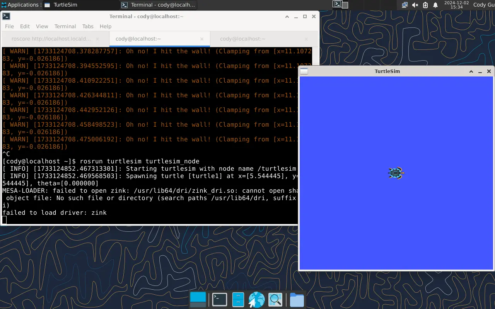
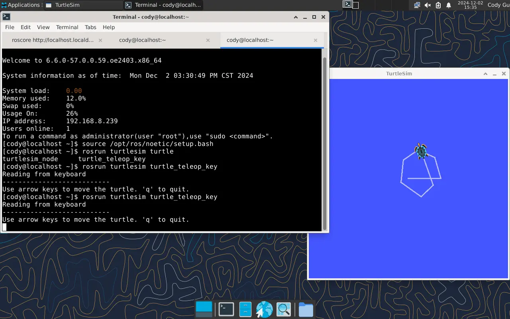

---
tags:
  - ROS1-noetic
  - openEuler
---

# 在 openEuler 24.03 上安装 ROS1 Noetic

## 1. 安装ROS Noetic

本教程将介绍如何在openEuler 24.03下安装测试ROS Noetic软件包。

在安装ROS Noetic前，需确保已经安装好**openEuler操作系统** 和**系统桌面**。

首先在[官网下载openEuler 24.03 LTS镜像](https://www.openeuler.org/zh/download/?version=openEuler%2024.03%20LTS)

按照[官网教程](https://docs.openeuler.org/zh/docs/24.03_LTS/docs/desktop/Install_XFCE.html)安装xfce桌面环境

### 添加ROS Noetic软件源

下面以openEuler 24.03为例介绍软件源的配置过程。

输入以下命令在/etc/yum.repos.d/ROS.repo文件中配置软件源：

- x86架构软件源配置：

```
bash -c 'cat << EOF > /etc/yum.repos.d/ROS.repo
[openEulerROS-Noetic]
name=openEulerROS-Noetic
baseurl=https://eulermaker.compass-ci.openeuler.openatom.cn/api/ems1/repositories/ROS-SIG-Multi-Version_ros-noetic_openEuler-24.03-LTS-TEST1/openEuler%3A24.03-LTS/x86_64/
enabled=1
gpgcheck=0
EOF'
```

- ARM架构软件源配置：

```
bash -c 'cat << EOF > /etc/yum.repos.d/ROS.repo
[openEulerROS-Noetic]
name=openEulerROS-Noetic
baseurl=https://eulermaker.compass-ci.openeuler.openatom.cn/api/ems1/repositories/ROS-SIG-Multi-Version_ros-noetic_openEuler-24.03-LTS-TEST1/openEuler%3A24.03-LTS/aarch64/
enabled=1
gpgcheck=0
EOF'
```

### 安装ROS Noetic

依次输入以下命令安装ROS Noetic所有软件包：

```
sudo dnf update
sudo dnf install "ros-noetic-*" --skip-broken
```

也可输入以下命令安装单独软件包：

```
yum install ros-noetic-<package-name>
# or
dnf install ros-noetic-<package-name>
```

安装上述软件包后，编辑 `~/.bashrc` 追加以下内容

```bash
source /opt/ros/noetic/setup.bash
```

或者输入以下命令将上述语句写入~/.bashrc文件

```
echo "source /opt/ros/noetic/setup.bash" >> ~/.bashrc
```

随后输入`source ~/.bashrc`来激活ROS环境变量的设置

### 测试小乌龟

安装ROS后，打开终端输入以下命令启动小乌龟仿真测试：

```
rosrun turtlesim turtlesim_node
```



新开终端，输入以下命令启动键盘控制节点，在英文输入法下，可以根据终端提示按下键盘的上下左右键控制小乌龟运动：

```
rosrun turtlesim turtle_teleop_key
```



若小乌龟仿真测试通过，则说明openEuler ROS Noetic已成功安装～

## 2. ROS Noetic catkin 构建功能包并测试通信

需要注意的是，这里是ROS1 Noetic的教程，以下步骤均在openEuler 24.03下测试

> - ROS2请使用colcon工具，可以参考[此篇教程](/tutorials/base_demo_01.md)

本教程介绍如何使用 roscreate-pkg 或 catkin 创建新包，并使用 rospack 列出包依赖项。

### Catkin 包的组成

一个 Catkin 包，必须满足以下几个要求：

- 该包必须包含一个符合 Catkin 标准的 **package.xml** 文件。
  - 这个 **package.xml** 文件提供了有关该包的元信息。

- 该包必须包含一个使用 Catkin 的 **CMakeLists.txt** 文件。
  - 如果是一个 Catkin 元包（metapackage），则必须有相关的模板化 **CMakeLists.txt** 文件。

- 每个包必须有自己的目录
  - 这意味着不能有嵌套包，也不能有多个包共享同一个目录。

最简单的包具有如下结构：

```
my_package/
  CMakeLists.txt
  package.xml
```

### 创建catkin工作空间

开发catkin软件包的推荐方法是使用catkin工作空间，但是你也可以单独开发catkin软件包。一个简单的工作空间如下所示： 

```
workspace_folder/        -- catkin 工作空间
  src/                   -- 源码文件夹
    CMakeLists.txt       -- 顶层 CMake 文件，由catkin生成
    package_1/           -- 第一个软件包 package_1
      CMakeLists.txt     -- package_1 的 CMakeLists.txt 文件
      package.xml        -- package_1 的软件包清单
    ...
    package_n/           -- 第n个软件包 package_n
      CMakeLists.txt     -- package_n 的 CMakeLists.txt 文件
      package.xml        -- package_n 的软件包清单
```

假设你已经安装成功了ros1，我们需要先配置我们的ros环境

```bash
source /opt/ros/noetic/setup.bash
sudo ln -s /usr/bin/python3-catkin_find_pkg /usr/local/bin/catkin_find_pkg
sudo ln -s /usr/bin/python3-catkin_create_pkg /usr/local/bin/catkin_create_pkg
```

下面我们开始创建和构建一个catkin工作空间：

```bash
mkdir -p ~/catkin_ws/src
catkin_make
```

catkin_make命令在catkin工作空间中是一个非常方便的工具。在你的工作空间中第一次运行它时，它会在src目录下创建一个CMakeLists.txt的链接。

你会发现已经给你创建了一个“build”和“devel”文件夹。在“devel”文件夹中，您可以看到现在有几个 `setup.*sh` 文件。继续之前请source这个工作区下的`devel/setup.bash`文件设置工作区环境变量

```bash
source devel/setup.bash
```

### 创建catkin软件包

本部分教程将演示如何使用catkin_create_pkg脚本来创建一个新的catkin软件包，以及创建之后都能做些什么。 

首先切换到刚才创建的空白catkin工作空间中的源文件空间目录

```bash
cd ~/catkin_ws/src
```

现在使用catkin_create_pkg命令创建一个名为beginner_tutorials的新软件包，这个软件包依赖于std_msgs、roscpp和rospy：

```bash
catkin_create_pkg beginner_tutorials std_msgs rospy roscpp
```

此时catkin_create_pkg工具会根据提供的依赖创建一个软件包模板

#### 编写简单的发布者和订阅者（C++）

此时进入新建的beginner_tutorials包，并下载源码文件

```bash
cd beginner_tutorials/src
curl -o talker.cpp https://raw.githubusercontent.com/ros/ros_tutorials/refs/heads/noetic-devel/roscpp_tutorials/talker/talker.cpp
curl -o listener.cpp https://raw.githubusercontent.com/ros/ros_tutorials/refs/heads/noetic-devel/roscpp_tutorials/listener/listener.cpp
```

然后在beginner_tutorials/CMakeLists.txt的第137行添加如下内容

```
add_executable(talker src/talker.cpp)
target_link_libraries(talker ${catkin_LIBRARIES})
add_dependencies(talker beginner_tutorials_generate_messages_cpp)

add_executable(listener src/listener.cpp)
target_link_libraries(listener ${catkin_LIBRARIES})
add_dependencies(listener beginner_tutorials_generate_messages_cpp)
```

这将创建两个可执行文件talker和listener，默认情况下，它们将被放到软件包目录下的devel空间中，即`~/catkin_ws/devel/lib/<package name>`。 

#### 编写简单的发布者和订阅者（Python）

在软件包beginner_tutorials/目录下创建一个新的文件夹，用于存放Python脚本

```bash
mkdir scripts
cd scripts
curl -o talker.py https://raw.githubusercontent.com/ros/ros_tutorials/refs/heads/noetic-devel/rospy_tutorials/001_talker_listener/talker.py
chmod +x talker.py
curl -o listener.py https://raw.githubusercontent.com/ros/ros_tutorials/refs/heads/noetic-devel/rospy_tutorials/001_talker_listener/listener.py
chmod +x listener.py
```

然后在beginner_tutorials/CMakeLists.txt的Install部分添加如下内容

```
catkin_install_python(PROGRAMS scripts/talker.py
  DESTINATION ${CATKIN_PACKAGE_BIN_DESTINATION}
)

catkin_install_python(PROGRAMS scripts/listener.py
  DESTINATION ${CATKIN_PACKAGE_BIN_DESTINATION}
)
```

#### 编写简单的服务和客户端（C++）

让我们创建一个srv文件

```bash
roscd beginner_tutorials
mkdir srv
curl -o srv/AddTwoInts.srv https://raw.githubusercontent.com/ros/ros_tutoria
ls/refs/heads/noetic-devel/rospy_tutorials/srv/AddTwoInts.srv
```

在package.xml中添加下面两行

```
  <build_depend>message_generation</build_depend>
  <exec_depend>message_runtime</exec_depend>
```

然后修改CMakeLists.txt，大概在第14行的位置添加message_generation

```
# 不要只将此行添加到 CMakeLists.txt 中，请修改现有行
find_package(catkin REQUIRED COMPONENTS
  roscpp
  rospy
  std_msgs
  message_generation
)
```

删除 # 以取消注释以下行：

```
# add_service_files(
#   FILES
#   Service1.srv
#   Service2.srv
# )
```

并将占位符 Service*.srv 文件替换为您的服务文件：

```
add_service_files(
  FILES
  AddTwoInts.srv
)
```

下载源码文件

```bash
roscd beginner_tutorials
curl -o src/add_two_ints_server.cpp https://raw.githubusercontent.com/ros/ros_tutorials/refs/heads/noetic-devel/roscpp_tutorials/add_two_ints_server/add_two_ints_server.cpp
curl -o src/add_two_ints_client.cpp https://raw.githubusercontent.com/ros/ros_tutorials/refs/heads/noetic-devel/roscpp_tutorials/add_two_ints_client/add_two_ints_client.cpp
```

在CMakeLists.txt添加下面的内容

```
add_executable(add_two_ints_server src/add_two_ints_server.cpp)
target_link_libraries(add_two_ints_server ${catkin_LIBRARIES})
add_dependencies(add_two_ints_server beginner_tutorials_gencpp)

add_executable(add_two_ints_client src/add_two_ints_client.cpp)
target_link_libraries(add_two_ints_client ${catkin_LIBRARIES})
add_dependencies(add_two_ints_client beginner_tutorials_gencpp)
```

#### 编写简单的服务和客户端（Python）

让我们创建一个srv文件

```bash
roscd beginner_tutorials
mkdir srv
curl -o srv/AddTwoInts.srv https://raw.githubusercontent.com/ros/ros_tutoria
ls/refs/heads/noetic-devel/rospy_tutorials/srv/AddTwoInts.srv
```

在package.xml中添加下面两行

```
  <build_depend>message_generation</build_depend>
  <exec_depend>message_runtime</exec_depend>
```

然后修改CMakeLists.txt，大概在第14行的位置添加message_generation

```
# 不要只将此行添加到 CMakeLists.txt 中，请修改现有行
find_package(catkin REQUIRED COMPONENTS
  roscpp
  rospy
  std_msgs
  message_generation
)
```

删除 # 以取消注释以下行：

```
# add_service_files(
#   FILES
#   Service1.srv
#   Service2.srv
# )
```

并将占位符 Service*.srv 文件替换为您的服务文件：

```
add_service_files(
  FILES
  AddTwoInts.srv
)
```

下载源码文件

```bash
roscd beginner_tutorials
curl -o scripts/add_two_ints_client.py https://raw.githubusercontent.com/ros/ros_tutorials/refs/heads/noetic-devel/rospy_tutorials/005_add_two_ints/add_two_ints_client
chmod +x scripts/add_two_ints_client.py
curl -o scripts/add_two_ints_server.py https://raw.githubusercontent.com/ros/ros_tutorials/refs/heads/noetic-devel/rospy_tutorials/005_add_two_ints/add_two_ints_server
chmod +x scripts/add_two_ints_server.py
```

在CMakeLists.txt添加下面的内容

```
catkin_install_python(PROGRAMS scripts/add_two_ints_server.py scripts/add_two_ints_client.py
  DESTINATION ${CATKIN_PACKAGE_BIN_DESTINATION}
)
```

## 编译工作空间

编译工作空间需要回到工作空间目录

```bash
cd ~/catkin_ws
catkin_make
```

出现错误了尝试再次执行catkin_make命令

不要忘记source这个工作区下的`devel/setup.bash`文件以设置工作区环境变量

```bash
source devel/setup.bash
```

## 测试Topic节点通信功能

首先新建一个终端，执行roscore

```bash
roscore
```

再新建一个终端，执行talker发布者节点

```bash
rosrun beginner_tutorials talker      # (C++)
rosrun beginner_tutorials talker.py   # (Python)
```

你会看到： 

```
[ INFO] [1733137567.849563526]: hello world 0
[ INFO] [1733137567.951505521]: hello world 1
[ INFO] [1733137568.056751312]: hello world 2
[ INFO] [1733137568.157259379]: hello world 3
[ INFO] [1733137568.257426081]: hello world 4
[ INFO] [1733137568.357204509]: hello world 5
[ INFO] [1733137568.450970539]: hello world 6
[ INFO] [1733137568.556989952]: hello world 7
```

再新建一个终端，执行listener订阅者节点

```bash
rosrun beginner_tutorials listener      # (C++)
rosrun beginner_tutorials listener.py   # (Python)
```

你会看到： 

```
[ INFO] [1733137611.118126712]: I heard: [hello world 3]
[ INFO] [1733137611.220794771]: I heard: [hello world 4]
[ INFO] [1733137611.319169605]: I heard: [hello world 5]
[ INFO] [1733137611.420422589]: I heard: [hello world 6]
[ INFO] [1733137611.520123230]: I heard: [hello world 7]
[ INFO] [1733137611.619708604]: I heard: [hello world 8]
[ INFO] [1733137611.718861613]: I heard: [hello world 9]
```

完成后，按Ctrl+C停止listener和talker。 

## 测试Service节点通信功能


运行服务端

```
$ rosrun beginner_tutorials add_two_ints_server
[ INFO] [1733139026.126561451]: request: x=1, y=3
[ INFO] [1733139026.127457276]:   sending back response: [4]
```

运行客户端

```
$ rosrun beginner_tutorials add_two_ints_client 1 3
[ INFO] [1733139026.127719882]: Sum: 4
```

## 参考链接

- [Writing a Simple Publisher and Subscriber (C++)](https://wiki.ros.org/ROS/Tutorials/WritingPublisherSubscriber%28c%2B%2B%29)
- [Writing a Simple Publisher and Subscriber (Python)](https://wiki.ros.org/ROS/Tutorials/WritingPublisherSubscriber%28python%29)
- [Writing a Simple Service and Client (C++)](https://wiki.ros.org/ROS/Tutorials/WritingServiceClient%28c%2B%2B%29)
- [Writing a Simple Service and Client (Python)](https://wiki.ros.org/ROS/Tutorials/WritingServiceClient%28python%29)
