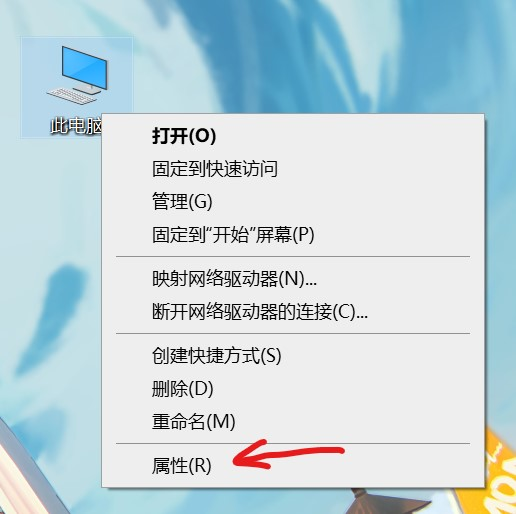
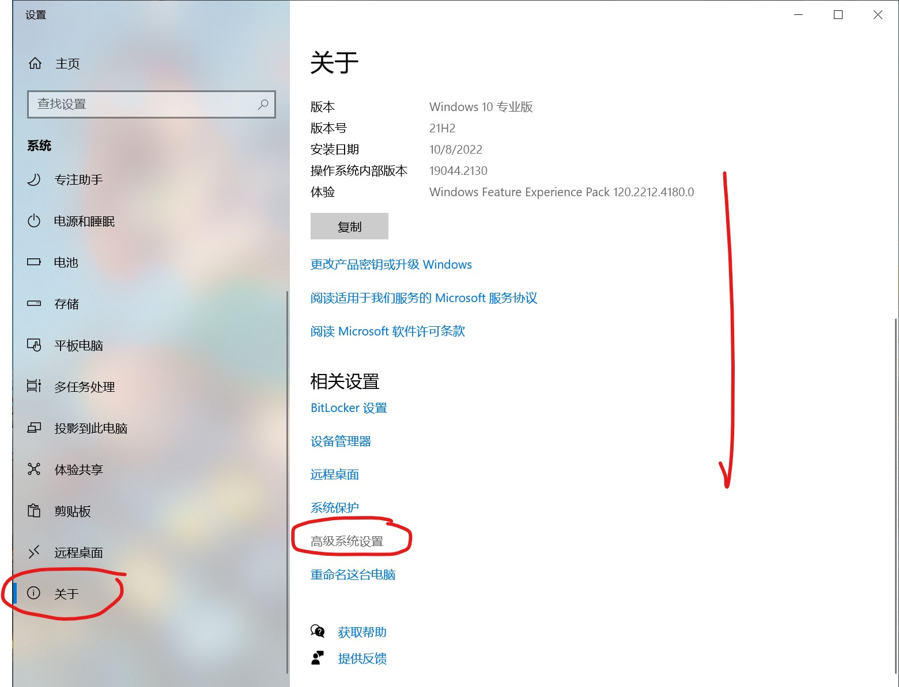
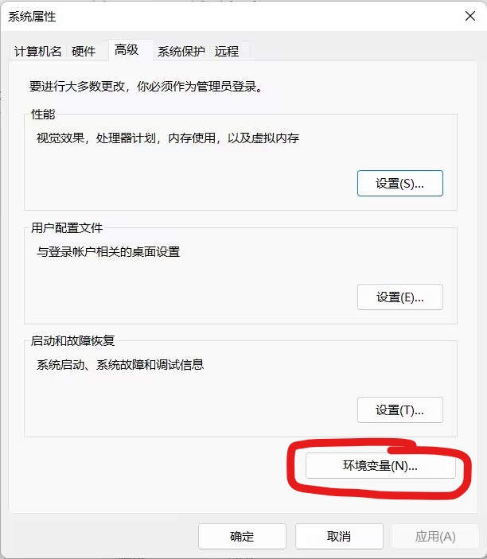
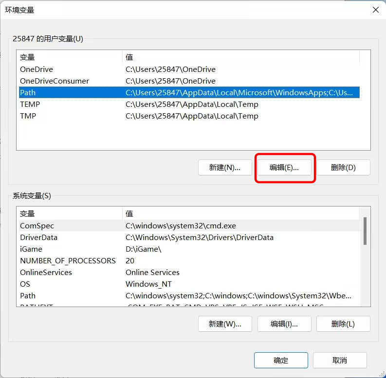
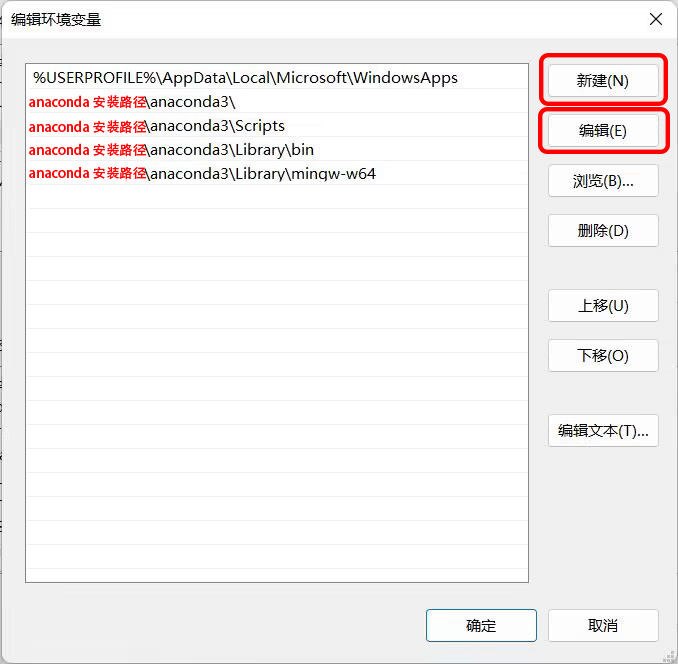
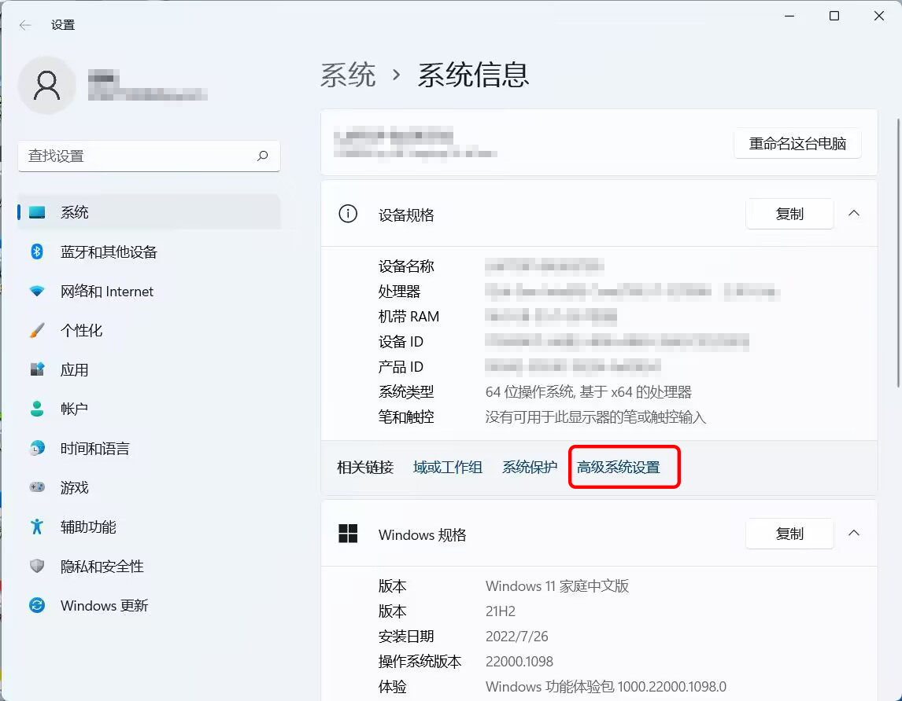

# 设置Path环境变量

页面大纲：
[[toc]]

## windows如何设置Path环境变量

::: warning
**请在这边选择你的windows版本哦**
:::

### 如果你使用的是win10

windows10 设置环境变量的方法

首先找到`windows设置->系统->关于->高级系统设置`选项

或者通过右键此电脑快速进入这个选项卡

进入选项卡以后，`高级系统设置`位于最下方或者最右方，请仔细找找

点击图片中的`高级系统设置`，会弹出下面的界面

点击`环境变量`，会出现下面的界面

然后**双击**上面`用户的Path条目`，也就是图片中`蓝色的一行`，或者选中这一行以后点击一下`编辑`按钮

然后弹出的界面就是你`当前用户的环境变量`了

可以通过右边的按钮编辑，优先级是**从上到下**的

### 如果你使用的是win11

windows11 设置环境变量的方法

首先找到`windows设置->系统->系统信息->高级系统设置`选项

或者通过右键此电脑快速进入这个选项卡

然后点击图片中的`高级系统设置`，会弹出下面的界面

然后点击`环境变量`，会出现下面的界面

然后**双击**上面`用户的Path条目`，也就是图片中`蓝色的一行`，或者选中这一行以后点击一下`编辑`按钮

然后弹出的界面就是你`当前用户的环境变量`了

可以通过右边的按钮编辑，优先级是**从上到下**的

[无法将-xxx-项识别为-cmdlet、函数、脚本文件或可运行程序的名称。](../✍️%20写在前面/常见问题.md#无法将-xxx-项识别为-cmdlet、函数、脚本文件或可运行程序的名称。)
